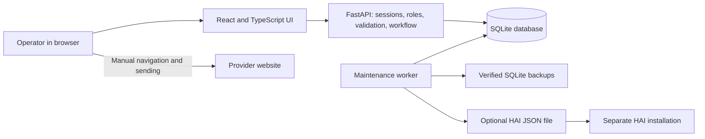

# Simbi Reach-Out

[](https://github.com/Robert-Velhorst/022-Simbi-Reach-out/actions/workflows/ci.yml)

**Project 022 — a locally hosted workspace for preparing, reviewing, and tracking personal outreach about services, exchanges, and networking.**

Simbi Reach-Out helps you keep track of whom you want to contact, why the contact is appropriate, what you plan to say, and what happened afterward. You enter authorized information, prepare a message from a reusable template, review it, and record the outcome. Your work is stored in a database on the computer or server where you run the application.

Sending is a separate human action. The app provides approved text to copy and a link to the provider's website. You decide whether to open that website, sign in there, and send the message yourself. Replies are entered manually too.

The application uses **React and TypeScript** in the browser, **FastAPI and Python** for the backend, and **SQLite** for storage. It includes a maintenance worker, operator commands, Docker deployment, a Windows standalone package builder, an ngrok launcher, and a file-based connector for HAI.

> **Current scope:** an assisted outreach application, not an official Simbi integration. It has no provider scraper, automatic login, form filler, message sender, inbox synchronization, or Simbi-credit management. No AI service or provider API key is needed. Older commits and the historical repository description refer to a previous automation project; this README describes the replacement application on `main`.

## Contents

- [Purpose and audience](#purpose-and-audience)
- [Features](#features)
- [First use and daily workflow](#first-use-and-daily-workflow)
- [Roles and access](#roles-and-access)
- [Choose a deployment](#choose-a-deployment)
- [Get the source](#get-the-source)
- [Local Docker installation](#local-docker-installation)
- [Windows development installation](#windows-development-installation)
- [Windows standalone application](#windows-standalone-application)
- [Temporary remote access with ngrok](#temporary-remote-access-with-ngrok)
- [Hosted deployment with Docker and Caddy](#hosted-deployment-with-docker-and-caddy)
- [HAI integration](#hai-integration)
- [Configuration reference](#configuration-reference)
- [Data, privacy, and security](#data-privacy-and-security)
- [Maintenance and recovery](#maintenance-and-recovery)
- [Architecture and repository map](#architecture-and-repository-map)
- [API guide](#api-guide)
- [Verification and performance](#verification-and-performance)
- [Troubleshooting](#troubleshooting)
- [Known limitations](#known-limitations)
- [Contributing and documentation](#contributing-and-documentation)
- [License and ownership](#license-and-ownership)

## Purpose and audience

The intended users are individuals or small teams organizing service-related conversations: community coordinators, people arranging exchanges, and operators responding to relevant requests. Developers can maintain or extend the workflow and its deployment tools.

For example, you might have permission to respond to someone's request for project help. You record the request's source, create a campaign describing the exchange, prepare a personalized draft, review it, and manually contact the person. Later, you record their reply or a decision to stop. The app organizes this process; it does not find people for you or establish permission to contact them.

“Local” means the application runs on your computer or a server you control. Its interface opens in a normal web browser. A hosted installation stores information on that host, not on each visitor's computer. Once installed, local preparation and record keeping do not require an external AI or messaging service. Opening provider pages, downloading dependencies, and using ngrok require connectivity.

## Features

| Area | Implemented behavior |
|---|---|
| Dashboard | Workflow counts, items needing attention, campaign progress, reminders, and recent activity from stored records. |
| Campaigns | Purpose, outreach context, description, daily handoff limit, cooldown, and active/paused/archived status. |
| Prospects | Names, organizations, source links, provider labels, notes, contact handles, consent status, search, and CSV-text import. |
| Templates | Reusable message bodies with explicit placeholders and deterministic text substitution. |
| Review queue | Create and edit drafts, inspect quality signals, approve/decline, and prepare manual handoffs. Editing approved text requires a new review. |
| Outcomes and replies | Record sent, not sent, or ambiguous outcomes and manually enter replies. A prepared handoff does not prove delivery. |
| Reminders | Manual decision reminders and worker-generated reminders after seven days without a reply. No automatic follow-up messages or external notifications. |
| Reports | Current draft-state counts and campaign average quality, based on local records. No provider open rates or delivery analytics. |
| Safety controls | Compliance acknowledgement, provider-host matching, opt-out recording, and a stop for new approvals/handoffs. |
| Team | Local owner, admin, editor, and viewer accounts. |
| Data operations | Workspace JSON export, diagnostic output, API prospect deletion, CLI backup/restore/reconciliation/retention cleanup. |
| Deployment | Docker, Windows package building, temporary ngrok access, Caddy TLS deployment, and optional HAI feed export. |

Records start empty. The app does not populate live contacts, import a provider account, or fabricate activity. The image in `docs/design/` is a design concept, not a current application screenshot or evidence of real user data.

## First use and daily workflow

### Set up the workspace

1. Start the application using a method below and open its local URL.
2. Create the first owner with your name, workspace name, email, and a password of at least 12 characters. This is an application account; use a password distinct from your provider account. There is no default login.
3. Open **Settings → Compliance acknowledgement**. Review the provider's current rules and confirm the four statements about source authorization, manual operation, and handling opt-outs.
4. Check **Provider handoff** in Settings. Initial setup creates a Simbi base link at `https://simbi.com/`. Saving a link configures URL validation; it does not authenticate with or verify an account at the provider.
5. Add local team members as needed.

Complete first-owner setup while access is restricted to you. The setup endpoint creates the owner when the database has no users; initialize it before exposing a new installation publicly.

### Prepare and track a conversation

1. **Create a campaign.** Describe the exchange and why contact is appropriate. Defaults are 10 prepared handoffs per day and a 1,440-minute (24-hour) cooldown. Accepted ranges are 1–50 handoffs and 60–43,200 minutes.
2. **Add a prospect.** Supply a name, an HTTPS source link, context, and the consent status you actually know. An `unknown` or `contextual` status is recorded information, not an automated determination of permission.
3. **Create a template.** Supported body placeholders are `{name}`, `{organization}`, `{campaign}`, and `{notes}`. Unsupported fields are rejected. Subjects are copied as entered; substitution applies to the body.
4. **Create a draft in the review queue.** Select a campaign, prospect, and template. The database permits one draft per campaign/prospect pair.
5. **Review and edit.** Check the source and recipient context, then save explicitly. The 0–100 quality score flags missing personalization, short/long text, promotional wording, and missing decline language. It is an English-oriented heuristic, not AI, permission to send, or a success probability.
6. **Approve.** Confirm authorized source, personalized message, policy review, and understanding that sending is manual. Owner/admin/editor roles can approve their own drafts; a second reviewer is not enforced.
7. **Activate the campaign and prepare the handoff.** The backend checks approval, campaign status, workspace pause, prospect status, provider hostname, limits, cooldown, and an idempotency key. Daily limits count prepared handoffs on the UTC date, including later cancellations, rather than confirmed sends.
8. **Perform any external action yourself.** Copy the approved text, open the provider if appropriate, and send manually there.
9. **Record the result.** Choose **Sent** after checking the provider, **Not sent** when you did not send, or **Ambiguous** when uncertain. Verify ambiguous results before retrying or resolving them.
10. **Record the reply or next decision.** Enter the necessary reply/summary, manage reminders, and record any opt-out promptly.

### Draft states

| State | Meaning |
|---|---|
| `needs_review` | New or edited text needs human review. |
| `approved` | Current text passed review; no send is implied. |
| `handoff_created` | A handoff was prepared; its external outcome remains to be recorded. |
| `sent` | An operator recorded a manual send. |
| `ambiguous` | The operator could not confirm the external outcome. |
| `replied` | A reply was manually recorded. |
| `declined` | Review declined the draft; the current interface has no reopen action. |
| `suppressed` | The prospect was marked to stop contact. |

The common path is `needs_review → approved → handoff_created → sent → replied`. Cancelling a handoff returns its draft to `approved`; editing approved text returns it to `needs_review`. Historical handoffs persist. The domain transition map is not itself an API: only implemented endpoints and interface actions are available.

### CSV intake

In Prospects, paste CSV text, preview it, correct errors, and explicitly commit. Required columns are `name` and `source_url`; optional columns are `organization`, `provider`, `contact_handle`, `notes`, and `consent_status`.

Illustrative input only—replace it with authorized records:

```csv
name,source_url,organization,provider,contact_handle,notes,consent_status
Example Person,https://example.org/request/example,Example Group,example,,Context to verify before contact,unknown
```

The default text limit is 1 MiB of UTF-8 data, with a separate 5,000-row maximum. Invalid rows block commitment; preview returns at most 50 errors. A successful import inserts in one transaction and skips duplicates by workspace/provider/source URL. It does not update existing records, fetch source URLs, or infer consent. Status values are `unknown`, `contextual`, `consented`, `opted_out`, and `blocked`.

## Roles and access

| Capability | Owner / admin | Editor | Viewer |
|---|---|---|---|
| Read workspace records, reports, and audit events | Yes | Yes | Yes |
| Create campaigns, prospects, templates, and drafts | Yes | Yes | No |
| Review, prepare handoffs, record outcomes/replies, manage reminders and opt-outs | Yes | Yes | No |
| Compliance, provider settings, workspace pause/resume | Yes | No | No |
| Add local members | Yes | No | No |
| JSON export, support data, API prospect deletion | Yes | No | No |

The backend enforces access even where a restricted role still sees a control in the interface. The first account is owner; new members can be admin, editor, or viewer. Email is a login identifier, not an invitation service. Password reset/change, member removal, and role editing are not exposed workflows.

The schema supports workspace memberships and isolation, but shipped onboarding creates one workspace. There is no self-service workspace selector or organization provisioning. CLI commands use the filesystem authority of the person running them and do not use browser roles.

## Choose a deployment

| Mode | Requirements | Default address | Worker | Automatic backups by default |
|---|---|---|---|---|
| Local Docker | Docker with Compose | `http://127.0.0.1:8000` | Separate Compose service | No |
| Windows development | Python, Node, pnpm | UI `:5173`, API `:8000`, on loopback | Start separately | No |
| Windows standalone | Built package and browser | `http://127.0.0.1:8765` | Included in executable | Yes, while running |
| ngrok | Source installation, compiled UI, authenticated ngrok | Reported HTTPS URL | Start separately | Setting enabled; worker still required |
| Docker + Caddy | Docker host, domain, available TLS ports | Your HTTPS domain | Separate Compose service | Yes, while running |

`127.0.0.1` means the computer on which the browser is running. Local URLs are not remotely accessible without deliberate deployment. ngrok exposes an app on your computer; it does not move it into a cloud server or keep it running during sleep.

## Get the source

For Docker, development, or package building, install Git and clone `main`:

```powershell
git clone https://github.com/Robert-Velhorst/022-Simbi-Reach-out.git
Set-Location 022-Simbi-Reach-out
```

Commands below run from the repository root unless stated otherwise. On Linux/macOS, use `cd`, `.venv/bin/python`, and `pnpm` in place of their Windows equivalents. The `.ps1` scripts target Windows.

## Local Docker installation

Start Docker Desktop with Linux-container support, or a Docker Engine host with Compose, then run:

```powershell
docker compose up --build
```

Open [the local application](http://127.0.0.1:8000). Docker builds the frontend and installs backend dependencies; host Python/Node installations are unnecessary. The default Compose file starts app and worker and publishes the app only on loopback.

```powershell
docker compose ps
docker compose logs --tail 100 app worker
docker compose stop
docker compose start
```

SQLite is stored at `/app/data/simbi.db` in the `simbi-data` named volume, normally prefixed by Docker's project name. Stopping/recreating containers preserves that volume. Removing it removes your database.

Local Compose does not enable automatic backups or mount a separate backup volume. A manual backup can use its existing persistent data volume:

```powershell
docker compose exec app python -m app.cli backup --destination /app/data/backups
```

To enable automatic local backups, configure the worker with `SIMBI_AUTO_BACKUP=true` and `SIMBI_BACKUP_PATH=/app/data/backups`, then recreate it. Editing `.env.example` alone does not configure that service. Also keep a protected backup outside the Docker volume.

## Windows development installation

### Install dependencies

Use Python 3.13, Node.js 24, and pnpm 11 to match CI; CI pins pnpm 11.16.0. The Python manifest declares 3.11 or later, but every newer interpreter/packaging combination is not necessarily tested. Docker is additionally required for the full verification script.

```powershell
python -m venv .venv
.\.venv\Scripts\python.exe -m pip install -e ".[dev]"
pnpm.cmd --dir frontend install --frozen-lockfile
```

Defaults work without an environment-file copy. Python reads process environment variables; it does not automatically load `.env`. See [Configuration reference](#configuration-reference).

### Start development

The convenience script installs dependencies and starts API and Vite servers:

```powershell
.\scripts\dev.ps1
```

Open [the development interface](http://127.0.0.1:5173). Vite forwards `/api` to `http://127.0.0.1:8000`. The script stops its API child when the frontend exits. It does not start maintenance.

If PowerShell selects a blocked `pnpm.ps1` shim, use these explicit commands in separate terminals after installing dependencies:

```powershell
# Terminal 1: API
.\.venv\Scripts\python.exe -m uvicorn app.main:app --app-dir backend --host 127.0.0.1 --port 8000 --reload
```

```powershell
# Terminal 2: frontend
pnpm.cmd --dir frontend dev
```

```powershell
# Terminal 3: maintenance, when needed
.\.venv\Scripts\python.exe -m app.worker --interval 300
```

Stop each with Ctrl+C. App and worker must use the same database settings. Migrations run at startup; the default source database is `data/simbi.db` under the repository. Runtime data, dependencies, and builds are ignored by Git.

### Serve compiled assets locally

For a local server without Vite:

```powershell
pnpm.cmd --dir frontend build
$env:SIMBI_FRONTEND_ORIGIN = 'http://127.0.0.1:8000'
.\.venv\Scripts\python.exe -m uvicorn app.main:app --app-dir backend --host 127.0.0.1 --port 8000
```

The backend serves `frontend/dist` when it exists at startup. Restart if it was absent when the server started. Maintenance remains separate. `app.server` binds `0.0.0.0` for container ingress; use the explicit loopback command above for native local serving.

## Windows standalone application

### Build and distribute

On Windows, install the development prerequisites and create `.venv`, then run:

```powershell
.\scripts\build-windows.ps1
& '.\dist\Simbi Reach-Out\Simbi Reach-Out.exe'
```

PyInstaller creates `dist/Simbi Reach-Out/` with the executable, Python runtime, libraries, migrations, and compiled UI. Distribute **the entire folder**, including `_internal`, not just the executable. The destination needs a compatible Windows system and browser, but no Python, Node, pnpm, or Docker.

Successful Windows [Actions runs](https://github.com/Robert-Velhorst/022-Simbi-Reach-out/actions/workflows/ci.yml) upload a `simbi-reach-out-windows` artifact. Download it while GitHub retains it; sign-in may be required. There is no signed installer, automatic updater, or Windows service. Windows CI builds the package; it does not launch-test the executable.

### Run and store data

Double-click `Simbi Reach-Out.exe`. It opens the default browser at `http://127.0.0.1:8765`. Keep the console open and press Ctrl+C there to stop. The integrated worker runs every five minutes and enables automatic backups by default.

- Database: `%LOCALAPPDATA%\Simbi Reach-Out\data\simbi.db`
- Backups: `%LOCALAPPDATA%\Simbi Reach-Out\backups`
- Support bundles generated against that database: its `data\support-bundles` folder

These paths differ from the source checkout. Replacing the package folder does not automatically migrate data from another installation. For a port conflict, set `SIMBI_WINDOWS_PORT` to an unused port from 1024–65535 before starting. Launch from a clean environment when switching between local and hosted modes because existing process settings are inherited.

## Temporary remote access with ngrok

ngrok makes the app running on your Windows computer reachable through an HTTPS tunnel. The computer must remain on, awake, and connected. ngrok is a separate service with its own account, configuration, terms, and possible charges.

Before launching:

1. Install source dependencies and build with `pnpm.cmd --dir frontend build`.
2. Complete owner setup locally against the database to expose, then stop that API.
3. Install a real authenticated ngrok executable on `PATH`. A zero-byte WindowsApps alias is insufficient.
4. Choose an unused origin port and stop other ngrok agents. The script uses ngrok's local API at `127.0.0.1:4040` and is intended for one supervised tunnel.

From a fresh PowerShell window:

```powershell
.\scripts\start-ngrok.ps1 -Port 8000
```

The launcher configures production mode, exact public origin/hostname, secure cookies, loopback proxy trust, and the backup setting. It waits for public readiness and opens a browser unless `-NoBrowser` is supplied. Cleanup stops its app and ngrok children when the launcher exits. The tunnel exposes Simbi, not HAI.

**The launcher does not start maintenance.** For reminders, backups, cleanup, or HAI refresh, run a worker against the same database. For the default source database, use a separate local terminal:

```powershell
$env:SIMBI_AUTO_BACKUP = 'true'
.\.venv\Scripts\python.exe -m app.worker --interval 300
```

Supply matching custom database/backup/HAI settings if used and stop this worker separately. It does not expose an HTTP server. Setting backup configuration without a worker does not schedule backups.

The public URL is an Internet entry point protected by the application's login, not a secret that replaces authentication. This launcher is for supervised access; it is not a service manager or verified unattended cloud deployment.

## Hosted deployment with Docker and Caddy

Production Compose provides a Caddy HTTPS edge, app, worker, persistent storage, resource limits, and rotated logs. Prepare a Docker host, DNS for your domain, and ports 80/443 available to Caddy. Bootstrap the owner against the production database volume with access restricted to you before opening public ingress.

```powershell
Copy-Item .env.production.example .env.production
# Edit .env.production: replace reachout.example.com with your actual domain.
docker compose --env-file .env.production -f compose.production.yaml config --quiet
docker compose --env-file .env.production -f compose.production.yaml up -d --build
```

Open your configured HTTPS domain and verify `/api/health/ready`. For local bootstrap, keep public ingress restricted and temporarily serve the app locally against the same volume. A new publicly reachable database with no users exposes first-owner setup.

Deployment properties:

- Only Caddy publishes host ports. App and worker use a dedicated bridge network. It is not an `internal: true` network or a blanket outbound-network block.
- App/worker run non-root, with read-only filesystems, 64 MiB temporary filesystems, dropped capabilities, and no privilege escalation. Each is capped at 1 CPU and 512 MiB memory; these are limits, not measured idle requirements.
- Volumes persist SQLite, backups, and Caddy state. App and worker share SQLite.
- The fixed subnet is `172.30.0.0/24`; Caddy is trusted at `172.30.0.3`. If it conflicts with your network, change the subnet, addresses, and proxy trust together.
- The worker cycles every 300 seconds. Daily backups and 30-day backup retention are enabled by default while it runs. Its health check verifies process presence, not successful maintenance; inspect logs and backup timestamps.
- `SIMBI_IMAGE_TAG` names the locally built image. No published image registry or managed hosting is implied.

```powershell
docker compose --env-file .env.production -f compose.production.yaml ps
docker compose --env-file .env.production -f compose.production.yaml logs --tail 100 app worker caddy
docker compose --env-file .env.production -f compose.production.yaml stop
```

Although `.env.production.example` lists HAI settings, the shipped production Compose environment does not forward them or mount a feed folder. Add explicit worker environment entries and a shared writable mount for continuous HAI export.

## HAI integration

HAI is separate software. Simbi writes a JSON file for its `generic_json_feed` ingestion contract. The export grants no Simbi session, provider credential, or send authority and does not synchronize changes back to Simbi.

After workspace setup, export from an installed source checkout:

```powershell
.\.venv\Scripts\python.exe -m app.cli hai-export 'C:\path\to\hai\data\phase2\feeds\simbi.json'
```

Replace the example path with the folder HAI reads. A `.json` suffix is required; parent directories are created as needed. Use `--workspace-id ID` when the database has multiple workspaces. Without it, the exporter requires exactly one workspace.

Configure the receiving HAI installation:

```text
HAI_PHASE2_FEEDS_DIR=C:\path\to\hai\data\phase2\feeds
HAI_PHASE2_FEED_FILES=simbi.json
```

For periodic source-installation export, set variables before starting the worker:

```powershell
$env:SIMBI_HAI_FEED_PATH = 'C:\path\to\hai\data\phase2\feeds\simbi.json'
$env:SIMBI_HAI_INCLUDE_CONTENT = 'false'
.\.venv\Scripts\python.exe -m app.worker --interval 300
```

The standalone executable can inherit these settings for its integrated worker. Automatic export has no workspace-selection setting, so it requires a single-workspace database. Use explicitly scoped CLI exports for multiple workspaces.

### Contract and privacy

The JSON object has `cursor` and `items`. Each item supplies an external ID, campaign-derived thread ID, title, content, source URI, timestamp, provider label, project key, and metadata with `reviewRequired: true` and `automaticSendingAllowed: false`.

- The snapshot includes up to 500 drafts in `needs_review`, `approved`, `handoff_created`, or `ambiguous`, ordered by update time and ID. It is not a full history export.
- Default content includes campaign name, state, quality score, safety flags, and suggested next action. Campaign names can be sensitive; metadata-only does not mean anonymous.
- Prospect names, subjects, and message bodies are excluded by default. A one-off CLI export requires `--include-content`; automatic export uses `SIMBI_HAI_INCLUDE_CONTENT=true`. These are distinct opt-ins.
- Provider URLs and credentials are excluded. A `simbi://draft/ID` URI identifies the source; this repository does not register a Windows URI handler.
- Writes use temporary files and atomic replacement. Identical output is not rewritten. Completed drafts disappear from the next snapshot; no deletion events are emitted, so HAI must handle staleness itself.
- A successful file export is not proof of live HAI ingestion. Verify the receiving version, configuration, and behavior separately.

Docker installations need a shared mount and container-visible path; a host Windows path cannot be used inside a Linux container without mapping it. Simbi does not connect to Gmail or Google Drive; such connectors belong to HAI or other separate software.

## Configuration reference

[backend/app/config.py](backend/app/config.py) is authoritative. Settings load when the process imports the app; restart after changing them. Use absolute paths for custom deployments. Relative paths resolve against the working directory.

Native process settings can be assigned in PowerShell:

```powershell
$env:SIMBI_DATABASE_PATH = 'C:\SimbiData\simbi.db'
$env:SIMBI_BACKUP_PATH = 'C:\SimbiData\backups'
$env:SIMBI_AUTO_BACKUP = 'true'
```

These affect that terminal and its children. Copying `.env.example` to `.env` does not load Python settings. Compose reads `--env-file` for interpolation, but only variables wired into a service's environment reach its container.

| Variable | Application default | Meaning / accepted range |
|---|---|---|
| `SIMBI_ENV` | `local` | `local`, `test`, `demo`, `production`. Demo blocks handoffs but does not populate sample data. |
| `SIMBI_DATABASE_PATH` | Runtime root + `data/simbi.db` | SQLite file; source runtime root is the repository, packaged root is `%LOCALAPPDATA%\Simbi Reach-Out`. |
| `SIMBI_FRONTEND_ORIGIN` | `http://localhost:5173` | Allowed UI origin; production requires HTTPS. Launchers/Compose override it. |
| `SIMBI_SESSION_HOURS` | `12` | 1–168 hours. |
| `SIMBI_COOKIE_SECURE` | `true` in production, otherwise `false` | Production refuses `false`. |
| `SIMBI_ALLOWED_HOSTS` | `localhost,127.0.0.1,testserver` outside production | Comma-separated hostnames; production requires explicit public hosts including the origin host. |
| `SIMBI_FORWARDED_ALLOW_IPS` | `127.0.0.1` | Proxy addresses trusted by the container server; Compose uses Caddy's fixed address. |
| `SIMBI_RETENTION_DAYS` | `365` | 30–3,650 days; explicit analytics cleanup, not automatic erasure of all personal data. |
| `SIMBI_MAX_IMPORT_BYTES` | `1048576` | 1,024–10,485,760 CSV text bytes; independent 5,000-row cap. |
| `SIMBI_MAX_FAILED_LOGINS` | `5` | Failure threshold, 3–20. |
| `SIMBI_LOGIN_WINDOW_MINUTES` | `15` | Counting window, 1–120 minutes. |
| `SIMBI_LOGIN_LOCK_MINUTES` | `15` | Lock duration, 1–1,440 minutes. |
| `SIMBI_AUTO_BACKUP` | `true` in production, otherwise `false` | Enables backups during maintenance; standalone defaults to `true`. |
| `SIMBI_BACKUP_PATH` | Runtime root + `backups` | Writable persistent destination. |
| `SIMBI_BACKUP_RETENTION_DAYS` | `30` | 7–3,650 days; old matching backups are pruned after a successful new daily backup. |
| `SIMBI_HAI_FEED_PATH` | Unset | Optional worker JSON destination. |
| `SIMBI_HAI_INCLUDE_CONTENT` | `false` | Explicit personal-content opt-in for worker exports. |

Additional tool settings: `SIMBI_WINDOWS_PORT` defaults to `8765`; `SIMBI_E2E_PYTHON` selects the browser harness's Python interpreter. Compose uses `SIMBI_DOMAIN` and `SIMBI_IMAGE_TAG` (default `1.0.0`). Boolean settings accept `true`, `false`, `1`, and `0`.

## Data, privacy, and security

SQLite stores users/sessions, workspace membership, campaigns, prospects, templates, drafts, handoffs, replies, reminders, suppressions, provider links, and events. It uses foreign keys, unique constraints, indexes, explicit transactions, and write-ahead logging (WAL). No external database or analytics service is required.

Passwords use salted scrypt hashes. Sessions use opaque random tokens and server-side expiry; session cookies are `HttpOnly`, cookies are `SameSite=Strict`, and production requires `Secure`. Writes including logout require a CSRF cookie/header pair except setup/login. Backend controls include role/workspace checks, login throttling, host validation, request IDs, security headers, and production HSTS.

Provider URLs must use HTTPS, have no embedded credentials or unsupported ports, and match the configured hostname at handoff. URL validation does not establish trustworthiness or permission to contact someone. Provider accounts remain outside the app's credential storage.

### Different data operations have different scopes

| Operation | Scope |
|---|---|
| Workspace JSON export | Campaigns, prospects, templates, drafts, handoffs, replies, reminders, suppressions, and audit for the workspace. Personal content is included; account credentials are not. No JSON restore endpoint exists. |
| SQLite backup | Entire database, including account/session data and all workspaces; protect it accordingly. |
| Support data | Defined diagnostic counts, migrations, event types/times; message bodies and direct personal identifiers are excluded from that output. Review before sharing. |
| Prospect deletion | Owner/admin API action; related records cascade per schema. Suppression identifiers remain for opt-out history. |
| Retention purge | Deletes old `analytics_events` and expired sessions only. It does not erase prospects, messages, replies, audit events, or suppressions. |

Opt-out handling marks the existing prospect `opted_out`, records a suppression, and suppresses its drafts except those already replied/suppressed. **Creation/import does not automatically reapply retained suppressions to newly recreated prospects after deletion.** Retain opted-out prospect records and review suppression history before reimporting; deletion/recreation does not automatically preserve the block.

Audit events normally contain action metadata instead of bodies, but suppression reasons are free text; avoid unnecessary personal details there. The audit UI has no edit/delete action, but the database is not cryptographically tamper-proof against a filesystem administrator.

Application-layer encryption at rest is absent. Use protected OS accounts/storage and full-disk encryption as appropriate. Same-disk backups do not protect against disk loss. See [Security](docs/SECURITY.md) and the dated [Provider compliance review](docs/PROVIDER_COMPLIANCE.md); recheck current provider rules before operational use. A stored acknowledgement is not legal approval.

### Historical credential exposure

An earlier `main.py` contained a plaintext provider credential. The active tree removed it, but old Git commits retain it. The account owner must rotate the credential, review/revoke affected sessions, and coordinate any shared-history rewrite. This README does not claim those actions occurred. Do not reproduce the credential in reports. See [the recorded exposure](docs/SECURITY.md#pre-existing-credential-exposure).

## Maintenance and recovery

The worker cleans up expired sessions/login attempts, creates reminders, optionally backs up daily, and optionally exports HAI. It defaults to a 300-second interval (minimum 30). It creates a reminder for a sent draft at least seven days old when no reply and no open reminder exist. Completing a reminder does not permanently disable future reminders for an otherwise eligible draft.

### Operator commands

Use the installed source virtual environment from the repository root:

```powershell
.\.venv\Scripts\python.exe -m app.cli --help
.\.venv\Scripts\python.exe -m app.cli doctor
.\.venv\Scripts\python.exe -m app.cli migrate
.\.venv\Scripts\python.exe -m app.worker --once
.\.venv\Scripts\python.exe -m app.cli backup
.\.venv\Scripts\python.exe -m app.cli reconcile
.\.venv\Scripts\python.exe -m app.cli support-bundle
```

`doctor` checks database/migrations, environment, the source frontend manifest, and absence of legacy root automation scripts. It may create/migrate the database; it is not purely read-only and does not prove browser/provider readiness. Packaged/container runtimes may lack that source manifest; use HTTP readiness there. `migrate` applies numbered SQL migrations; rollback migrations are not supplied.

`reconcile` reports orphan drafts, missing send timestamps, and expired sessions. `reconcile --repair` removes expired sessions and marks `sent` records without timestamps as ambiguous; it does not repair every inconsistency or infer a send. `purge-retention --confirm` performs the limited cleanup above. Both modify the selected database, so inspect settings and back up first.

### Backup and restore

Backups use SQLite's backup API and an integrity check. Automatic backup runs during maintenance when a backup has not yet been recorded for the UTC day. It cannot run while the standalone app is closed. Configure persistent storage and test recovery on a separate installation.

Before restoring, confirm the database path and backup, preserve current data, and stop every app/worker writing to the target. Do not copy over a database with active writers or unresolved WAL/SHM sidecars; inspect/checkpoint it first. Test the candidate against a separate target before replacing the real installation.

```powershell
.\.venv\Scripts\python.exe -m app.cli restore 'C:\SimbiBackups\simbi-YYYYMMDDTHHMMSSZ.db' --confirm
```

Replace the example with an existing `.db` file. Restore validates integrity and the migration table, backs up the current target, copies the candidate, and applies pending migrations. Use the correct environment for source, standalone, or container storage. Container restore requires controlled access to the volume while writers are stopped. A workspace JSON export cannot replace this process. Downgrading the app also requires schema compatibility checks or a compatible pre-upgrade backup.

## Architecture and repository map



Vite provides development serving and compilation. In compiled/package/container deployments, FastAPI serves the assets and client-route fallback. A shared frontend wrapper handles API requests and CSRF. There is no Redis, distributed task queue, external AI runtime, or automatically sending adapter. Standalone embeds maintenance in one process; Compose runs it separately against shared SQLite.

| Path | Purpose |
|---|---|
| `frontend/src/App.tsx`, `components/` | Startup, setup/login, navigation, shared controls. |
| `frontend/src/pages/` | Dashboard, resources, review queue, operations, settings, help. |
| `frontend/src/api.ts`, `types.ts` | Request/error handling and frontend types. |
| `frontend/package.json`, `frontend/pnpm-lock.yaml` | Frontend commands and locked dependencies. |
| `backend/app/main.py` | API, models, sessions, roles, workflow actions, static serving. |
| `backend/app/domain.py`, `security.py` | Rules, scoring, rendering, credentials, URL checks. |
| `backend/app/config.py`, `db.py` | Settings, SQLite, migrations, transactions, backups. |
| `backend/app/worker.py`, `cli.py`, `hai.py` | Maintenance, operator commands, HAI export. |
| `backend/app/server.py`, `windows.py` | Container and standalone launchers. |
| `backend/migrations/`, `backend/tests/` | SQL changes and backend regression tests. |
| `frontend/src/` test files | Tests beside frontend modules, components, and pages. |
| `scripts/` | Development, verification, browser testing, capacity, ngrok, Windows packaging. |
| `Dockerfile`, `docker-compose.yml` | Multi-stage image and local app/worker deployment. |
| `compose.production.yaml`, `Caddyfile` | Hosted deployment and HTTPS edge. |
| `simbi-windows.spec` | PyInstaller package contents. |
| `.github/workflows/ci.yml` | Linux checks and Windows package/artifact build. |
| `docs/` | Operator guidance and historical implementation evidence. |

[pyproject.toml](pyproject.toml) and [frontend/package.json](frontend/package.json) declare dependencies and application version `1.0.0`. A version string alone does not imply a tagged release or verified public deployment.

## API guide

The API is under `/api`; interactive documentation is `/api/docs` outside production. FastAPI's schema remains at `/openapi.json`; disabling the production docs UI does not disable that schema route.

Authenticated requests use the `simbi_session` cookie. After setup/login, send the `simbi_csrf` cookie value in `X-CSRF-Token` on writes. Setup/login are exempt; logout is not. There is no bearer-token API or provider OAuth flow. Handoff keys must be 12–120 characters and unique per action. Reuse an `Idempotency-Key` only for retrying that same action: replay returns the earlier workspace-scoped handoff, so never reuse a key for another draft.

| Endpoint | Operations |
|---|---|
| `/api/health/live`, `/api/health/ready` | GET liveness and database readiness. |
| `/api/auth/status`, `/api/me` | GET setup/session information. |
| `/api/auth/setup`, `/api/auth/login`, `/api/auth/logout` | POST account setup and session actions. |
| `/api/overview` | GET dashboard data. |
| `/api/campaigns`, `/api/campaigns/{id}/status` | GET/POST campaigns; PATCH status. |
| `/api/prospects`, `/api/prospects/import`, `/api/prospects/{id}` | GET/POST prospects; POST import; owner/admin DELETE. |
| `/api/templates` | GET/POST; no template-update endpoint. |
| `/api/drafts`, `/api/drafts/{id}` | GET/POST drafts; PATCH draft text. |
| `/api/drafts/{id}/review`, `/api/drafts/{id}/handoff` | POST review and handoff preparation. |
| `/api/handoffs`, `/api/handoffs/{id}/outcome` | GET handoffs; POST `sent`, `ambiguous`, or `cancelled` (UI: Not sent). |
| `/api/replies` | GET/POST manually recorded replies. |
| `/api/reminders`, `/api/reminders/{id}` | GET/POST reminders; PATCH `open`, `done`, or `cancelled`. |
| `/api/suppressions` | POST opt-out. |
| `/api/reports/summary`, `/api/audit` | GET reports and events. |
| `/api/settings` | GET settings. |
| `/api/settings/compliance`, `/api/settings/provider`, `/api/settings/pause`, `/api/settings/team` | Owner/admin POST administration. |
| `/api/export`, `/api/support-bundle` | Owner/admin GET data export and diagnostics. |

Campaign/prospect/template list APIs support `limit`, `offset`, `search`, and allowlisted `order`; drafts support filtering and pagination. Most list limits cap at 100, audit at 500. The UI is narrower: several pages show their first requested batch without pagination controls.

Handled app errors return `error.code`, `error.message`, `error.details`, and `error.request_id`. Common responses include 409 for state/duplicate conflicts, 422 for validation, 401/403 for authentication/access/CSRF, and 429 for throttling/limits. Framework/proxy failures may use another response shape. Include a redacted request ID when reporting issues. See the running schema/source for exact fields and the [API usage audit](docs/API_USAGE_AUDIT.md) for existing consumer/test mappings. No endpoint sends an external message.

## Verification and performance

Use [commit-specific Actions results](https://github.com/Robert-Velhorst/022-Simbi-Reach-out/actions/workflows/ci.yml) for current checks. The [2026-08-09 verification report](docs/FINAL_VERIFICATION_REPORT.md) records earlier tests, browser runs, container and Windows executable startup, and a fresh-clone exercise. These are dated results, not a promise that dependencies or deployment conditions remain unchanged.

The suites currently contain 14 backend tests and 7 frontend tests covering the assisted path, isolation/security, import, suppression, worker, HAI, backup, and selected interface behavior. Browser acceptance covers setup through a cancelled handoff without provider navigation, responsive navigation, selected automated WCAG checks, and browser errors. It is not exhaustive security or accessibility certification.

### Run checks

After dependency installation:

```powershell
.\scripts\verify.ps1
```

This script also expects Docker and installs Chromium. Inspect individual results: it invokes external commands without checking every `$LASTEXITCODE`, so its final exit code alone does not prove every check passed. CI runs them as separate failing steps. For explicit checks:

```powershell
.\.venv\Scripts\python.exe -m ruff check backend
.\.venv\Scripts\python.exe -m pytest
.\.venv\Scripts\python.exe -m pip_audit --skip-editable
.\.venv\Scripts\python.exe scripts\benchmark.py
pnpm.cmd --dir frontend lint
pnpm.cmd --dir frontend test
pnpm.cmd --dir frontend build
pnpm.cmd --dir frontend audit --audit-level high
pnpm.cmd --dir frontend exec playwright install chromium
pnpm.cmd --dir frontend test:e2e:run
docker compose config --quiet
docker compose -f compose.production.yaml --env-file .env.production.example config --quiet
```

Build before `test:e2e:run`; it does not build automatically. Linux CI uses browser installation with `--with-deps`. Browser tests use port 4173 and recreate `.e2e-runtime`; the benchmark recreates `.benchmark-runtime`; backend tests use `backend/tests/.runtime`. Keep real data out of test folders and avoid concurrent suites sharing their fixture storage.

Linux CI includes lint, tests, dependency audits, build, capacity checks, browser acceptance, a source guard, Docker build, Compose validation, and container readiness. Windows CI builds/uploads the package. Neither proves live ngrok, public-domain, HAI, or provider acceptance.

### Performance scope

The 10,000-prospect/10,000-draft benchmark checks an aggregate query and 100-row page. Budgets are at most two seconds for those queries and 30,000,000 bytes for the database file. The earlier report measured about 0.014 seconds on its machine. This is a database microbenchmark, not HTTP latency, simultaneous-user capacity, memory usage, or a service-level guarantee.

Indexes, bounded API lists, compiled assets, and one maintenance loop keep the architecture simple. SQLite writes are serialized; distributed workers, sharding, and horizontal scaling are not implemented or validated. Use one worker per database and measure your own concurrency and workload before broader hosting.

## Troubleshooting

| Symptom | Check / next step |
|---|---|
| Loading fails / Service unavailable | Confirm API readiness, server output, permissions, and disk space. Development UI uses 5173; API uses 8000. |
| API works but compiled UI is missing | Build `frontend/dist` and restart. Vite serves development separately. |
| PowerShell blocks pnpm | Use `pnpm.cmd` or the manual startup commands without weakening machine-wide policy. |
| Data missing after switching runtime | Check source/Docker/standalone database paths; they differ. Do not restore over the wrong database. |
| Invalid host / cookie / CSRF errors | Check hostname, origin, HTTPS cookie mode; avoid mixing localhost and 127.0.0.1. Sign in again at the intended URL. |
| Compliance required / campaign inactive | Owner/admin records acknowledgement; activate the campaign before handoff. |
| Workspace paused | Investigate the stop; owner/admin can resume in Settings. |
| Daily limit / cooldown | Review prepared handoffs and next allowed time. UTC daily counting includes cancellations. |
| Idempotency required | Supply a stable unique 12–120-character key for one action, reused only for its retry. |
| Ambiguous outcome | Inspect the provider conversation manually before resolving or retrying. |
| Login HTTP 429 | Wait for the lock window, check the login identifier, investigate repeated unexpected failures. |
| No reminders/backups/feed updates | Confirm a worker, matching database settings, writable destinations, and successful logs. Development/ngrok launchers do not start it. |
| HAI export failure | Complete setup, use a writable JSON path, and select workspace explicitly when necessary. Check shared mounts in containers. |
| ngrok failure | Check real executable/account setup, unused origin port, and no competing agent at port 4040. |
| Public deployment fails | Check domain, DNS, TLS ports, production settings, proxy address, and subnet conflicts. |
| Port conflict | Stop the conflicting process you own or choose a supported unused port. |
| SQLite locked/unavailable | Inspect writers, duplicate workers, permissions, disk, and mounts. Preserve data before recovery. |

## Known limitations

- No official messaging integration, automated sending, scraping, inbox reading, delivery receipts, credit accounting, billing, or AI generation. Entered outcomes cannot independently verify provider events.
- No managed hosting, signed installer, automatic updates, Windows service, or live public-domain/ngrok/HAI acceptance supplied by the repository itself.
- No password reset/change, MFA/SSO, invitation email, workspace provisioning, member removal, or role-change workflows. Wider hosting requires additional account administration.
- Several UI lists lack pagination even though APIs support it. Large datasets may need API access for records beyond the first batch; some lists remain bounded without full navigation.
- Templates have a version field but no editing/history workflow. Prospect and campaign metadata editing is limited. Autosave and translation catalogs are absent.
- Review scoring uses English text checks and does not enforce a minimum approval score. Recorded consent is not provider-verified.
- Retained suppressions are not reapplied automatically after deleting/recreating a prospect. Unresolved handoffs can outlive later local state changes; reconcile outcomes before acting and never use an old handoff to resume contact after an opt-out.
- General personal-data retention, encryption at rest, cryptographic audit integrity, and multi-host database/worker coordination are absent.
- The HAI snapshot is bounded, has no deletion events or two-way sync, and needs receiving-side configuration.
- A dedicated screen-reader and broader accessibility review remains outstanding.
- Historical credentials remain in Git history until owner rotation and a separately coordinated cleanup are completed.

These statements describe current source behavior. Older completion/audit documents can contain design intentions or earlier snapshots; consult current code/tests and this README when descriptions differ.

## Contributing and documentation

For a bug report, include commit, deployment mode, reproduction steps, expected/actual behavior, redacted errors/request IDs, and relevant check results. Use [issues](https://github.com/Robert-Velhorst/022-Simbi-Reach-out/issues) for non-sensitive reports. Contact the repository owner privately for sensitive matters; do not publish credentials, databases, or personal exports.

Develop on a branch from current `main`, preserve migrations and existing records, and run checks appropriate to the change. Add regression coverage for state, authorization, data, or recovery changes. Document configuration and deployment impacts. An external-action feature requires an explicit integration design and verification; a flag or template alone does not grant provider access.

| Document | Purpose |
|---|---|
| [Operator runbook](docs/OPERATOR_RUNBOOK.md) | Daily operation, safety stop, recovery. |
| [Critical path](docs/CRITICAL_PATH.md) | Intended workflow and state model. |
| [Security](docs/SECURITY.md) | Trust boundaries, privacy, exposure, reporting. |
| [Provider compliance](docs/PROVIDER_COMPLIANCE.md) | Dated source review and responsibilities. |
| [Acceptance tests](docs/ACCEPTANCE_TESTS.md) | Automated/manual cases. |
| [UI audit](docs/UI_ACTION_AUDIT.md) / [API audit](docs/API_USAGE_AUDIT.md) | Action/endpoint/consumer/test mappings. |
| [Technical audit](docs/TECHNICAL_AUDIT.md) | Starting repository and architecture context. |
| [Completion matrix](docs/GOAL_COMPLETION_MATRIX.md) | Historical requirement-by-requirement record and gaps. |
| [Verification report](docs/FINAL_VERIFICATION_REPORT.md) | Dated implementation verification. |
| [Changelog](CHANGELOG.md) | Recorded product changes. |
| [Task graph](docs/TASK_GRAPH.md), [checkpoints](docs/CODEX_CHECKPOINTS.md), [worklog](docs/CODEX_WORKLOG.md) | Implementation and maintenance history. |

## License and ownership

Repository: [Robert-Velhorst/022-Simbi-Reach-out](https://github.com/Robert-Velhorst/022-Simbi-Reach-out). Project name: **022 - Simbi reach out**.

No project license file is supplied. Do not assume public visibility grants an open-source license for reuse or redistribution; request an explicit license from the owner. Dependencies retain their own licenses. This project does not claim Simbi affiliation, endorsement, or messaging API authorization.
