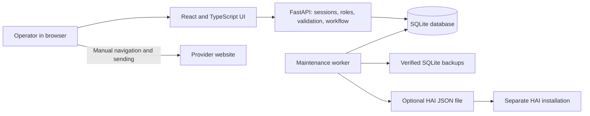

# Simbi Reach-Out

[](https://github.com/Robert-Velhorst/022-Simbi-Reach-out/actions/workflows/ci.yml)

**Project 022 — a locally hosted workspace for preparing, reviewing, and tracking personal outreach about services, exchanges, and networking.**

**Intended use:** Robert's personal tool for his own Simbi account, as clarified on 2026-09-05. The release target is one owner and one personal workspace, not a shared service for independent teams. Existing team and deployment options are preserved, but multi-tenant signup, workspace switching, billing and expanded team administration are not personal-release requirements.

Simbi Reach-Out helps you keep track of whom you want to contact, why the contact is appropriate, what you plan to say, and what happened afterward. You enter authorized information, prepare a message from a reusable template, review it, and record the outcome. Your work is stored in a database on the computer or server where you run the application.

Sending is a separate human action. The app provides approved text to copy and a link to the provider's website. You decide whether to open that website, sign in there, and send the message yourself. Replies are entered manually too.

The application uses **React and TypeScript** in the browser, **FastAPI and Python** for the backend, and **SQLite** for storage. It includes a maintenance worker, operator commands, Docker deployment, a Windows standalone package builder, an ngrok launcher, and a file-based connector for HAI.

> **Current scope:** an assisted outreach application, not an official Simbi integration. It has no provider scraper, automatic login, form filler, message sender, inbox synchronization, or Simbi-credit management. No AI service or provider API key is needed. Older commits and the historical repository description refer to a previous automation project; this README describes the replacement application on `main`.

## Contents

- [Purpose and audience](#purpose-and-audience)
- [Features](#features)
- [English and Dutch interface](#english-and-dutch-interface)
- [First use and daily workflow](#first-use-and-daily-workflow)
- [Roles and access](#roles-and-access)
- [Choose a deployment](#choose-a-deployment)
- [Get the source](#get-the-source)
- [Local Docker installation](#local-docker-installation)
- [Windows development installation](#windows-development-installation)
- [Windows standalone application](#windows-standalone-application)
- [Temporary remote access with ngrok](#temporary-remote-access-with-ngrok)
- [Hosted deployment with Docker and Caddy](#hosted-deployment-with-docker-and-caddy)
- [HAI integration](#hai-integration)
- [Configuration reference](#configuration-reference)
- [Data, privacy, and security](#data-privacy-and-security)
- [Maintenance and recovery](#maintenance-and-recovery)
- [Architecture and repository map](#architecture-and-repository-map)
- [API guide](#api-guide)
- [Verification and performance](#verification-and-performance)
- [Troubleshooting](#troubleshooting)
- [Known limitations](#known-limitations)
- [Contributing and documentation](#contributing-and-documentation)
- [License and ownership](#license-and-ownership)

## Purpose and audience

The intended operator is the repository owner organizing his own service-related conversations and exchanges through his own Simbi account. Developers can maintain the personal workflow and its deployment tools. Existing local team roles are an optional capability, not the intended operating model or a claim of shared-service readiness.

For example, you might have permission to respond to someone's request for project help. You record the request's source, create a campaign describing the exchange, prepare a personalized draft, review it, and manually contact the person. Later, you record their reply or a decision to stop. The app organizes this process; it does not find people for you or establish permission to contact them.

“Local” means the application runs on your computer or a server you control. Its interface opens in a normal web browser. A hosted installation stores information on that host, not on each visitor's computer. Once installed, local preparation and record keeping do not require an external AI or messaging service. Opening provider pages, downloading dependencies, and using ngrok require connectivity.

## Features

| Area | Implemented behavior |
|---|---|
| Dashboard | Workflow counts, items needing attention, campaign progress, reminders, and recent activity from stored records. |
| Campaigns | Purpose, outreach context, description, daily handoff limit, cooldown, and active/paused/archived status. |
| Prospects | Names, organizations, source links, provider labels, notes, contact handles, consent status, search, and CSV-text import. |
| Templates | Reusable message bodies with explicit placeholders and deterministic text substitution. |
| Review queue | Create and edit drafts, inspect quality signals, approve/decline, and prepare manual handoffs. Editing approved text requires a new review. |
| Outcomes and replies | Record sent, not sent, or ambiguous outcomes and manually enter replies. A prepared handoff does not prove delivery. |
| Reminders | Manual decision reminders and worker-generated reminders after seven days without a reply. No automatic follow-up messages or external notifications. |
| Reports | Current draft-state counts and campaign average quality, based on local records. No provider open rates or delivery analytics. |
| Audit log | Local who/what/when history. New suppression/provider/review details are minimized. A separate owner-confirmed historical operation removes known old duplicate fields without deleting events or operational restrictions. Events do not prove delivery. |
| Safety controls | Compliance acknowledgement, provider-host matching, opt-out recording, and a stop for new approvals/handoffs. |
| Team | Local owner, admin, editor, and viewer accounts. |
| Data operations | Workspace JSON export, diagnostics, owner-only paged contact/history and campaign/template cleanup, historical known-field audit minimization, and separate sole-owner installation retirement. Exact confirmations, verified recovery copies, safe retry and older-receipt lookup; CLI backup/restore/reconciliation/limited operational cleanup. |
| Deployment | Docker, Windows package building, temporary ngrok access, Caddy TLS deployment, and optional HAI feed export. |
| Languages | English/Dutch interface selection before sign-in and in the application, including forms, safety instructions, statuses, notices and dates. Stored content is not translated. |

Records start empty. The app does not populate live contacts, import a provider account, or fabricate activity. The image in `docs/design/` is a design concept, not a current application screenshot or evidence of real user data.

Keyboard access: the first Tab reveals **Skip to main content**; Enter skips repeated navigation. At mobile widths, **Open navigation** opens a named dialog with Help, contained Tab/Shift+Tab, Escape and restored focus. Selecting a route focuses its content; resizing to desktop closes the drawer. Populated queue/prospect/report/audit tables are named keyboard-focusable regions: use arrow keys to reveal overflowing columns. This does not autosave edits or perform outreach. See [keyboard controls and tested accessibility scope](docs/ACCESSIBILITY.md), including remaining screen-reader/device/action limits.

Loading is separate from an empty result: the nine operational screens show pending reads and retryable failures, not a claim that your records have disappeared. During refresh, retained records are labelled as the last loaded snapshot. A failed report refresh keeps the previous figures with an out-of-date warning; unknown figures are not invented as zeros.

## English and Dutch interface

Choose **English** or **Nederlands** in the language selector on setup/sign-in screens or the application header. English is the default. The browser remembers only this preference locally; it is not an account setting or a cloud sync feature. Changing language changes the interface immediately without rewriting names, notes, campaigns, templates, drafts, approved messages, replies or exports. Existing unsaved inputs and review checks remain tied to the same record. Another tab's language change is applied without resetting an open form.

The interface translates navigation, setup/sign-in, resource forms, review checks, handoff warnings and outcomes, reminders/replies, reports, audit labels, settings, help, loading/empty/error notices and known message-quality signals. Dates use English (`en-GB`) or Dutch (`nl-NL`) formatting in the browser's time zone. API field names, status values, CSV headers and the template fields `{name}`, `{organization}`, `{campaign}`, `{notes}` stay unchanged.

This is **interface localization, not automatic message translation**. The starter template is English; create a new Dutch template or edit the resulting draft text if appropriate. Existing reusable templates have no editing workflow. Unknown technical diagnostics retain their original detail with a Dutch explanation rather than being silently omitted. CLI commands, generated system record content, external provider pages and linked documentation are not translated by the selector. If browser storage is denied, switching still works for the current tab but may not survive reload. See the [language maintenance guide](docs/LOCALIZATION.md) for developer contracts and verification limits.

## First use and daily workflow

### Set up the workspace

1. Start the application using a method below and open its local URL.
2. Create the first owner with your name, workspace name, email, and a password of at least 12 characters. This is an application account; use a password distinct from your provider account. There is no default login.
3. Open **Settings → Compliance acknowledgement**. Review the provider's current rules and confirm the four statements about source authorization, manual operation, and handling opt-outs.
4. Check **Provider handoff** in Settings. Initial setup creates a Simbi base link at `https://simbi.com/`. Saving a link configures URL validation; it does not authenticate with or verify an account at the provider.
5. For your personal workspace, keep using the owner account. Optional local team members can be added if you deliberately need them.

Complete first-owner setup while access is restricted to you. In production, the setup form also requires the operator's `SIMBI_SETUP_TOKEN` (a unique random secret of 32–200 characters). With no configured token, production setup refuses every request; there is no default token. Setup is serialized so concurrent requests cannot create two owners. Remove the token from the runtime environment after bootstrap and keep the owner password in a password manager.

Use **Settings → Change password** to replace your application password. You must enter the current password; a successful change revokes every session for that user and requires sign-in again. If you forgot the local owner's password, use the [offline recovery procedure](#forgotten-local-owner-password). Neither operation changes your Simbi account password.

### Prepare and track a conversation

1. **Create a campaign.** Describe the exchange and why contact is appropriate. Defaults are 10 prepared handoffs per day and a 1,440-minute (24-hour) cooldown. Accepted ranges are 1–50 handoffs and 60–43,200 minutes.
2. **Add a prospect.** Supply a name, an HTTPS source link, context, and the consent status you actually know. An `unknown` or `contextual` status is recorded information, not an automated determination of permission.
3. **Create a template.** Supported body placeholders are `{name}`, `{organization}`, `{campaign}`, and `{notes}`. Unsupported fields are rejected. Subjects are copied as entered; substitution applies to the body.
4. **Create a draft in the review queue.** Select a campaign, prospect, and template. The database permits one draft per campaign/prospect pair.
5. **Review and edit.** Check the source and recipient context, then save explicitly. The 0–100 quality score flags missing personalization, short/long text, promotional wording, and missing decline language using a small English/Dutch phrase heuristic. It is not language understanding, AI, permission to send, or a success probability.
6. **Approve.** Confirm authorized source, personalized message, policy review, and understanding that sending is manual. Unsaved edits block approval; saving resets the checks. The backend binds approval to the exact saved subject/body and rejects a stale view if another editor changed it. Owner/admin/editor roles can approve their own drafts; a second reviewer is not enforced.
7. **Activate the campaign and prepare the handoff.** The backend checks approval, campaign status, workspace pause, prospect status, provider hostname, limits, cooldown, and an idempotency key. Daily limits count prepared handoffs on the UTC date, including later cancellations, rather than confirmed sends.
8. **Perform any external action yourself.** Copy the approved text, open the provider if appropriate, and send manually there. Copy/open recheck the current handoff permission. Opening navigates the same browser tab; use Back to return and recover the handoff. A page refresh does not imply a send or prepare a second handoff.
9. **Record the result.** Choose **Sent** after checking the provider, **Not sent** when you did not send, or **Ambiguous** when uncertain. Verify ambiguous results before retrying or resolving them.
10. **Record the reply or next decision.** Enter the necessary reply/summary and manage reminders. To record an objection, use **Prospects → Stop contact**, enter the reason, and confirm. This blocks further outreach, cancels open reminders/pending handoffs, and retains the restriction even if the prospect is later deleted and re-imported. A later stale outcome cannot overwrite the restriction or an already recorded reply.

### Draft states

| State | Meaning |
|---|---|
| `needs_review` | New or edited text needs human review. |
| `approved` | Current text passed review; no send is implied. |
| `handoff_created` | A handoff was prepared; its external outcome remains to be recorded. |
| `sent` | An operator recorded a manual send. |
| `ambiguous` | The operator could not confirm the external outcome. |
| `replied` | A reply was manually recorded. |
| `declined` | Review declined the draft; the current interface has no reopen action. |
| `suppressed` | The prospect was marked to stop contact. |

The common path is `needs_review → approved → handoff_created → sent → replied`. Cancelling a handoff returns its draft to `approved`; editing approved text returns it to `needs_review`. Historical handoffs persist. The domain transition map is not itself an API: only implemented endpoints and interface actions are available.

### CSV intake

In Prospects, paste CSV text, preview it, correct errors, and explicitly commit. Required columns are `name` and `source_url`; optional columns are `organization`, `provider`, `contact_handle`, `notes`, and `consent_status`.

Illustrative input only—replace it with authorized records:

```csv
name,source_url,organization,provider,contact_handle,notes,consent_status
Example Person,https://example.org/request/example,Example Group,example,,Context to verify before contact,unknown
```

The default text limit is 1 MiB of UTF-8 data, with a separate 5,000-row maximum. Invalid rows block commitment; preview returns at most 50 errors. A successful import inserts in one transaction and skips duplicate content by workspace/provider/source URL. The safety exception is an imported `opted_out` or `blocked` restriction: it is persisted and applied even to an existing duplicate. Other fields are not updated; no source URL is fetched and no consent is inferred. Status values are `unknown`, `contextual`, `consented`, `opted_out`, and `blocked`. Existing durable restrictions override a newly claimed consent status. URL normalization covers host case, default HTTPS port and fragments; it cannot determine that two genuinely different provider URLs identify the same person.

## Roles and access

| Capability | Owner / admin | Editor | Viewer |
|---|---|---|---|
| Read workspace records, reports, and audit events | Yes | Yes | Yes |
| Create campaigns, prospects, templates, and drafts | Yes | Yes | No |
| Review, prepare handoffs, record outcomes/replies, manage reminders and opt-outs | Yes | Yes | No |
| Compliance, provider settings, workspace pause/resume | Yes | No | No |
| Add local members | Yes | No | No |
| JSON export, support data | Yes | No | No |

Personal cleanup/retention preferences and historical audit minimization/receipts are **owner-only**; admins can export diagnostics/workspace records but cannot perform these changes or read their private operation receipts. Direct API deletion no longer bypasses the preview/password/backup path. Normal audit-log reading is still available to workspace members.

The backend enforces access even where a restricted role still sees a control in the interface. The first account is owner; new members can be admin, editor, or viewer. Email is a login identifier, not an invitation service. Authenticated password change and offline personal-owner recovery are available. Member removal and role editing are not exposed workflows.

The schema supports workspace memberships and isolation, but shipped onboarding creates one workspace. There is no self-service workspace selector or organization provisioning. CLI commands use the filesystem authority of the person running them and do not use browser roles.

## Choose a deployment

For the confirmed personal-use target, the Windows standalone application is the primary local option on this workspace's Windows computer. Keep it on loopback unless you deliberately choose remote access. Docker remains an alternative; ngrok, public-domain hosting and HAI are optional and need their respective acceptance checks only when used. Personal use does not require a public website or additional team accounts.

| Mode | Requirements | Default address | Worker | Automatic backups by default |
|---|---|---|---|---|
| Local Docker | Docker with Compose | `http://127.0.0.1:8000` | Separate Compose service | No |
| Windows development | Python, Node, pnpm, PowerShell 7.2+ | UI `:5173`, API `:8000`, on loopback | Supervised by launcher | No, unless enabled |
| Windows standalone | Built package and browser | `http://127.0.0.1:8765` | Included in executable | Yes, while running |
| ngrok | Source installation, compiled UI, authenticated ngrok, PowerShell 7.2+ | Reported HTTPS URL | Supervised by launcher | Yes, while running |
| Docker + Caddy | Docker host, domain, available TLS ports | Your HTTPS domain | Separate Compose service | Yes, while running |

`127.0.0.1` means the computer on which the browser is running. Local URLs are not remotely accessible without deliberate deployment. ngrok exposes an app on your computer; it does not move it into a cloud server or keep it running during sleep.

## Get the source

For Docker, development, or package building, install Git and clone `main`:

```powershell
git clone https://github.com/Robert-Velhorst/022-Simbi-Reach-out.git
Set-Location 022-Simbi-Reach-out
```

Commands below run from the repository root unless stated otherwise. On Linux/macOS, use `cd`, `.venv/bin/python`, and `pnpm` in place of their Windows equivalents. The `.ps1` scripts target Windows.

## Local Docker installation

Start Docker Desktop with Linux-container support, or a Docker Engine host with Compose, then run:

```powershell
docker compose up --build
```

Open [the local application](http://127.0.0.1:8000). Docker builds the frontend and installs backend dependencies; host Python/Node installations are unnecessary. The default Compose file starts app and worker and publishes the app only on loopback.

```powershell
docker compose ps
docker compose logs --tail 100 app worker
docker compose stop
docker compose start
```

SQLite is stored at `/app/data/simbi.db` in the `simbi-data` named volume, normally prefixed by Docker's project name. Stopping/recreating containers preserves that volume. Removing it removes your database.

Local Compose does not enable automatic backups or mount a separate backup volume. A manual backup can use its existing persistent data volume:

```powershell
docker compose exec app python -m app.cli backup --destination /app/data/backups
```

To enable automatic local backups, configure the worker with `SIMBI_AUTO_BACKUP=true` and `SIMBI_BACKUP_PATH=/app/data/backups`, then recreate it. Editing `.env.example` alone does not configure that service. Also keep a protected backup outside the Docker volume.

## Windows development installation

### Install dependencies

Use Python 3.13, Node.js 24, and pnpm 11 to match CI; CI pins pnpm 11.16.0. The Python manifest declares 3.11 or later, but every newer interpreter/packaging combination is not necessarily tested. Docker is additionally required for the full verification script.

```powershell
python -m venv .venv
.\.venv\Scripts\python.exe -m pip install -e ".[dev]"
pnpm.cmd --dir frontend install --frozen-lockfile
```

Defaults work without an environment-file copy. Python reads process environment variables; it does not automatically load `.env`. See [Configuration reference](#configuration-reference).

### Start development

The convenience script installs dependencies and starts API and Vite servers:

```powershell
.\scripts\dev.ps1
```

Open [the development interface](http://127.0.0.1:5173). Vite forwards `/api` to `http://127.0.0.1:8000`. The launcher supervises frontend, API, and maintenance together, with matching child-only environment settings. A required process exiting stops the other owned processes. Do not start a second worker for this database. The scripts require PowerShell 7.2 or newer (`pwsh`), not Windows PowerShell 5.1.

If PowerShell selects a blocked `pnpm.ps1` shim, use these explicit commands in separate terminals after installing dependencies:

```powershell
# Terminal 1: API
.\.venv\Scripts\python.exe -m uvicorn app.main:app --app-dir backend --host 127.0.0.1 --port 8000 --reload
```

```powershell
# Terminal 2: frontend
pnpm.cmd --dir frontend dev
```

```powershell
# Terminal 3: maintenance, when needed
.\.venv\Scripts\python.exe -m app.worker --interval 300
```

Stop each with Ctrl+C. App and worker must use the same database settings. Migrations run at startup; the default source database is `data/simbi.db` under the repository. Runtime data, dependencies, and builds are ignored by Git.

### Serve compiled assets locally

For a local server without Vite:

```powershell
pnpm.cmd --dir frontend build
$env:SIMBI_FRONTEND_ORIGIN = 'http://127.0.0.1:8000'
.\.venv\Scripts\python.exe -m uvicorn app.main:app --app-dir backend --host 127.0.0.1 --port 8000
```

The backend serves `frontend/dist` when it exists at startup. Restart if it was absent when the server started. Maintenance remains separate. `app.server` binds `0.0.0.0` for container ingress; use the explicit loopback command above for native local serving.

## Windows standalone application

### Build and distribute

On Windows, install the development prerequisites and create `.venv`, then run:

```powershell
.\scripts\build-windows.ps1
& '.\dist\Simbi Reach-Out\Simbi Reach-Out.exe'
```

PyInstaller creates `dist/Simbi Reach-Out/` with the executable, Python runtime, libraries, migrations, and compiled UI. Distribute **the entire folder**, including `_internal`, not just the executable. The destination needs a compatible Windows system and browser, but no Python, Node, pnpm, or Docker.

The preserved [legacy Selenium archive](legacy/README.md) is separate from the supported application and is excluded from Docker and Windows packages. It must not be used as an account integration or daily launcher.

Successful Windows [Actions runs](https://github.com/Robert-Velhorst/022-Simbi-Reach-out/actions/workflows/ci.yml) upload a `simbi-reach-out-windows` artifact. Download it while GitHub retains it; sign-in may be required. There is no signed installer, automatic updater, or Windows service. Windows CI builds the package and runs an isolated executable smoke test covering readiness, packaged frontend serving, automatic backup creation, shutdown, and port release. A maintenance failure stops the standalone server rather than continuing with misleading readiness.

### Run and store data

Double-click `Simbi Reach-Out.exe`. It opens the default browser at `http://127.0.0.1:8765`. Keep the console open and press Ctrl+C there to stop. The integrated worker runs every five minutes and enables automatic backups by default.

- Database: `%LOCALAPPDATA%\Simbi Reach-Out\data\simbi.db`
- Backups: `%LOCALAPPDATA%\Simbi Reach-Out\backups`
- Support bundles generated against that database: its `data\support-bundles` folder

These paths differ from the source checkout. Replacing the package folder does not automatically migrate data from another installation. For a port conflict, set `SIMBI_WINDOWS_PORT` to an unused port from 1024–65535 before starting. Launch from a clean environment when switching between local and hosted modes because existing process settings are inherited.

### Maintain the Windows package

The current source supports operator commands directly through the executable. Rebuild before using these commands; older downloaded artifacts may only launch the app. Open PowerShell in the folder containing `Simbi Reach-Out.exe` and run:

```powershell
& '.\Simbi Reach-Out.exe' --help
& '.\Simbi Reach-Out.exe' doctor
& '.\Simbi Reach-Out.exe' backup
& '.\Simbi Reach-Out.exe' support-bundle
```

With no arguments, the executable starts the app normally. Commands use the same standalone data location and inherited overrides as the app and then exit without starting a web server. To restore, stop the app first, choose an existing backup, and run `& '.\Simbi Reach-Out.exe' restore 'C:\SimbiBackups\actual-backup.db' --confirm`. The [restore safeguards](#backup-and-restore) apply. A command does not require Python or the source checkout.

## Temporary remote access with ngrok

ngrok makes the app running on your Windows computer reachable through an HTTPS tunnel. The computer must remain on, awake, and connected. ngrok is a separate service with its own account, configuration, terms, and possible charges.

Before launching:

1. Install source dependencies and build with `pnpm.cmd --dir frontend build`.
2. Complete owner setup locally against the database to expose, then stop that API.
3. Install a real authenticated ngrok executable on `PATH`. A zero-byte WindowsApps alias is insufficient.
4. Choose an unused origin port. The launcher refuses occupied ports before starting a tunnel. It identifies its own HTTPS tunnel from that ngrok process's JSON startup logs and exact loopback upstream; it does not select an arbitrary tunnel from the shared port-4040 API.

From a fresh PowerShell window:

```powershell
.\scripts\start-ngrok.ps1 -Port 8000
```

The launcher configures production mode, exact public origin/hostname, secure cookies, loopback proxy trust, backups, and required maintenance in its child processes. It waits for local app/worker readiness using the public host header, then opens the reported HTTPS URL unless `-NoBrowser` is supplied. This is not an independent public-edge/TLS acceptance test. Cleanup stops only its owned app, worker, and ngrok process trees. The tunnel exposes Simbi, not HAI.

**The launcher includes maintenance.** Supply custom database/backup/HAI settings in the calling environment before launch; both child processes inherit them consistently. Do not run another worker against the same database. An OS lock rejects duplicate workers. Closing the launcher stops maintenance; backups and feed refresh do not continue while the computer sleeps or the app is stopped.

The public URL is an Internet entry point protected by the application's login, not a secret that replaces authentication. This launcher is for supervised access; it is not a service manager or verified unattended cloud deployment.

## Hosted deployment with Docker and Caddy

Production Compose provides a Caddy HTTPS edge, app, worker, persistent storage, resource limits, and rotated logs. Prepare a Docker host, DNS for your domain, and ports 80/443 available to Caddy. Bootstrap the owner against the production database volume with access restricted to you before opening public ingress.

```powershell
Copy-Item .env.production.example .env.production
# Edit .env.production: set your domain and a unique random SIMBI_SETUP_TOKEN.
docker compose --env-file .env.production -f compose.production.yaml config --quiet
docker compose --env-file .env.production -f compose.production.yaml up -d --build
```

Open your configured HTTPS domain and verify `/api/health/ready`. Keep ingress restricted during bootstrap, enter your configured setup token, and create the owner. Missing or incorrect tokens are rejected. Generate a high-entropy token with a password manager; do not use a sample value from documentation. After setup, remove the token from `.env.production` and recreate the app service. Protect that untracked file and never commit it.

Deployment properties:

- Only Caddy publishes host ports. App and worker use a dedicated bridge network. It is not an `internal: true` network or a blanket outbound-network block.
- App/worker run non-root, with read-only filesystems, 64 MiB temporary filesystems, dropped capabilities, and no privilege escalation. Each is capped at 1 CPU and 512 MiB memory; these are limits, not measured idle requirements.
- Volumes persist SQLite, backups, the optional private HAI feed, and Caddy state. App and worker share SQLite. The optional container HAI path is `/app/hai/simbi.json`; its volume is writable by the non-root app user and is not published over HTTP.
- The fixed subnet is `172.30.0.0/24`; Caddy is trusted at `172.30.0.3`. If it conflicts with your network, change the subnet, addresses, and proxy trust together.
- The worker cycles every 300 seconds. Daily backups and 30-day backup retention are enabled by default while it runs. Health requires the singleton worker lock and a successful cycle no older than the configured interval plus 60 seconds, with no later failure. App readiness also checks maintenance in supervised/production modes. Initial HAI export waits for first-owner setup; a database with multiple workspaces needs explicit export selection and is not silently merged.
- `SIMBI_IMAGE_TAG` names the locally built image. No published image registry or managed hosting is implied.

```powershell
docker compose --env-file .env.production -f compose.production.yaml ps
docker compose --env-file .env.production -f compose.production.yaml logs --tail 100 app worker caddy
docker compose --env-file .env.production -f compose.production.yaml stop
```

The shipped production Compose file mounts the private `simbi-hai` volume at `/app/hai` for app/worker and forwards `SIMBI_HAI_FEED_PATH` and `SIMBI_HAI_INCLUDE_CONTENT`. Export stays disabled while the feed path is empty. To deliberately enable it, configure `/app/hai/simbi.json` in `.env.production`, keep content inclusion off unless explicitly needed, validate configuration and recreate app/worker. Receiving-side HAI setup and acceptance remain separate; see [HAI integration](#hai-integration).

## HAI integration

HAI is separate software. Simbi writes a JSON file for its `generic_json_feed` ingestion contract. The export grants no Simbi session, provider credential, or send authority and does not synchronize changes back to Simbi.

After workspace setup, export from an installed source checkout:

```powershell
.\.venv\Scripts\python.exe -m app.cli hai-export 'C:\path\to\hai\data\phase2\feeds\simbi.json'
```

Replace the example path with the folder HAI reads. A `.json` suffix is required; parent directories are created as needed. Use `--workspace-id ID` when the database has multiple workspaces. Without it, the exporter requires exactly one workspace.

Configure the receiving HAI installation:

```text
HAI_PHASE2_FEEDS_DIR=C:\path\to\hai\data\phase2\feeds
HAI_PHASE2_FEED_FILES=simbi.json
```

For periodic source-installation export, set variables before starting the worker:

```powershell
$env:SIMBI_HAI_FEED_PATH = 'C:\path\to\hai\data\phase2\feeds\simbi.json'
$env:SIMBI_HAI_INCLUDE_CONTENT = 'false'
.\.venv\Scripts\python.exe -m app.worker --interval 300
```

The standalone executable can inherit these settings for its integrated worker. Automatic export has no workspace-selection setting, so it requires a single-workspace database. Use explicitly scoped CLI exports for multiple workspaces.

### Contract and privacy

The JSON object has `cursor` and `items`. Each item supplies an external ID, campaign-derived thread ID, title, content, source URI, timestamp, provider label, project key, and metadata with `reviewRequired: true` and `automaticSendingAllowed: false`.

- The snapshot includes up to 500 drafts in `needs_review`, `approved`, `handoff_created`, or `ambiguous`, ordered by update time and ID. It is not a full history export.
- Default content includes campaign name, state, quality score, safety flags, and suggested next action. Campaign names can be sensitive; metadata-only does not mean anonymous.
- Prospect names, subjects, and message bodies are excluded by default. A one-off CLI export requires `--include-content`; automatic export uses `SIMBI_HAI_INCLUDE_CONTENT=true`. These are distinct opt-ins.
- Provider URLs and credentials are excluded. A `simbi://draft/ID` URI identifies the source; this repository does not register a Windows URI handler.
- Writes use temporary files and atomic replacement. Identical output is not rewritten. Completed drafts disappear from the next snapshot; no deletion events are emitted, so HAI must handle staleness itself.
- A successful file export is not proof of live HAI ingestion. Verify the receiving version, configuration, and behavior separately.

Docker installations need a shared mount and container-visible path; a host Windows path cannot be used inside a Linux container without mapping it. Simbi does not connect to Gmail or Google Drive; such connectors belong to HAI or other separate software.

## Configuration reference

[backend/app/config.py](backend/app/config.py) is authoritative. Settings load when the process imports the app; restart after changing them. Use absolute paths for custom deployments. Relative paths resolve against the working directory.

Native process settings can be assigned in PowerShell:

```powershell
$env:SIMBI_DATABASE_PATH = 'C:\SimbiData\simbi.db'
$env:SIMBI_BACKUP_PATH = 'C:\SimbiData\backups'
$env:SIMBI_AUTO_BACKUP = 'true'
```

These affect that terminal and its children. Copying `.env.example` to `.env` does not load Python settings. Compose reads `--env-file` for interpolation, but only variables wired into a service's environment reach its container.

| Variable | Application default | Meaning / accepted range |
|---|---|---|
| `SIMBI_ENV` | `local` | `local`, `test`, `demo`, `production`. Demo blocks handoffs but does not populate sample data. |
| `SIMBI_DATABASE_PATH` | Runtime root + `data/simbi.db` | SQLite file; source runtime root is the repository, packaged root is `%LOCALAPPDATA%\Simbi Reach-Out`. |
| `SIMBI_FRONTEND_ORIGIN` | `http://localhost:5173` | Allowed UI origin; production requires HTTPS. Launchers/Compose override it. |
| `SIMBI_SESSION_HOURS` | `12` | 1–168 hours. |
| `SIMBI_COOKIE_SECURE` | `true` in production, otherwise `false` | Production refuses `false`. |
| `SIMBI_ALLOWED_HOSTS` | `localhost,127.0.0.1,testserver` outside production | Comma-separated hostnames; production requires explicit public hosts including the origin host. |
| `SIMBI_FORWARDED_ALLOW_IPS` | `127.0.0.1` | Proxy addresses trusted by the container server; Compose uses Caddy's fixed address. |
| `SIMBI_RETENTION_DAYS` | `365` | 30–3,650 days; explicit analytics cleanup, not automatic erasure of all personal data. |
| `SIMBI_MAX_IMPORT_BYTES` | `1048576` | 1,024–10,485,760 CSV text bytes; independent 5,000-row cap. |
| `SIMBI_MAX_FAILED_LOGINS` | `5` | Failure threshold, 3–20. |
| `SIMBI_LOGIN_WINDOW_MINUTES` | `15` | Counting window, 1–120 minutes. |
| `SIMBI_LOGIN_LOCK_MINUTES` | `15` | Lock duration, 1–1,440 minutes. |
| `SIMBI_AUTO_BACKUP` | `true` in production, otherwise `false` | Enables backups during maintenance; standalone defaults to `true`. |
| `SIMBI_BACKUP_PATH` | Runtime root + `backups` | Writable persistent destination. |
| `SIMBI_BACKUP_RETENTION_DAYS` | `30` | 7–3,650 days; old matching backups are pruned after a successful new daily backup. |
| `SIMBI_HAI_FEED_PATH` | Unset | Optional worker JSON destination. |
| `SIMBI_HAI_INCLUDE_CONTENT` | `false` | Explicit personal-content opt-in for worker exports. |
| `SIMBI_SETUP_TOKEN` | Unset | Unique operator secret, 32–200 characters. Required for first-owner setup in production; configuring it also protects setup in other modes. Remove after bootstrap. |
| `SIMBI_REQUIRE_MAINTENANCE` | `false` | Include live-worker/successful-cycle checks in API readiness. Enabled by supervised launchers, standalone, and production Compose. |

Additional tool settings: `SIMBI_WINDOWS_PORT` defaults to `8765`; `SIMBI_E2E_PYTHON` selects the browser harness's Python interpreter. Compose uses `SIMBI_DOMAIN` and `SIMBI_IMAGE_TAG` (default `1.0.0`). Boolean settings accept `true`, `false`, `1`, and `0`.

## Data, privacy, and security

SQLite stores users/sessions, workspace membership, campaigns, prospects, templates, drafts, handoffs, replies, reminders, suppressions, provider links, and events. It uses foreign keys, unique constraints, indexes, explicit transactions, and write-ahead logging (WAL). No external database or analytics service is required.

Passwords use salted scrypt hashes. Sessions use opaque random tokens and server-side expiry; session cookies are `HttpOnly`, cookies are `SameSite=Strict`, and production requires `Secure`. Writes including logout require a CSRF cookie/header pair except setup/login. Backend controls include role/workspace checks, login throttling, host validation, request IDs, security headers, and production HSTS.

Provider URLs must use HTTPS, have no embedded credentials or unsupported ports, and match the configured hostname at handoff. URL validation does not establish trustworthiness or permission to contact someone. Provider accounts remain outside the app's credential storage.

### Different data operations have different scopes

For local cleanup, open **Settings → Privacy & cleanup** as the owner. Optionally save an inactive-contact-history preference (30–3650 days). Choose old closed history, one contact, one campaign or one template; named selections support search and pages of 50. Inspect the exact names and counts, including retained contacts that become do-not-contact and template links that will be cleared. Nothing is removed until you review that preview, acknowledge the consequences and enter your local app password. A verified recovery copy is required before removal; failed backups and stale/expired previews fail closed. Confirmation shares the managed worker/HAI maintenance lease before reserving the database writer, so managed export cannot race across cleanup. A busy operation removes nothing; retry after it finishes. This never deletes anything on Simbi.

Age-based cleanup only includes old contacts whose linked campaigns are archived, with no recent activity, open reminders or pending/uncertain handoffs. It scans at most 1,000 contacts of every age per explicit page and selects at most 50 eligible contacts per confirmation. Recent contacts do not hide older contacts on later pages. Page-only counts distinguish selected, protected, oversized and further eligible contacts; they are not workspace totals. After completing a batch, choose **Preview cleanup** again on the same cursor until no contacts are selected, then use **Next contact scan page** if more pages remain. **Restart contact scan** rechecks earlier IDs after changes, reload or restore. Missing/invalid/time-zone-less activity dates, inconsistent links or histories above 1,000 inspected rows remain protected. A page with no eligible contacts is not proof that all stored history is clear.

Individual contact removal includes all that contact's local conversation/reminder history, without requiring old age or archived campaigns, but still refuses pending/uncertain or oversized histories. Contact/age-based removal retains campaigns/templates and durable do-not-contact identities, so deletion/re-import cannot bypass safety history. The complete workspace restriction registry is streamed into a snapshot digest rather than copied into every contact graph; changes still invalidate pending previews.

**Campaign removal** deletes only the chosen campaign and its drafts, handoffs, replies and draft-linked reminders. Contacts and contact-only reminders remain; every affected identity is retained as do-not-contact so removing conversation evidence cannot permit repeated outreach. Resolve pending/uncertain actions for those contacts first, even in another campaign. **Template removal** deletes only the reusable template and clears existing draft references to it; saved text, approvals and conversation history stay unchanged, including an already prepared handoff. Removing a template does not erase text previously copied into drafts. Related graphs exceeding1000 inspected rows are rejected, not silently truncated. Audit history, accounts, old exports/backups and HAI copies remain for these record-level modes: this is not anonymization or secure erasure. Full scope, errors and recovery caveats are in the [personal cleanup guide](docs/PRIVACY_CLEANUP.md).

Ordinary cleanup claims completion only after validating the receipt's exact scope, plan ID, every previewed count, timestamp, recovery filename and replay flag. An interrupted or unverified response is inconclusive: keep and retry **the same preview** with fresh acknowledgement/password to retrieve its stored receipt without another removal. **Keep its displayed Cleanup reference before closing the page.** After reload, **Check cleanup receipts** shows your last ten completed operations; **Find cleanup receipt by reference** retrieves an older exact completion without replacing a current preview or deleting anything. Missing/404 results are not proof of failure. If the reference is lost, use audit completion metadata or read-only local operator support; never reset/restore the database or start a replacement destructive batch to guess an outcome. A backup file alone does not prove successful cleanup. The [cleanup guide](docs/PRIVACY_CLEANUP.md) documents exact scope, recovery and API errors.

**Retire personal installation** is a separate owner control at the bottom of Settings. It requires exactly one account, one owner membership and one workspace; shared installations are refused. Enable the safety stop and resolve pending/uncertain handoffs first. Review the owner/workspace names and exact counts, acknowledge both the deletion and loss of do-not-contact history, type `RETIRE`, and enter your current **local** password. A verified recovery copy of the paused workspace must succeed before deletion. Changed/expired previews, unsupported schemas, oversized installations and failed backups cannot proceed.

Retirement removes the local account/password hash, all sessions, workspace content/configuration, restrictions, audit/analytics events, sign-in protection records and cleanup plans/receipts from the active database. A minimal non-content completion receipt, schema history and operational maintenance metadata remain. Sign-in and fresh setup are blocked after restart: it is retirement, **not a reset that forgets opt-outs**. The current tab clears its private view; other open app tabs refresh via browser BroadcastChannel where supported, otherwise reload them. The opaque preview token can retrieve only its non-content receipt after a lost response; it grants no write or sign-in authority and is not saved in browser storage. **Keep that page open until its completion receipt is recovered.** Reload/closing loses the token and detailed receipt display; the public retired screen still identifies the retired state. If the token is lost, use local operator support to inspect the minimal marker and recovery copy; do not reset/delete the database or assume an interrupted request failed. Treat receipt URLs as private operational metadata.

The worker stops creating/pruning backups and refreshing HAI after retirement, preserving the required recovery copy. A shared operation lease prevents managed background exports/pruning from racing with deletion. **Nothing is deleted from Simbi, earlier backups, exports, browser downloads or receiving HAI installations.** Those copies remain sensitive; database/WAL free space is not securely erased. Recovery requires the documented offline backup restore, which restores the paused workspace, prior credentials/sessions and restriction history. Never create a replacement database to bypass lost safety records. See [the complete retirement procedure](docs/PRIVACY_CLEANUP.md#personal-installation-retirement).

| Operation | Scope |
|---|---|
| Workspace JSON export | Campaigns, prospects, templates, drafts, handoffs, replies, reminders, suppressions, and audit for the workspace. Personal content is included; account credentials are not. No JSON restore endpoint exists. |
| SQLite backup | Entire database, including account/session data and all workspaces; protect it accordingly. |
| Support data | Defined diagnostic counts, migrations, event types/times; message bodies and direct personal identifiers are excluded from that output. Review before sharing. |
| Personal cleanup | Settings → Privacy & cleanup: owner-only contact/conversation, campaign or template removal after exact preview, password reauthentication and verified backup. Paged age-based batches and exact older-receipt lookup are explicit owner actions, not automatic purging. Each mode has the scope described above; durable restrictions, unrelated records, audit and external copies remain. |
| Historical audit detail minimization | Settings → Minimize old audit details: owner-only removal of known old duplicate reason/URL/unrecognized-check fields after exact event/field preview, acknowledgement, current password and verified original recovery copy. Core events, recognized evidence, other metadata, operational restrictions/settings and external copies remain. No automatic expiry or universal scrubber. |
| Personal installation retirement | Settings → Retire personal installation: one-owner/one-workspace deletion with safety stop, exact counts, two acknowledgements, `RETIRE`, current password and verified paused recovery copy. Active account/workspace records are removed; minimal receipt/schema/maintenance metadata and all external copies remain. New setup is blocked. |
| CLI retention purge | Deletes old `analytics_events` and expired sessions only, using the installation environment setting. This differs from the workspace's owner-controlled personal cleanup preference. |

Opt-out handling marks the existing prospect `opted_out`, records a durable suppression, suppresses drafts except those already replied/suppressed, and cancels pending handoffs/open reminders. Creation/import rechecks retained restrictions, including after deletion. Intake restrictions are persisted even for duplicate CSV records. Approval, preparation and recovery recheck the restriction rather than trusting a possibly inconsistent prospect status. Restrictions identify the normalized provider/source URL; operators must still recognize alternate URLs belonging to the same person.

New suppression audit entries record a do-not-contact marker instead of copying the free-text reason. Provider-setting entries record assisted mode instead of the full URL. Approval/decline entries contain only sorted, unique recognized checklist names; extra request strings cannot replace required approval checks. The actual reason remains in the suppression registry and the URL remains in Settings. Startup, ordinary cleanup, reads, exports and backups do not automatically rewrite older audit details.

For historical copies, open **Settings → Minimize old audit details → Preview old audit details** as owner. Review exact event IDs/types/references/dates and the field names to be changed; original text is not copied into the preview/plan. Only known event types strictly older than the workspace retention preference qualify. Each scan page checks at most 1000 events and selects at most 50 for confirmation. Recent, invalid-date, malformed/ambiguous JSON, overly nested content and numbers that cannot be re-encoded without changing their value are protected. Other fields/types are not scrubbed. No-eligible on one page does not mean all history is free of personal data.

**Review audit minimization** requires explicit acknowledgement, your current local password and a verified whole-database recovery copy. Cancel/Escape changes no details and clears credentials/checks; a pending request blocks closing and duplicate submission. Changed/expired/replaced previews fail closed. A new privacy preview invalidates your other pending previews, including other tabs. Confirmation removes only string `reason`/`base_url` keys or unknown strings in `checks`; recognized historical checks keep their original ordering/duplicates. IDs, actors, event/entity types/references, timestamps, hashes, other metadata and operational records remain. Complete each page's batches with another preview before advancing with **Next audit scan page**; restart begins at ID 0.

Success reports **events updated**, not contacts removed. Wrong-plan/kind/count/file/time responses cannot claim completion. After interruption, keep and retry the same preview with fresh acknowledgement/password or use **Check audit minimization receipts**. Completed retry retrieves its existing receipt without another backup/update. After reload the audit-only list shows your last ten completed audit operations; the general cleanup history also labels them correctly. Older receipts remain stored. Backup failure changes no details; a later database failure rolls back updates/receipt, even if the recovery file already exists.

The recovery copy retains all original data, local credential hashes and sessions; exports, previous backups and HAI/external copies are unchanged. Normal backup rotation may later prune files in the configured folder, so protect a separate copy if needed. Full restore can bring old text, passwords/sessions and restriction state back; use the isolated recovery test below and reconcile safety state before resuming. This is narrow historical minimization, **not general anonymization, automatic audit expiry or secure erasure**. See [the full operator/API policy and exact protections](docs/AUDIT_PRIVACY.md).

The audit log retains actor/entity references and timestamps, and the UI resolves actor display names. The audit page stays read-only; Settings' narrow known-field operation is not arbitrary event editing/deletion. The database is not cryptographically tamper-proof against a filesystem administrator. Keep free-text reasons and other records limited to necessary information; never paste provider credentials into them.

Application-layer encryption at rest is absent. Use protected OS accounts/storage and full-disk encryption as appropriate. Same-disk backups do not protect against disk loss. See [Security](docs/SECURITY.md) and the dated [Provider compliance review](docs/PROVIDER_COMPLIANCE.md); recheck current provider rules before operational use. A stored acknowledgement is not legal approval.

### Historical credential exposure

An earlier `main.py` contained a plaintext provider credential. The active tree removed it, but old Git commits retain it. The account owner must rotate the credential, review/revoke affected sessions, and coordinate any shared-history rewrite. This README does not claim those actions occurred. Do not reproduce the credential in reports. See [the recorded exposure](docs/SECURITY.md#pre-existing-credential-exposure).

## Maintenance and recovery

The worker cleans up expired sessions/login attempts, creates reminders, optionally backs up daily, and optionally exports HAI. It defaults to a 300-second interval (minimum 30). It creates a reminder for a sent draft at least seven days old when no reply, no open reminder and no existing worker-generated reminder exist. Completing/cancelling that worker-generated reminder does not trigger another while its record remains. Completing a manual reminder can allow the first worker-generated one when the other conditions are met.

### Operator commands

Use the installed source virtual environment from the repository root:

```powershell
.\.venv\Scripts\python.exe -m app.cli --help
.\.venv\Scripts\python.exe -m app.cli doctor
.\.venv\Scripts\python.exe -m app.cli migrate
.\.venv\Scripts\python.exe -m app.worker --once
.\.venv\Scripts\python.exe -m app.cli backup
.\.venv\Scripts\python.exe -m app.cli reconcile
.\.venv\Scripts\python.exe -m app.cli support-bundle
```

`doctor` checks database/migrations, environment, the compiled frontend index (or source manifest for development), and absence of legacy root automation scripts. It may create/migrate the database; it is not purely read-only and does not prove browser/provider readiness. A compiled index check does not validate every asset; HTTP readiness and browser checks remain separate. `migrate` applies numbered SQL migrations; rollback migrations are not supplied.

`reconcile` reports orphan drafts, missing send timestamps, and expired sessions. `reconcile --repair` removes expired sessions and marks `sent` records without timestamps as ambiguous; it does not repair every inconsistency or infer a send. `purge-retention --confirm` performs the limited cleanup above. Both modify the selected database, so inspect settings and back up first.

### Backup and restore

Backups use SQLite's backup API and an integrity check. Automatic backup runs during maintenance when a backup has not yet been recorded for the UTC day. It cannot run while the standalone app is closed. Configure persistent storage and test recovery on a separate installation.

A retired installation skips automatic backup creation/pruning and HAI refresh; its worker may still record non-content health timestamps. A maintenance/export operation already in progress makes retirement temporarily unavailable without deleting anything. Unmanaged external file/database tools are outside these locks. Protect the verified retirement recovery copy separately against disk loss or manual deletion.

Before restoring, confirm the database path and backup, preserve current data, and stop every app/worker writing to the target. Do not copy over a database with active writers or unresolved WAL/SHM sidecars; inspect/checkpoint it first. Test the candidate against a separate target before replacing the real installation.

```powershell
.\.venv\Scripts\python.exe -m app.cli restore 'C:\SimbiBackups\simbi-YYYYMMDDTHHMMSSZ.db' --confirm
```

Replace the example with an existing `.db` file; actual backup names include a unique suffix to avoid collisions. Stop the app and worker first. Restore acquires an exclusive runtime lease, stages the candidate using SQLite's backup API (including committed WAL content), validates integrity, foreign keys, exact schema and known migration history, and applies pending migrations to the staging copy. It creates a validated safety backup of the existing target before restoring through SQLite's atomic backup transaction. Invalid candidates, active managed runtimes, and unsupported schemas are refused.

Use the correct environment for source, standalone, or container storage. Container restore requires controlled access to the volume while all writers are stopped. The lock cannot control unrelated external database tools. A corrupt existing target that cannot produce the required safety snapshot is refused and needs a separate, explicitly planned recovery procedure. Backup publication requires filesystem hard-link support (for example NTFS); unsupported destinations fail rather than overwrite another backup. A workspace JSON export cannot replace a database backup. Downgrading requires schema compatibility checks or a compatible pre-upgrade backup.

### Test a restore without replacing the real database

Open a **new, temporary PowerShell window**, separate from the one used to start your normal app, and change to the repository folder (source install) or executable folder (standalone). Do not run the normal launcher in this test window. Replace the backup example with the actual protected recovery file. These settings select a new test database, not your normal installation:

```powershell
$simbiRestoreTestRoot = Join-Path ([System.IO.Path]::GetTempPath()) ('simbi-restore-check-' + [guid]::NewGuid())
New-Item -ItemType Directory -Path $simbiRestoreTestRoot -ErrorAction Stop | Out-Null
$simbiRestoreBackup = 'C:\SimbiBackups\actual-protected-backup.db'
$env:SIMBI_ENV = 'local'
$env:SIMBI_DATABASE_PATH = Join-Path $simbiRestoreTestRoot 'restore-check.db'
$env:SIMBI_BACKUP_PATH = Join-Path $simbiRestoreTestRoot 'backups'
$env:SIMBI_AUTO_BACKUP = 'false'
$env:SIMBI_REQUIRE_MAINTENANCE = 'false'
$env:SIMBI_HAI_FEED_PATH = ''
Write-Output ('TEST database: ' + $env:SIMBI_DATABASE_PATH)
Write-Output ('Source backup: ' + $simbiRestoreBackup)
```

Verify that **TEST database** ends in the newly created `simbi-restore-check-…\restore-check.db` folder and is not your real database or the backup itself. Stop if you are unsure. Then run **one** of these, matching your installation:

```powershell
# Source checkout:
.\.venv\Scripts\python.exe -m app.cli restore $simbiRestoreBackup --confirm
# OR current standalone executable:
& '.\Simbi Reach-Out.exe' restore $simbiRestoreBackup --confirm
```

A successful command verifies integrity, schema/migrations and foreign keys at that **test** target. Inspect the restored data/safety state in that isolated installation before deciding whether to restore the real one; an exit code is not confirmation that you selected the desired historical backup. The test copy contains private content and previous login material—protect it. Close the temporary PowerShell window when finished so its test-only environment overrides cannot affect the normal launcher. Do not copy its database over the real installation; perform any actual recovery separately with the correct target, protected backup and all writers stopped.

### Forgotten local owner password

Stop the app and worker. In PowerShell, open the folder containing the current Windows executable, replace the email with your existing **local app owner login**, and run:

```powershell
& '.\Simbi Reach-Out.exe' recover-owner --email 'your-local-login@example.com' --confirm
```

For a source installation, use `.\.venv\Scripts\python.exe -m app.cli recover-owner --email 'your-local-login@example.com' --confirm` from the repository root instead. Check the printed database path before entering a password. The command asks twice for a new 12–200-character password with hidden input; it accepts no password command-line argument and refuses a terminal that cannot hide input.

Recovery requires an existing, valid database with one personal workspace and a matching owner account, in local mode. It refuses a running managed app/worker, missing or unsupported database, non-owner email, invalid password, or failed safety backup. It preserves records and other accounts, changes the owner's password, revokes that owner's sessions, and records an offline recovery audit event. It does not recover a Simbi login, create a replacement workspace, or offer remote password reset. Anyone who can operate on the local database already has privileged access to its contents; protect the Windows account and storage.

Restart the app and sign in with the new password. A previous sign-in rate lock remains in effect until its displayed waiting period expires. The pre-recovery backup contains the old password hash and sessions; restoring it also restores that earlier account state. Protect all database backups as sensitive files.

## Architecture and repository map


```mermaid
flowchart LR
    User["Operator in browser"] --> UI["React and TypeScript UI"]
    UI --> API["FastAPI: sessions, roles, validation, workflow"]
    API --> DB[("SQLite database")]
    Worker["Maintenance worker"] --> DB
    Worker --> Backup["Verified SQLite backups"]
    Worker --> Feed["Optional HAI JSON file"]
    Feed --> HAI["Separate HAI installation"]
    User -->|"Manual navigation and sending"| Provider["Provider website"]
```

Vite provides development serving and compilation. In compiled/package/container deployments, FastAPI serves the assets and client-route fallback. A shared frontend wrapper handles API requests and CSRF. There is no Redis, distributed task queue, external AI runtime, or automatically sending adapter. Standalone embeds maintenance in one process; Compose runs it separately against shared SQLite.

| Path | Purpose |
|---|---|
| `frontend/src/App.tsx`, `components/` | Startup, setup/login, navigation, shared controls. |
| `frontend/src/pages/` | Dashboard, resources, review queue, operations, settings, help. |
| `frontend/src/api.ts`, `types.ts` | Request/error handling and frontend types. |
| `frontend/package.json`, `frontend/pnpm-lock.yaml` | Frontend commands and locked dependencies. |
| `backend/app/main.py` | API, models, sessions, roles, workflow actions, static serving. |
| `backend/app/domain.py`, `security.py` | Rules, scoring, rendering, credentials, URL checks. |
| `backend/app/config.py`, `db.py` | Settings, SQLite, migrations, transactions, backups. |
| `backend/app/privacy.py`, `retirement.py` | Exact-preview record cleanup and separate sole-owner retirement; backup/rollback/stale-plan safeguards. |
| `backend/app/worker.py`, `cli.py`, `hai.py` | Maintenance, operator commands, HAI export. |
| `backend/app/server.py`, `windows.py` | Container and standalone launchers. |
| `backend/migrations/`, `backend/tests/` | SQL changes and backend regression tests. |
| `frontend/src/` test files | Tests beside frontend modules, components, and pages. |
| `scripts/` | Development, verification, browser testing, capacity, ngrok, Windows packaging. |
| `Dockerfile`, `docker-compose.yml` | Multi-stage image and local app/worker deployment. |
| `compose.production.yaml`, `Caddyfile` | Hosted deployment and HTTPS edge. |
| `simbi-windows.spec` | PyInstaller package contents. |
| `.github/workflows/ci.yml` | Linux checks, full Firefox/WebKit browser matrix, and Windows package/artifact build. |
| `docs/` | Operator guidance and historical implementation evidence. |

[pyproject.toml](pyproject.toml) and [frontend/package.json](frontend/package.json) declare dependencies and application version `1.0.0`. A version string alone does not imply a tagged release or verified public deployment.

## API guide

The API is under `/api`; interactive documentation is `/api/docs` outside production. FastAPI's schema remains at `/openapi.json`; disabling the production docs UI does not disable that schema route.

Authenticated requests use the `simbi_session` cookie. After setup/login, send the `simbi_csrf` cookie value in `X-CSRF-Token` on writes. Setup/login are exempt; logout and password changes are not. There is no bearer-token API or provider OAuth flow. Approvals must include `expected_content_hash` from the current draft list response; the server rejects missing or stale hashes, ensuring the saved subject/body match what was reviewed. Handoff keys must be 12–120 characters and unique per action. Reuse an `Idempotency-Key` only for retrying the same still-pending handoff: replay is bound to its draft, exact content and current permission. Finalized or superseded handoffs cannot be replayed. Recovery responses include `can_open_provider`; historical records are not permission to initiate renewed contact.

| Endpoint | Operations |
|---|---|
| `/api/health/live`, `/api/health/ready` | GET liveness and database readiness; readiness also requires healthy maintenance when configured. |
| `/api/auth/status`, `/api/me` | GET setup/session information. |
| `/api/auth/setup`, `/api/auth/login`, `/api/auth/logout` | POST account setup and session actions. |
| `/api/auth/password` | POST current/new password; successful change revokes all sessions and requires sign-in again. |
| `/api/overview` | GET dashboard data. |
| `/api/campaigns`, `/api/campaigns/{id}/status` | GET/POST campaigns; PATCH status. |
| `/api/prospects`, `/api/prospects/import`, `/api/prospects/{id}` | GET/POST prospects; POST import. Direct owner DELETE now requires the privacy preview/confirmation path and returns409 for an owned record. |
| `/api/settings/retention`, `/api/privacy/preview`, `/api/privacy/confirm`, `/api/privacy/receipts`, `/api/privacy/receipts/{plan_id}` | Owner-only retention preference and exact-preview cleanup. Kind: retention, prospect, campaign or template; use exactly its matching ID for named scopes. Retention alone accepts strict JSON integer `after_id` (default 0, range 0–9223372036854775807), with 1,000-contact scan pages / 50-contact batches and page-only counts/continuation. CSRF writes, current-password confirmation, shared managed maintenance lease, stale digest and verified backup gates. Receipt list: last ten owner/workspace completions; exact-reference GET: older completed receipt, no mutation; invalid/pending/unknown/foreign reference 404 is inconclusive, never permission for replacement removal. |
| `/api/privacy/audit/preview`, `/api/privacy/audit/confirm`, `/api/privacy/audit/receipts` | Owner-only known old audit field minimization. POST preview accepts an optional nonnegative `after_id` cursor, default 0; confirmation uses plan ID/current local password/true acknowledgement. Fixed event IDs, selected-row digest, maintenance/writer reservation, verified original backup and typed `audit_redaction` retry receipt. GET returns the last ten completed audit-only receipts. No event deletion. |
| `/api/templates` | GET/POST; no template-update endpoint. |
| `/api/drafts`, `/api/drafts/{id}` | GET/POST drafts; PATCH draft text. |
| `/api/drafts/{id}/review`, `/api/drafts/{id}/handoff` | POST review and handoff preparation. |
| `/api/handoffs`, `/api/handoffs/{id}/outcome` | GET handoffs; POST `sent`, `ambiguous`, or `cancelled` (UI: Not sent). |
| `/api/replies` | GET/POST manually recorded replies. |
| `/api/reminders`, `/api/reminders/{id}` | GET/POST reminders; PATCH `open`, `done`, or `cancelled`. |
| `/api/suppressions` | POST opt-out. |
| `/api/reports/summary`, `/api/audit` | GET reports and events. |
| `/api/settings` | GET settings. |
| `/api/settings/compliance`, `/api/settings/provider`, `/api/settings/pause`, `/api/settings/team` | Owner/admin POST administration. |
| `/api/export`, `/api/support-bundle` | Owner/admin GET data export and diagnostics. |
| `/api/privacy/retirement/preview`, `/api/privacy/retirement/confirm` | Sole-owner POST exact preview and separate safety-stop/password/two-acknowledgement/RETIRE confirmation. |
| `/api/privacy/retirement/receipt/{plan_id}` | Capability-only public GET of a matching non-content completion receipt; no write/sign-in authority. |

Campaign/prospect/template list APIs support `limit`, `offset`, `search`, and allowlisted `order`; drafts support filtering and pagination. Replies, reminders, and audit provide `items`, `total`, `limit`, and `offset`. Most list limits cap at 100, audit at 500. Resource, review, reply, reminder, audit and conversation/resource selector interfaces navigate bounded 50-record pages and expose retryable errors. The aggregate report is not a paged list.

Handled app errors return `error.code`, `error.message`, `error.details`, and `error.request_id`. Common responses include 409 for state/duplicate conflicts, 422 for validation, 401/403 for authentication/access/CSRF, and 429 for throttling/limits. Framework/proxy failures may use another response shape. Include a redacted request ID when reporting issues. See the running schema/source for exact fields and the [API usage audit](docs/API_USAGE_AUDIT.md) for existing consumer/test mappings. No endpoint sends an external message.

## Verification and performance

Personal keyboard navigation and accessible record-table scrolling are published through [PR97](https://github.com/Robert-Velhorst/022-Simbi-Reach-out/pull/97), merged without conflicts at `bc69e72` after [source CI](https://github.com/Robert-Velhorst/022-Simbi-Reach-out/actions/runs/36810172470) and [PR CI](https://github.com/Robert-Velhorst/022-Simbi-Reach-out/actions/runs/36810175692) passed all four jobs at `f2d76bb`: Linux verification, full Firefox and WebKit workflows, and Windows packaging. All eight exact-head checks completed before merge, main's base was unchanged, and source/merge trees match. Exhaustive paginated inventory found no open repository pull requests after merging. This README is published separately afterward, as requested. [Merge-main CI](https://github.com/Robert-Velhorst/022-Simbi-Reach-out/actions/runs/36810583480) subsequently passed all four jobs at `bc69e72`; completed results were inspected. Later documentation/main runs must be checked against their exact revision, not presumed passed from these checks.

Use [commit-specific GitHub Actions results](https://github.com/Robert-Velhorst/022-Simbi-Reach-out/actions/workflows/ci.yml) for the revision you intend to run. The [current keyboard-access acceptance ledger](docs/PRODUCTION_READINESS.md#personal-keyboard-navigation-and-table-access-2026-10-01) records exact source/merge/run identities and remaining production gates; an older green badge or test count is not current proof. The final local keyboard build passes 264 backend/186 frontend tests and the full Chromium workflow; the source and PR runs above additionally verify the exact published source across all four CI jobs each.

The exact source and PR CI on 2026-10-01 passed **264 backend tests** (including 33 retention/reference cases, 38 historical minimization regressions, 13 new-write privacy regressions and 21 retirement cases), **186 frontend tests in 16 files** (including seven added navigation/table/backdrop regressions), four strict engine-selector contracts, Ruff/ESLint, TypeScript/Vite build, both dependency audits and all three worker-process contracts. The 672-key English/Dutch catalogs have matching keys/placeholders. Full bilingual workflows, paged 50+3 cleanup/original-backup/response-loss/verified-retry/reference-lookup checks, historical exact-field/original-backup/operational-preservation/validated-retry assertions and sole-owner retirement/cancel/backup/response-loss/sibling/reload checks pass in **Chromium 151.0.7922.34, Firefox 153.0 and WebKit 26.5**, with zero unexpected errors or selected automated WCAG violations. Logs confirm selected engines and actual outcomes, not just successful builds/processes. The paused backup restore is tested on a separate fictional target. Fresh documentation reader testing clarified the eleven-route inventory and current evidence links; it checks explanation/procedure/recovery limits, not independent implementation/provider proof.

Backend coverage includes the assisted workflow, authorization/workspace isolation, CSRF/login throttling, exact-content approval, durable restrictions, stale/uncertain handoffs, account races, bounded pagination, maintenance, HAI and backup/restore. Audit regressions verify minimized new writes, required-check rejection and retained operational reasons, plus explicit old known-field updates with original backup/core evidence preservation, cross-scope/cross-owner rejection, exact scan continuation/batches, malformed/deep/lossy-number protection, stale/expired/replaced plans and rollback. Startup/export/backup alone still do not redact legacy history. Privacy checks retain exact deletion/link-only scopes, current-owner confirmation, recovery snapshots, durable restrictions, shared-installation refusal, blocked bootstrap after retirement and worker/export serialization. Retention/reference regressions check exact 1,000-contact / 1,000-row boundaries, recent-first pages, strict cursors/semantic dates, protected oversized histories, streamed-registry stale detection, shared maintenance lease and older completed receipts outside the last-ten list without new writes/backups/removal. All fixtures are fictional, never Robert's real records or provider account.

Browser coverage includes setup/sign-in, resources, review, interrupted/cancelled handoff recovery, opt-outs, fictional sent/reply/reminder/report records, password change, read-only viewer controls, campaign read/retry and stale report refresh, language persistence/cross-tab inputs, cleanup and retirement. The additional keyboard checks traverse all eleven routes as an owner and a real fictional read-only viewer, in both languages and at desktop 1440x1000/mobile 390x844: **88 route checks and 96 selected automated accessibility scans per engine**, including open/short drawers. They exercise first-tab skip, Tab/Shift+Tab containment, Enter/Space activation, Escape/Close/backdrop focus return, mobile Help, current/new-route focus, desktop-resize recovery, short-mobile 390x450 scrolling and actual ArrowRight record-table scrolling. Navigation must issue no record-changing API requests, and the owner's nine-table record snapshot is unchanged afterward; the viewer is not granted export permission. See the exact [accessibility scope and route inventory](docs/ACCESSIBILITY.md).

English Settings/Stop contact verifies minimized new audit output and retained operational data. Both locales exercise historical exact-field preview/cancel, original backup verification, core/operational preservation, a deliberately substituted wrong-plan response after a real committed update, and idempotent retry/reload receipts. That audit scenario is unverified-response recovery, not a network abort; Dutch retention and retirement scenarios each abort an actual committed response. Both locales traverse protected 1,000-contact pages to exact 50+3 old-contact batches, verify original backups/restriction and unrelated-record preservation, retry the existing receipt and look up that exact reference after reload without operational/audit changes. English retention substitutes a wrong-count response to require truthful uncertainty. Deep/precision JSON protections and 1000-event scan continuation are backend regressions, not claimed as browser interactions. Controlled 503/401 and response probes are intentional. The harness verifies its own server bound and blocks unexpected external requests in owner/viewer/retirement contexts. Fictional outcomes do not prove delivery. Engine checks are not full security/screen-reader/branded-browser/physical-device certification; Playwright WebKit is not installed Safari. See [the browser guide](docs/BROWSER_COMPATIBILITY.md).

Linux CI also audits dependencies, runs the capacity benchmark, checks for unsafe automation/secret patterns, builds Docker, verifies isolated production storage/maintenance and validates Compose/runtime readiness. Chromium runs in the full verification job; Firefox and WebKit have independent complete-workflow jobs, not reduced demo checks. Windows CI checks launcher/worker lifecycles, builds the standalone app, runs isolated executable readiness/backup/shutdown smoke and uploads the package. A newly built artifact proves those tested package paths—not a signed release, fresh-machine installation, personal-data migration, public TLS/ngrok reachability or receiving-side HAI ingestion. No paid AI/provider integration is exercised.

A separately authorized live check on 2026-09-05 opened the real public Simbi homepage through a fictional app handoff, used browser Back, recovered that handoff and recorded **Not sent**. Provider writes were blocked; there was no login, clipboard copy or messaging. This is dated public-navigation proof only, not authenticated operation or delivery. See [A29 and its limitations](docs/ACCEPTANCE_TESTS.md#a29-operator-procedure-and-observed-result).

Historical incremental releases, exact package hashes, prior test totals and observations remain in the [dated readiness ledger](docs/PRODUCTION_READINESS.md) and [earlier verification report](docs/FINAL_VERIFICATION_REPORT.md). They are intentionally not repeated here as competing “current” totals. Publishing a verified increment does not complete the full production goal; see [Known limitations](#known-limitations).

### Run checks

After dependency installation:

```powershell
.\scripts\verify.ps1
```

Run this script in PowerShell 7.2 or newer. It also expects Docker and installs Chromium. Its browser harness honours an existing `SIMBI_E2E_BROWSER`; if you deliberately select Firefox/WebKit, install that matching runtime first or follow the all-engine guide below. With the variable unset, Chromium is the default. Each external check runs through `Invoke-SimbiNative`, which stops the script and reports the command's nonzero exit code on failure; missing commands also stop execution. A successful run proves only the checks included in this script, not every release gate listed below. CI runs its checks as separate failing steps. The explicit example below selects Chromium for its browser call and restores your prior setting:

```powershell
.\.venv\Scripts\python.exe -m ruff check backend
.\.venv\Scripts\python.exe -m pytest
.\.venv\Scripts\python.exe -m pip_audit --skip-editable
.\.venv\Scripts\python.exe scripts\benchmark.py
pnpm.cmd --dir frontend lint
pnpm.cmd --dir frontend test
pnpm.cmd --dir frontend build
pnpm.cmd --dir frontend audit --audit-level high
pnpm.cmd --dir frontend exec playwright install chromium
if ($LASTEXITCODE -ne 0) { throw 'Chromium runtime installation failed.' }
$PreviousTestBrowser = $env:SIMBI_E2E_BROWSER
try {
    $env:SIMBI_E2E_BROWSER = 'chromium'
    pnpm.cmd --dir frontend test:e2e:run
    if ($LASTEXITCODE -ne 0) { throw 'Chromium acceptance failed.' }
} finally {
    $env:SIMBI_E2E_BROWSER = $PreviousTestBrowser
}
docker compose config --quiet
docker compose -f compose.production.yaml --env-file .env.production.example config --quiet
```

Build before `test:e2e:run`; it does not build automatically. `SIMBI_E2E_BROWSER` selects exactly `chromium` (default), `firefox`, or `webkit`; invalid names fail rather than silently falling back. The [browser guide](docs/BROWSER_COMPATIBILITY.md#run-the-full-suite) provides fail-closed PowerShell commands to install matching runtimes and run all three engines, restoring the prior environment setting. Linux CI uses browser installation with `--with-deps`. The main suite defaults to port 4173 and retirement to 4178; use `SIMBI_E2E_PORT`/`SIMBI_RETIREMENT_E2E_PORT` for unused ports 1024–65535 if necessary. Each suite creates fresh engine-labelled `.e2e-runtime` folders and preserves earlier runs; named screenshots are outside the checkout under `../browser-qa/<engine>/`. The benchmark recreates `.benchmark-runtime`; backend tests use `backend/tests/.runtime`. Keep real data out of test folders and avoid concurrent suites sharing their fixture storage.

Linux CI includes lint, tests, dependency audits, build, capacity checks, browser acceptance, a source guard, Docker build, Compose validation, worker lifecycle checks, and container readiness. Windows CI checks launcher/worker process contracts, builds the package, runs an isolated executable smoke, and uploads the artifact. The local `verify.ps1` does not itself build/launch-test the executable or perform a clean container build: run the separate smoke scripts or inspect commit-specific CI. Neither local checks nor CI prove live ngrok, public-domain, receiving-side HAI, or provider acceptance.

### Performance scope

The 10,000-prospect/10,000-draft benchmark checks an aggregate query and 100-row page. Budgets are at most two seconds for those queries and 30,000,000 bytes for the database file. The earlier report measured about 0.014 seconds on its machine. This is a database microbenchmark, not HTTP latency, simultaneous-user capacity, memory usage, or a service-level guarantee.

Indexes, bounded API lists, compiled assets, and one maintenance loop keep the architecture simple. SQLite writes are serialized; distributed workers, sharding, and horizontal scaling are not implemented or validated. Use one worker per database and measure your own concurrency and workload before broader hosting.

## Troubleshooting

| Symptom | Check / next step |
|---|---|
| Loading fails / Service unavailable | Confirm API readiness, server output, permissions, and disk space. Development UI uses 5173; API uses 8000. |
| API works but compiled UI is missing | Build `frontend/dist` and restart. Vite serves development separately. |
| PowerShell blocks pnpm | Use `pnpm.cmd` or the manual startup commands without weakening machine-wide policy. |
| Data missing after switching runtime | Check source/Docker/standalone database paths; they differ. Do not restore over the wrong database. |
| Invalid host / cookie / CSRF errors | Check hostname, origin, HTTPS cookie mode; avoid mixing localhost and 127.0.0.1. Sign in again at the intended URL. |
| Compliance required / campaign inactive | Owner/admin records acknowledgement; activate the campaign before handoff. |
| Workspace paused | Investigate the stop; owner/admin can resume in Settings. |
| Daily limit / cooldown | Review prepared handoffs and next allowed time. UTC daily counting includes cancellations. |
| Idempotency required | Supply a stable unique 12–120-character key for one action, reused only for its retry. |
| Ambiguous outcome | Inspect the provider conversation manually before resolving or retrying. |
| Login HTTP 429 | Wait for the lock window, check the login identifier, investigate repeated unexpected failures. |
| No reminders/backups/feed updates | Confirm successful worker cycles, matching database settings and writable destinations. Supervised launchers include the worker; do not start a duplicate. An existing worker-generated reminder prevents another for that draft even after completion/cancellation; a completed manual reminder does not. |
| HAI export failure | Complete setup, use a writable JSON path, and select workspace explicitly when necessary. Check shared mounts in containers. |
| ngrok failure | Check real executable/account setup, unused origin port and the owned process's startup output. Readiness is checked at the local upstream; separately verify actual public HTTPS access. |
| Public deployment fails | Check domain, DNS, TLS ports, production settings, proxy address, and subnet conflicts. |
| Port conflict | Stop the conflicting process you own or choose a supported unused port. |
| SQLite locked/unavailable | Inspect writers, duplicate workers, permissions, disk, and mounts. Preserve data before recovery. |

## Known limitations

- No official messaging integration, automated sending, scraping, inbox reading, delivery receipts, credit accounting, billing, or AI generation. Entered outcomes cannot independently verify provider events.
- No managed hosting, signed installer, automatic updates, Windows service, or live public-domain/ngrok/HAI acceptance supplied by the repository itself.
- No remote password reset, MFA/SSO, invitation email, workspace provisioning, member removal, or role-change workflows. Offline owner recovery is limited to a local personal installation; wider hosting still requires additional account administration.
- Pagination does not establish large-scale simultaneous-user capacity. SQLite remains a single-host design; measure your workload and preserve the single-worker constraint.
- Templates have a version field but no editing/history workflow. Prospect and campaign metadata editing is limited. Autosave is absent.
- English/Dutch interface catalogs exist; authored content, CLI/output diagnostics and linked documentation are not automatically translated. Review scoring recognizes a limited set of English/Dutch phrases and does not enforce a minimum approval score. Recorded consent is not provider-verified.
- A retained restriction matches the normalized provider/source URL, not every possible alias for a person. The app cannot prevent contact made directly outside it; never use an old copied message to resume contact after an opt-out.
- Contact/conversation, campaign/template cleanup and narrow historical audit minimization are owner-controlled and backed up. Sole-owner account/workspace removal is installation retirement, not a reset or secure erasure. Known old duplicate audit fields can be minimized without deleting core events or restrictions; general anonymization/expiry, external-copy cleanup and long-term archival acceptance remain incomplete. Template removal does not erase text copied into drafts. Encryption at rest, cryptographic audit integrity and multi-host database/worker coordination are absent.
- The HAI snapshot is bounded, has no deletion events or two-way sync, and needs receiving-side configuration.
- Eleven-route owner/viewer keyboard navigation and selected automated scans cover both languages and desktop/mobile; these are not every action/state/role, a full keyboard-only outreach journey or WCAG certification. Dedicated screen-reader, zoom/high-contrast and broader accessibility acceptance remain outstanding; see [the exact scope](docs/ACCESSIBILITY.md).
- Automated Chromium/Firefox/WebKit acceptance is not current branded Edge/Chrome/Safari or physical-device/virtual-keyboard acceptance. Engine versions and scope are recorded in the browser guide and ledger.
- Historical credentials remain in Git history until owner rotation and a separately coordinated cleanup are completed.

These statements describe current source behavior. Older completion/audit documents can contain design intentions or earlier snapshots; consult current code/tests and this README when descriptions differ.

## Contributing and documentation

For a bug report, include commit, deployment mode, reproduction steps, expected/actual behavior, redacted errors/request IDs, and relevant check results. Use [issues](https://github.com/Robert-Velhorst/022-Simbi-Reach-out/issues) for non-sensitive reports. Contact the repository owner privately for sensitive matters; do not publish credentials, databases, or personal exports.

Develop on a branch from current `main`, preserve migrations and existing records, and run checks appropriate to the change. Add regression coverage for state, authorization, data, or recovery changes. Document configuration and deployment impacts. An external-action feature requires an explicit integration design and verification; a flag or template alone does not grant provider access.

| Document | Purpose |
|---|---|
| [Operator runbook](docs/OPERATOR_RUNBOOK.md) | Daily operation, safety stop, recovery. |
| [Critical path](docs/CRITICAL_PATH.md) | Intended workflow and state model. |
| [Security](docs/SECURITY.md) | Trust boundaries, privacy, exposure, reporting. |
| [Audit privacy](docs/AUDIT_PRIVACY.md) | Exact minimized new-event metadata, preserved operational/older/external data and regression coverage. |
| [Provider compliance](docs/PROVIDER_COMPLIANCE.md) | Dated source review and responsibilities. |
| [Acceptance tests](docs/ACCEPTANCE_TESTS.md) | Automated/manual cases. |
| [Browser compatibility](docs/BROWSER_COMPATIBILITY.md) | Exact-engine full workflow checks, reproduction, screenshots and unsupported claims. |
| [Keyboard access and accessibility](docs/ACCESSIBILITY.md) | Bypass, mobile drawer, route focus, table scrolling, reproducible coverage and remaining limits. |
| [UI audit](docs/UI_ACTION_AUDIT.md) / [API audit](docs/API_USAGE_AUDIT.md) | Action/endpoint/consumer/test mappings. |
| [Technical audit](docs/TECHNICAL_AUDIT.md) | Starting repository and architecture context. |
| [Completion matrix](docs/GOAL_COMPLETION_MATRIX.md) | Historical requirement-by-requirement record and gaps. |
| [Verification report](docs/FINAL_VERIFICATION_REPORT.md) | Dated implementation verification. |
| [Changelog](CHANGELOG.md) | Recorded product changes. |
| [Task graph](docs/TASK_GRAPH.md), [checkpoints](docs/CODEX_CHECKPOINTS.md), [worklog](docs/CODEX_WORKLOG.md) | Implementation and maintenance history. |

## License and ownership

Repository: [Robert-Velhorst/022-Simbi-Reach-out](https://github.com/Robert-Velhorst/022-Simbi-Reach-out). Project name: **022 - Simbi reach out**.

No project license file is supplied. Do not assume public visibility grants an open-source license for reuse or redistribution; request an explicit license from the owner. Dependencies retain their own licenses. This project does not claim Simbi affiliation, endorsement, or messaging API authorization.
