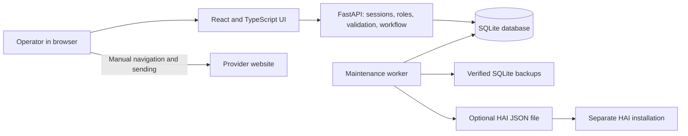

# Simbi Reach-Out

[](https://github.com/Robert-Velhorst/022-Simbi-Reach-out/actions/workflows/ci.yml)

**Project 022 — a locally hosted workspace for preparing, reviewing, and tracking personal outreach about services, exchanges, and networking.**

**Intended use:** Robert's personal tool for his own Simbi account, clarified on 2026-09-05 and reconfirmed on 2026-10-02. The release target is one owner and one personal workspace, not a shared service for independent teams. Existing team and deployment options are preserved, but multi-tenant signup, workspace switching, billing and expanded team administration are not personal-release requirements.

Simbi Reach-Out helps you keep track of whom you want to contact, why the contact is appropriate, what you plan to say, and what happened afterward. You enter authorized information, prepare a message from a reusable template, review it, and record the outcome. Your work is stored in a database on the computer or server where you run the application.

Sending is a separate human action. The app provides approved text to copy and a link to the provider's website. You decide whether to open that website, sign in there, and send the message yourself. Replies are entered manually too.

The application uses **React and TypeScript** in the browser, **FastAPI and Python** for the backend, and **SQLite** for storage. It includes a maintenance worker, operator commands, Docker deployment, a Windows standalone package builder, an ngrok launcher, and a file-based connector for HAI.

> **Current scope:** an assisted outreach application, not an official Simbi integration. It has no provider scraper, automatic login, form filler, message sender, inbox synchronization, or Simbi-credit management. No AI service or provider API key is needed. Older commits and the historical repository description refer to a previous automation project; this README describes the replacement application on `main`.

## Contents

- [Purpose and audience](#purpose-and-audience)
- [Features](#features)
- [Recover an unverified operational read](#recover-an-unverified-operational-read)
- [Verify a personal safety change](#verify-a-personal-safety-change)
- [Recover a damaged record-list read](#recover-a-damaged-record-list-read)
- [English and Dutch interface](#english-and-dutch-interface)
- [First use and daily workflow](#first-use-and-daily-workflow)
- [Roles and access](#roles-and-access)
- [Choose a deployment](#choose-a-deployment)
- [Get the source](#get-the-source)
- [Local Docker installation](#local-docker-installation)
- [Windows development installation](#windows-development-installation)
- [Windows standalone application](#windows-standalone-application)
- [Temporary remote access with ngrok](#temporary-remote-access-with-ngrok)
- [Hosted deployment with Docker and Caddy](#hosted-deployment-with-docker-and-caddy)
- [HAI integration](#hai-integration)
- [Configuration reference](#configuration-reference)
- [Data, privacy, and security](#data-privacy-and-security)
- [Maintenance and recovery](#maintenance-and-recovery)
- [Architecture and repository map](#architecture-and-repository-map)
- [API guide](#api-guide)
- [Verification and performance](#verification-and-performance)
- [Troubleshooting](#troubleshooting)
- [Known limitations](#known-limitations)
- [Personal-release acceptance checklist](#personal-release-acceptance-checklist)
- [Contributing and documentation](#contributing-and-documentation)
- [License and ownership](#license-and-ownership)

## Purpose and audience

The intended operator is the repository owner organizing his own service-related conversations and exchanges through his own Simbi account. Developers can maintain the personal workflow and its deployment tools. Existing local team roles are an optional capability, not the intended operating model or a claim of shared-service readiness.

For example, you might have permission to respond to someone's request for project help. You record the request's source, create a campaign describing the exchange, prepare a personalized draft, review it, and manually contact the person. Later, you record their reply or a decision to stop. The app organizes this process; it does not find people for you or establish permission to contact them.

“Local” means the application runs on your computer or a server you control. Its interface opens in a normal web browser. A hosted installation stores information on that host, not on each visitor's computer. Once installed, local preparation and record keeping do not require an external AI or messaging service. Opening provider pages, downloading dependencies, and using ngrok require connectivity.

## Features

| Area | Implemented behavior |
|---|---|
| Dashboard | Workflow counts, items needing attention, campaign progress, reminders, and recent activity from stored records. Safety indicators require a verified overview read; they describe local/manual mode, acknowledgement and the stop state, not certified backup/privacy readiness. All four remain visible at tested desktop, medium and mobile widths. |
| Campaigns | Purpose, outreach context, description, daily handoff limit, cooldown, and active/paused/archived status. |
| Prospects | Names, organizations, source links, provider labels, notes, contact handles, consent status, search, and CSV-text import. |
| Templates | Reusable message bodies with explicit placeholders and deterministic text substitution. |
| Review queue | Create drafts, save against the viewed version, compare conflicting/uncertain results, and warn before leaving unresolved edits. Current-row selection and cancelled leave choices preserve text/checks; pending requests cannot automatically replay navigation. Inspect quality signals, approve/decline and prepare manual handoffs. Changed approved text requires new review; no autosave. |
| Outcomes and replies | Record sent, not sent, or ambiguous outcomes and manually enter replies. A prepared handoff does not prove delivery. |
| Reminders | Manual decision reminders with native date/time entry or an explicitly selected, validated text option. Same-reference recovery checks an uncertain creation without duplicating an unchanged reminder; the server receipt is durable, the browser reference is RAM-only. Worker-generated reminders follow seven days without a reply. No automatic follow-up messages or external notifications. |
| Reports | Current draft-state counts and campaign average quality, based on local records. No provider open rates or delivery analytics. |
| Audit log | Local who/what/when history. New suppression/provider/review details are minimized. A separate owner-confirmed historical operation removes known old duplicate fields without deleting events or operational restrictions. Events do not prove delivery. |
| Safety controls | Compliance acknowledgement, provider-host matching, opt-out recording, and a stop for new approvals/handoffs. Acknowledgement, assisted provider-link and stop changes require matching confirmations and follow-up state before claiming success. |
| Settings | Verified initial workspace/provider/member read, refresh and an explicit retry after an unverified read. The three safety actions share repeated-submission protection and show pending/uncertain state beside the stop control; uncertainty disables them until a successful explicit recovery read. Existing password/privacy/retirement controls retain their separate confirmation and recovery rules. |
| Team | Local owner, admin, editor, and viewer accounts. |
| Data operations | Workspace JSON export, diagnostics, owner-only paged contact/history and campaign/template cleanup, historical known-field audit minimization, and separate sole-owner installation retirement. Exact confirmations, verified recovery copies, safe retry and older-receipt lookup; CLI backup/restore/reconciliation/limited operational cleanup. |
| Deployment | Docker, Windows package building, temporary ngrok access, Caddy TLS deployment, and optional HAI feed export. |
| Languages | English/Dutch interface selection before sign-in and in the application, including forms, safety instructions, statuses, notices and dates. Stored content is not translated. |

Records start empty. The app does not populate live contacts, import a provider account, or fabricate activity. The image in `docs/design/` is a design concept, not a current application screenshot or evidence of real user data.

Keyboard access: the first Tab reveals **Skip to main content**; Enter skips repeated navigation. At mobile widths, **Open navigation** opens a named dialog with Help, contained Tab/Shift+Tab, Escape and restored focus. Selecting a route focuses its content; resizing to desktop closes the drawer. Populated queue/prospect/report/audit tables are named keyboard-focusable regions: use arrow keys to reveal overflowing columns. Confirmed Stop contact returns focus to the Prospects region because the original button becomes disabled; cancelling restores that button. Selected first-owner setup, local sign-in/out and compliance paths, plus the signed-in owner's bounded local record-keeping path, are tested with sequential keyboard navigation. Setup/sign-in/compliance recover disabled-submitter focus only if it fell to the page body in a foreground document; they never reclaim another control/window's focus. This does not autosave edits or send messages. See [keyboard controls and exact tested scope](docs/ACCESSIBILITY.md), including recovery, screen-reader, device and broader action limits.

With unresolved draft edits/results, navigation opens the leave dialog instead of replacing the editor. Cancelling returns focus to editing and releases the dialog's scroll lock; overlapping navigation/warning dialogs keep the lock until the last owned dialog closes. Clean navigation still focuses its destination normally. See [draft leave choices](docs/DRAFT_SAVING.md#before-leaving-an-unresolved-draft).

Loading is separate from an empty result: the ten operational screens, including Settings, show pending reads and retryable failures, not a claim that your records have disappeared. During refresh, retained records are labelled as the last loaded snapshot. A failed report refresh keeps the previous figures with an out-of-date warning; unknown figures are not invented as zeros.

The shared request deadline is **20 seconds for the complete response**, including its body. Broken, empty, HTML, truncated or primitive JSON responses cannot count as success; seven core creation/import confirmations receive additional checks. Draft confirmations must match your chosen campaign, contact and template; replies must match the conversation and entered text; reminders must match their targets, title and due time. Every keyed creation also requires its matching retry reference and a boolean replay indicator. A wrong confirmation is uncertain even when the server really saved the record.

Campaign, prospect, CSV, template, draft preparation, reply and reminder forms block repeated submission and Close/Cancel/Escape/backdrop dismissal while waiting, retain inputs after an unverified result, and remain keyboard-scrollable with disabled controls. Pending focus never reclaims another control or background window. The client never retries automatically.

For these seven creation flows, first use [same-reference recovery](#recover-an-uncertain-local-creation) while the current page remains open. **Do not browser-reload or navigate away first:** that can lose the reference and fields. After losing them, inspect matching saved records before creating again; an inconclusive lookup is not proof that nothing committed. Existing draft-save/handoff/privacy/retirement recovery has its own controls. These guards are not universal route/reload protection, autosave, duplicate protection across fresh keys or rollback. See [the complete recovery guide](docs/REQUEST_RECOVERY.md).

### Recover a damaged record-list read

Campaigns, Prospects, Templates, Review queue, Replies, Reminders and Audit log reject a damaged record list before using its rows. A warning offers **Retry** / **Opnieuw proberen**. Use that in-page control to request the records again; do not reload the browser or resubmit a creation form for this purpose. Last successfully loaded rows, when available, remain visible with an out-of-date warning. A first failed load does not mean the workspace is empty.

This is a **read**, not undo, rollback or proof that a previous save failed. An uncertain creation still needs its own [same-reference recovery](#recover-an-uncertain-local-creation). Keep unsaved values and retry references: the Review queue's existing leave guard may ask before read Retry discards unresolved editor state; cancel that choice if you need to keep your working text. These controls do not provide durable autosave or crash recovery.

Developers: the guard checks consumed field types and unique safe record IDs on these seven GET pages, not every field's meaning or every API endpoint. It preserves legitimate deleted-template links, nullable labels/targets, extra fields and historical date/status strings; it does not repair data or prove authenticity/provider permission. Pagination metadata and action-specific confirmation checks remain separate. See [the exact read contract](docs/REQUEST_RECOVERY.md#core-paged-record-reads).

### Recover an unverified operational read

Dashboard, Reports and Settings reject a damaged successful response before using it. **Retry** / **Opnieuw proberen** requests the information again; startup/session failures use **Try again** / **Opnieuw proberen**. These are read controls, not instructions to repeat a save. A failed initial Settings read does not mean that your settings are normal or that your workspace is empty. Administrative settings controls remain unavailable until the read is verified. A failed refresh can retain the last loaded information with a warning that it may be out of date.

If a settings change reached the server but its follow-up read cannot be verified, **the earlier change may already be saved**. Keep the current page and use read Retry to inspect the result before deciding whether another change is needed. The app does not automatically repeat that write or display a false success. Recovery receipts retain their separate contracts, but not every working input survives every read. The provider-link form can reset to a returned Settings URL, even when that readback contradicts the preceding write confirmation. This is an input-recovery limitation, not autosave or crash/reload recovery. Password changes, privacy cleanup, audit minimization, retirement and handoff outcomes keep their own action-specific safeguards.

Dashboard safety indicators describe only the verified current local/manual mode, compliance acknowledgement and emergency stop. They do **not** certify that a backup exists, restore works, privacy obligations are fulfilled or Simbi permits a particular contact. Use the [backup and restore procedure](#backup-and-restore) and review the actual source/permission separately.

Developers: six additional consumed GET contracts cover `/api/auth/status`, `/api/me`, `/api/settings`, `/api/overview`, `/api/reports/summary` and `/api/handoffs`. They preserve actual SQLite boolean representations, nullable empty-report aggregates, extra fields and blocked historical handoff links. Active openable handoffs require structurally safe HTTPS URLs; the backend still decides configured-host matching, authorization and approved-content freshness. These guards do not validate every API semantic or prove authenticity. See [the exact operational read and recovery guide](docs/OPERATIONAL_READS.md).

### Verify a personal safety change

In **Settings & safety**, the compliance acknowledgement, assisted provider link and emergency stop/resume are three separate local changes. A successful network response alone is not enough: the confirmation must match the requested change, and the subsequent Settings read must agree. Acknowledgement and stop changes also check the current local account. Saving a provider link never verifies your Simbi account or permission to contact someone.

While any of these three changes is pending, all three controls are disabled and another submission is refused. The stop panel shows a waiting notice rather than its old normal-state claim. Checked acknowledgement choices stay mounted while waiting. The provider-link form can be recreated when readback changes its loaded saved URL; it may replace the original typed link even if that readback produces an uncertain result. Original provider input is not guaranteed through readback/recovery. This is not a lock on every Settings action or every browser tab.

If the confirmation is damaged or follow-up state disagrees, **the change may already have been saved**. The stop panel shows a nearby warning instead of its old green claim, and the three safety controls remain disabled. Use **Refresh** / **Vernieuwen**, or **Retry** / **Opnieuw proberen** after a failed read, to inspect the actual current values. A failed or superseded read does not unlock another change. These recovery reads do not repeat the preceding write.

After a successful read, decide whether another change is needed. It would be a new audited change, not recovery of the lost confirmation. The uncertainty flag is held only in the current page's memory: navigation/reload loses it, and a fresh Settings read establishes current state rather than reconstructing the lost confirmation. No automatic retry, durable browser working copy, cross-tab duplicate guarantee or rollback is added. Password changes, privacy cleanup, audit minimization and retirement keep their own recovery procedures. See the [operator and developer safety-change guide](docs/SAFETY_MUTATIONS.md).

## English and Dutch interface

Choose **English** or **Nederlands** in the language selector on setup/sign-in screens or the application header. English is the default. The browser remembers only this preference locally; it is not an account setting or a cloud sync feature. Changing language changes the interface immediately without rewriting names, notes, campaigns, templates, drafts, approved messages, replies or exports. Existing unsaved inputs and review checks remain tied to the same record. Another tab's language change is applied without resetting an open form.

The interface translates navigation, setup/sign-in, resource forms, review checks, handoff warnings and outcomes, reminders/replies, reports, audit labels, settings, help, loading/empty/error notices and known message-quality signals. Recognized stored dates use English (`en-GB`) or Dutch (`nl-NL`) formatting in the browser's time zone; unsupported nonempty dates show a translated warning with their original text. Empty dates show **Not set** / **Niet ingesteld**. See [stored dates and ordering](#enter-a-reminder-date-and-time) for the exact interpretation limits. API field names, status values, CSV headers and the template fields `{name}`, `{organization}`, `{campaign}`, `{notes}` stay unchanged.

This is **interface localization, not automatic message translation**. The starter template is English; create a new Dutch template or edit the resulting draft text if appropriate. Existing reusable templates have no editing workflow. Unknown technical diagnostics retain their original detail with a Dutch explanation rather than being silently omitted. CLI commands, generated system record content, external provider pages and linked documentation are not translated by the selector. If browser storage is denied, switching still works for the current tab but may not survive reload. See the [language maintenance guide](docs/LOCALIZATION.md) for developer contracts and verification limits.

## First use and daily workflow

### Set up the workspace

1. Start the application using a method below and open its local URL.
2. Create the first owner with the operator setup token when requested, your name, workspace name, email, and a password of at least 12 characters. This is an application account; use a password distinct from your provider account. There is no default login.
3. Open **Settings → Compliance acknowledgement**. Review the provider's current rules and confirm the four statements about source authorization, manual operation, and handling opt-outs.
4. Check **Provider handoff** in Settings. Initial setup creates a Simbi base link at `https://simbi.com/`. Saving a link configures URL validation; it does not authenticate with or verify an account at the provider.
5. For your personal workspace, keep using the owner account. Optional local team members can be added if you deliberately need them.

Complete first-owner setup while access is restricted to you. In production, the setup form also requires the operator's `SIMBI_SETUP_TOKEN` (a unique random secret of 32–200 characters). With no configured token, production setup refuses every request; there is no default token. Setup is serialized so concurrent requests cannot create two owners. Remove the token from the runtime environment after bootstrap and keep the owner password in a password manager.

With the keyboard, use Tab/Shift+Tab between controls, native selection keys for language, Space for the four acknowledgement checkboxes and Enter on the submitting button. Required/short-password validation focuses the invalid field without sending a request. A rejected token/password keeps entered fields for correction; it is not a successful setup/login. Compliance shows **Recording acknowledgement…** (**Bevestiging vastleggen…**) and disables its choices/button through save/readback; repeated pending submissions are refused synchronously. Rejection preserves choices for a deliberate retry, while an uncertain response does not establish that nothing committed. After a setup/sign-in/compliance button is re-enabled, lost page-body focus is restored only when you have not moved to another control or window. These safeguards do not perform provider authentication or establish that the operator actually reviewed current policy.

Use **Settings → Change password** to replace your application password. You must enter the current password; a successful change revokes every session for that user and requires sign-in again. If you forgot the local owner's password, use the [offline recovery procedure](#forgotten-local-owner-password). Neither operation changes your Simbi account password.

### Prepare and track a conversation

1. **Create a campaign.** Describe the exchange and why contact is appropriate. Defaults are 10 prepared handoffs per day and a 1,440-minute (24-hour) cooldown. Accepted ranges are 1–50 handoffs and 60–43,200 minutes.
2. **Add a prospect.** Supply a name, an HTTPS source link, context, and the consent status you actually know. An `unknown` or `contextual` status is recorded information, not an automated determination of permission.
3. **Create a template.** Supported body placeholders are `{name}`, `{organization}`, `{campaign}`, and `{notes}`. Unsupported fields are rejected. Subjects are copied as entered; substitution applies to the body.
4. **Create a draft in the review queue.** Select a campaign, prospect, and template. The database permits one draft per campaign/prospect pair.
5. **Review and edit.** Check the source and recipient context, then save explicitly. Another tab's newer version blocks a stale save. Check saved version opens a read-only comparison: explicitly discard local edits, or keep them against the compared version and press Save separately; a later change still blocks that save. Interrupted/unverifiable responses keep current-editor text; accepting identical verified saved text does not save twice. Before another draft/page, preparation, app/history navigation or sign-out replaces unresolved editor state, **Leave this draft?** offers **Keep editing** or an explicit discard without saving/deleting the stored draft. Pending continuation is disabled and never automatically replays when the request finishes. Reload/close warnings are browser-controlled and best effort; unsaved text is RAM-only, not crash recovery. See [draft saving, leave choices and recovery](docs/DRAFT_SAVING.md). The 0–100 quality score flags missing personalization, short/long text, promotional wording, and missing decline language using a small English/Dutch phrase heuristic. It is not language understanding, AI, permission to send, or a success probability.
6. **Approve.** Confirm authorized source, personalized message, policy review, and understanding that sending is manual. Unsaved edits block approval; saving resets the checks. The backend binds approval to the exact saved subject/body and rejects a stale view if another editor changed it. Owner/admin/editor roles can approve their own drafts; a second reviewer is not enforced.
7. **Activate the campaign and prepare the handoff.** The backend checks approval, campaign status, workspace pause, prospect status, provider hostname, limits, cooldown, and an idempotency key. Daily limits count prepared handoffs on the UTC date, including later cancellations, rather than confirmed sends.
8. **Perform any external action yourself.** Copy the approved text, open the provider if appropriate, and send manually there. Copy/open recheck the current handoff permission. Opening navigates the same browser tab; use Back to return and recover the handoff. A page refresh does not imply a send or prepare a second handoff.
9. **Record the result.** Choose **Sent** after checking the provider, **Not sent** when you did not send, or **Ambiguous** when uncertain. Verify ambiguous results before retrying or resolving them.
10. **Record the reply or next decision.** Enter the necessary reply/summary and manage reminders. To record an objection, use **Prospects → Stop contact**, enter the reason, and confirm. This blocks further outreach, cancels open reminders/pending handoffs, and retains the restriction even if the prospect is later deleted and re-imported. A later stale outcome cannot overwrite the restriction or an already recorded reply.

### Enter a reminder date and time

Open **Reminders → New reminder**, select the conversation, enter a title and set **Due**. Native date/time entry is the default. If that control cannot be edited conveniently, select **Enter date and time as text** (Dutch: **Datum en tijd als tekst invoeren**). With the keyboard, reach the checkbox with Tab, select it with Space, then Tab to Due.

Enter exactly `YYYY-MM-DDTHH:mm`, for example `2027-11-02T07:58` for 2 November 2027 at 07:58. The `T`, four-digit year and 24-hour time are required in both languages; do not add a time-zone offset. The app interprets this in the browser's local time zone and stores the corresponding UTC timestamp. It rejects impossible dates such as 30 February, year zero and local times skipped by daylight-saving changes before making a request. The backend separately validates supplied dates and normalizes new reminder/reply timestamps to UTC with six fractional digits; existing history is not rewritten. This API storage format does not change the minute-based local entry format above. Validation errors preserve the open form and focus Due; an uncertain server response is a different situation and is not a guarantee that nothing was stored.

Switching entry mode or interface language preserves the text only while this form remains open, not after closing or reloading. Repeated daylight-saving times use JavaScript's local-time interpretation; there is no explicit time-zone or first/second-occurrence selector. Check the displayed due time before confirming. Creating a reminder schedules a local review item, never an automatic message.

Replies appear newest-first; reminders and Overview's reminder preview appear earliest-first. Sorting compares actual timezone-explicit times, including microseconds, so older UTC/offset spellings do not change the order. Supported stored syntax is a valid four-digit-year `YYYY-MM-DDTHH:mm:ss`, optionally followed by one-to-six fractional digits, with explicit `Z` or `±HH:MM` timezone. Both the written year and resulting UTC year must be 1–9999; whitespace, impossible calendars, missing seconds/timezones, excessive precision and UTC overflow are refused. Equal times use descending reply IDs or ascending reminder IDs. Overview's due count compares interpreted times against the existing whole-second server clock. Stored historical timestamps are not rewritten. Unsupported legacy values are placed after valid dates with the same ID directions and excluded from due counts—not silently repaired or removed.

The shared browser formatter now interprets only this supported syntax, without browser-specific string-date guessing. A recognized instant displays at minute precision in your browser's local time zone; server ordering and creation-confirmation equality still retain microseconds. A nonempty unsupported value stays visible as **Unrecognized date: original text** / **Onherkende datum: oorspronkelijke tekst**, with the original text escaped rather than treated as HTML. For example, `2026-02-30T12:00:00Z` is labelled unrecognized, not silently moved to March. Empty values keep Not set/Niet ingesteld. This labels uncertainty; it does not repair records, certify every date-bearing screen or prove that a server-assigned default reply time is truthful. See [the exact record/date contract](docs/CRITICAL_PATH.md#conversation-records-and-older-dates).

### Recover an uncertain local creation

Campaigns, contacts, templates, draft preparation, locally recorded replies and committed CSV imports now have the same practical recovery choice as reminders. If saving reports **Unconfirmed change**, the record may already exist. Keep the current page open and retain the original values. Its warning displays the action's random **retry reference**; this is local operational metadata, not a Simbi login or message-delivery receipt.

1. Submit explicitly again with the original values. The form reuses that reference; no automatic retry occurs.
2. If the original record is still unchanged, the server confirms the same result without another record or audit event. A matching verified confirmation clears the reference so a later deliberate creation receives a fresh one.
3. Changed values under an already committed reference are refused. A changed or removed original record is not recreated or restored; inspect its current state instead of bypassing the refusal. Reviewing/editing a draft after creation can make its old creation confirmation unavailable.

**Cancel clears the fields, not the unresolved reference.** Reopening the form on the same still-mounted page retains the reference; you must re-enter the original values. Contact creation and CSV import keep separate references. A reply retry can select its original conversation even if the first attempt already marked it replied; that does not permit a second reply. There is no reference-reset or saved-reference lookup control in the UI.

CSV preview is read-only and uses no reference. Recovery of a committed import returns its original inserted/duplicate counts from import history—not the number of contacts present now. It does not reimport contacts that were later removed or reapply restrictions. Changed or removed import history makes its confirmation unavailable.

Navigation, browser reload, sign-out, crash or tab closure can lose the reference and fields. There is no durable browser working copy. Another tab, user or fresh reference is a different attempt, even with identical text. After reference loss, inspect saved records before creating again; one page's absence is not proof that a record was never saved or later changed/deleted.

To resume a genuinely new creation after a refusal, first establish the old attempt's saved outcome using its record/import history and respect retained do-not-contact restrictions. If that remains unclear, stop and investigate rather than clearing the reference to guess. Once the old attempt is resolved, you may deliberately leave and reopen the page for a different new creation; follow any separate draft-leave warning. This ends the RAM-only attempt, not its server receipt, and provides no fresh-key duplicate protection or way around capacity/safety refusals.

The server stores minimized retry metadata in SQLite without automatic expiry. The six operations above share a 10,000-reference limit per workspace/user; reminders have a separate 10,000-reference limit. At capacity, new keyed creations are refused while existing reference checks remain available. Do not omit/change the key, delete receipts or restore an old database to bypass a refusal. See [the developer contract, deletion tombstones and backup limits](docs/REQUEST_RECOVERY.md#durable-core-creation-confirmations).

### Recover an uncertain reminder creation

If saving reports **Unconfirmed change**, the reminder may already exist. Keep the Reminders page open. The warning shows a **Reminder retry reference** identifying that attempt—not a Simbi message or account credential.

1. Keep the original conversation, title and due time. Submit explicitly again with those original values; the form reuses its reference. It never retries automatically.
2. If the original unchanged reminder exists, the server returns its original confirmation; the form closes without another reminder or audit event. A verified confirmation clears that reference so a later deliberate creation receives a new one.
3. Changed values under an already committed reference are refused, not treated as a new reminder. Completed, changed, cancelled or deleted original records are not reopened or recreated by retry. Inspect the current state rather than trying to bypass the refusal.

After uncertainty, **Cancel** closes the form and loses its field values. The reference survives reopening **only while that Reminders page remains mounted**; re-enter the original values to retry. Navigation, reload, sign-out, crash or closing the tab can lose both fields and reference. There is no autosave, durable browser copy or UI reference-lookup/reset control. After losing the reference, inspect saved reminders before creating again; the open-reminder view alone cannot establish absence of a completed/deleted record. Another tab's new reference or another user's request is a different attempt, even with identical text.

The server keeps minimized retry metadata in SQLite without automatic expiry, including a tombstone when a reminder is removed. At 10,000 references per workspace/user, new keyed creations are refused; existing same-reference checks remain available. Do not delete the database, restore old data or omit the key to bypass this limit. See [the developer contract and privacy/backup limits](docs/REQUEST_RECOVERY.md#durable-reminder-creation-receipts).

### Draft states

| State | Meaning |
|---|---|
| `needs_review` | New or edited text needs human review. |
| `approved` | Current text passed review; no send is implied. |
| `handoff_created` | A handoff was prepared; its external outcome remains to be recorded. |
| `sent` | An operator recorded a manual send. |
| `ambiguous` | The operator could not confirm the external outcome. |
| `replied` | A reply was manually recorded. |
| `declined` | Review declined the draft; the current interface has no reopen action. |
| `suppressed` | The prospect was marked to stop contact. |

The common path is `needs_review → approved → handoff_created → sent → replied`. Cancelling a handoff returns its draft to `approved`; editing approved text returns it to `needs_review`. Historical handoffs persist. The domain transition map is not itself an API: only implemented endpoints and interface actions are available.

### CSV intake

In Prospects, paste CSV text, preview it, correct errors, and explicitly commit. Required columns are `name` and `source_url`; optional columns are `organization`, `provider`, `contact_handle`, `notes`, and `consent_status`.

Illustrative input only—replace it with authorized records:

```csv
name,source_url,organization,provider,contact_handle,notes,consent_status
Example Person,https://example.org/request/example,Example Group,example,,Context to verify before contact,unknown
```

The default text limit is 1 MiB of UTF-8 data, with a separate 5,000-row maximum. Invalid rows block commitment; preview returns at most 50 errors. A successful import inserts in one transaction and skips duplicate content by workspace/provider/source URL. The safety exception is an imported `opted_out` or `blocked` restriction: it is persisted and applied even to an existing duplicate. Other fields are not updated; no source URL is fetched and no consent is inferred. Status values are `unknown`, `contextual`, `consented`, `opted_out`, and `blocked`. Existing durable restrictions override a newly claimed consent status. URL normalization covers host case, default HTTPS port and fragments; it cannot determine that two genuinely different provider URLs identify the same person.

## Roles and access

| Capability | Owner / admin | Editor | Viewer |
|---|---|---|---|
| Read workspace records, reports, and audit events | Yes | Yes | Yes |
| Create campaigns, prospects, templates, and drafts | Yes | Yes | No |
| Review, prepare handoffs, record outcomes/replies, manage reminders and opt-outs | Yes | Yes | No |
| Compliance, provider settings, workspace pause/resume | Yes | No | No |
| Add local members | Yes | No | No |
| JSON export, support data | Yes | No | No |

Personal cleanup/retention preferences and historical audit minimization/receipts are **owner-only**; admins can export diagnostics/workspace records but cannot perform these changes or read their private operation receipts. Direct API deletion no longer bypasses the preview/password/backup path. Normal audit-log reading is still available to workspace members.

The backend enforces access even where a restricted role still sees a control in the interface. The first account is owner; new members can be admin, editor, or viewer. Email is a login identifier, not an invitation service. Authenticated password change and offline personal-owner recovery are available. Member removal and role editing are not exposed workflows.

The schema supports workspace memberships and isolation, but shipped onboarding creates one workspace. There is no self-service workspace selector or organization provisioning. CLI commands use the filesystem authority of the person running them and do not use browser roles.

## Choose a deployment

For the confirmed personal-use target, the Windows standalone application is the primary local option on this workspace's Windows computer. Keep it on loopback unless you deliberately choose remote access. Docker remains an alternative; ngrok, public-domain hosting and HAI are optional and need their respective acceptance checks only when used. Personal use does not require a public website or additional team accounts.

| Mode | Requirements | Default address | Worker | Automatic backups by default |
|---|---|---|---|---|
| Local Docker | Docker with Compose | `http://127.0.0.1:8000` | Separate Compose service | No |
| Windows development | Python, Node, pnpm, PowerShell 7.2+ | UI `:5173`, API `:8000`, on loopback | Supervised by launcher | No, unless enabled |
| Windows standalone | Built package and browser | `http://127.0.0.1:8765` | Included in executable | Yes, while running |
| ngrok | Source installation, compiled UI, authenticated ngrok, PowerShell 7.2+ | Reported HTTPS URL | Supervised by launcher | Yes, while running |
| Docker + Caddy | Docker host, domain, available TLS ports | Your HTTPS domain | Separate Compose service | Yes, while running |

`127.0.0.1` means the computer on which the browser is running. Local URLs are not remotely accessible without deliberate deployment. ngrok exposes an app on your computer; it does not move it into a cloud server or keep it running during sleep.

## Get the source

For Docker, development, or package building, install Git and clone `main`:

```powershell
git clone https://github.com/Robert-Velhorst/022-Simbi-Reach-out.git
Set-Location 022-Simbi-Reach-out
```

Commands below run from the repository root unless stated otherwise. On Linux/macOS, use `cd`, `.venv/bin/python`, and `pnpm` in place of their Windows equivalents. The `.ps1` scripts target Windows.

## Local Docker installation

Start Docker Desktop with Linux-container support, or a Docker Engine host with Compose, then run:

```powershell
docker compose up --build
```

Open [the local application](http://127.0.0.1:8000). Docker builds the frontend and installs backend dependencies; host Python/Node installations are unnecessary. The default Compose file starts app and worker and publishes the app only on loopback.

```powershell
docker compose ps
docker compose logs --tail 100 app worker
docker compose stop
docker compose start
```

SQLite is stored at `/app/data/simbi.db` in the `simbi-data` named volume, normally prefixed by Docker's project name. Stopping/recreating containers preserves that volume. Removing it removes your database.

Local Compose does not enable automatic backups or mount a separate backup volume. A manual backup can use its existing persistent data volume:

```powershell
docker compose exec app python -m app.cli backup --destination /app/data/backups
```

To enable automatic local backups, configure the worker with `SIMBI_AUTO_BACKUP=true` and `SIMBI_BACKUP_PATH=/app/data/backups`, then recreate it. Editing `.env.example` alone does not configure that service. Also keep a protected backup outside the Docker volume.

## Windows development installation

### Install dependencies

Use Python 3.13, Node.js 24, and pnpm 11 to match CI; CI pins pnpm 11.16.0. The Python manifest declares 3.11 or later, but every newer interpreter/packaging combination is not necessarily tested. Docker is additionally required for the full verification script.

```powershell
python -m venv .venv
.\.venv\Scripts\python.exe -m pip install -e ".[dev]"
pnpm.cmd --dir frontend install --frozen-lockfile
```

Defaults work without an environment-file copy. Python reads process environment variables; it does not automatically load `.env`. See [Configuration reference](#configuration-reference).

### Start development

The convenience script installs dependencies and starts API and Vite servers:

```powershell
.\scripts\dev.ps1
```

Open [the development interface](http://127.0.0.1:5173). Vite forwards `/api` to `http://127.0.0.1:8000`. The launcher supervises frontend, API, and maintenance together, with matching child-only environment settings. A required process exiting stops the other owned processes. Do not start a second worker for this database. The scripts require PowerShell 7.2 or newer (`pwsh`), not Windows PowerShell 5.1.

If PowerShell selects a blocked `pnpm.ps1` shim, use these explicit commands in separate terminals after installing dependencies:

```powershell
# Terminal 1: API
.\.venv\Scripts\python.exe -m uvicorn app.main:app --app-dir backend --host 127.0.0.1 --port 8000 --reload
```

```powershell
# Terminal 2: frontend
pnpm.cmd --dir frontend dev
```

```powershell
# Terminal 3: maintenance, when needed
.\.venv\Scripts\python.exe -m app.worker --interval 300
```

Stop each with Ctrl+C. App and worker must use the same database settings. Migrations run at startup; the default source database is `data/simbi.db` under the repository. Runtime data, dependencies, and builds are ignored by Git.

### Serve compiled assets locally

For a local server without Vite:

```powershell
pnpm.cmd --dir frontend build
$env:SIMBI_FRONTEND_ORIGIN = 'http://127.0.0.1:8000'
.\.venv\Scripts\python.exe -m uvicorn app.main:app --app-dir backend --host 127.0.0.1 --port 8000
```

The backend serves `frontend/dist` when it exists at startup. Restart if it was absent when the server started. Maintenance remains separate. `app.server` binds `0.0.0.0` for container ingress; use the explicit loopback command above for native local serving.

## Windows standalone application

### Start using a verified package (no developer tools needed)

1. Open a successful [main-branch CI run](https://github.com/Robert-Velhorst/022-Simbi-Reach-out/actions/workflows/ci.yml?query=branch%3Amain), check its exact revision and successful Windows job, and download the `simbi-reach-out-windows` artifact. GitHub may require sign-in; CI artifacts expire and are not permanent signed releases.
2. Extract the entire archive together. Locate `Simbi Reach-Out.exe` and keep its `_internal` folder alongside it; do not copy only the executable.
3. Double-click the executable and keep its console open. It opens the local browser application on loopback port 8765. Create your local owner and follow [first use](#first-use-and-daily-workflow); no Simbi login is performed by this application.
4. Your standalone database/backups are in the separate LOCALAPPDATA location described below, not the downloaded folder. Before replacing an existing package, make and verify a backup; do not delete or restore over a different runtime's data.

A successful CI package smoke is not fresh-machine or Robert's installed-runtime acceptance. The instructions below cover building, runtime paths, ports, shutdown and diagnostics in detail.

### Build and keep the package together

On Windows, install the development prerequisites and create `.venv`, then run:

```powershell
.\scripts\build-windows.ps1
& '.\dist\Simbi Reach-Out\Simbi Reach-Out.exe'
```

PyInstaller creates `dist/Simbi Reach-Out/` with the executable, Python runtime, libraries, migrations, and compiled UI. Keep **the entire folder**, including `_internal`, not just the executable. For the owner's personal installation, moving a package to another compatible Windows computer needs no Python, Node, pnpm or Docker there. This packaging instruction does not grant general redistribution permission; see [license and ownership](#license-and-ownership).

The preserved [legacy Selenium archive](legacy/README.md) is separate from the supported application and is excluded from Docker and Windows packages. It must not be used as an account integration or daily launcher.

Successful Windows [Actions runs](https://github.com/Robert-Velhorst/022-Simbi-Reach-out/actions/workflows/ci.yml) upload a `simbi-reach-out-windows` artifact. Download it while GitHub retains it; sign-in may be required. There is no signed installer, automatic updater, or Windows service. Windows CI builds the package and runs an isolated executable smoke test covering readiness, packaged frontend serving, automatic backup creation, shutdown, and port release. A maintenance failure stops the standalone server rather than continuing with misleading readiness.

### Run and store data

Double-click `Simbi Reach-Out.exe`. It opens the default browser at `http://127.0.0.1:8765`. Keep the console open and press Ctrl+C there to stop. The integrated worker runs every five minutes and enables automatic backups by default.

- Database: `%LOCALAPPDATA%\Simbi Reach-Out\data\simbi.db`
- Backups: `%LOCALAPPDATA%\Simbi Reach-Out\backups`
- Support bundles generated against that database: its `data\support-bundles` folder

These paths differ from the source checkout. Replacing the package folder does not automatically migrate data from another installation. For a port conflict, set `SIMBI_WINDOWS_PORT` to an unused port from 1024–65535 before starting. Launch from a clean environment when switching between local and hosted modes because existing process settings are inherited.

### Maintain the Windows package

The current source supports operator commands directly through the executable. Obtain a current verified Windows package, or rebuild it if you maintain the source; older downloaded artifacts may only launch the app. Open PowerShell in the folder containing `Simbi Reach-Out.exe` and run:

```powershell
& '.\Simbi Reach-Out.exe' --help
& '.\Simbi Reach-Out.exe' doctor
& '.\Simbi Reach-Out.exe' backup
& '.\Simbi Reach-Out.exe' support-bundle
```

With no arguments, the executable starts the app normally. Commands use the same standalone data location and inherited overrides as the app and then exit without starting a web server. To restore, stop the app first, choose an existing backup, and run `& '.\Simbi Reach-Out.exe' restore 'C:\SimbiBackups\actual-backup.db' --confirm`. The [restore safeguards](#backup-and-restore) apply. A command does not require Python or the source checkout.

## Temporary remote access with ngrok

ngrok makes the app running on your Windows computer reachable through an HTTPS tunnel. The computer must remain on, awake, and connected. ngrok is a separate service with its own account, configuration, terms, and possible charges.

Before launching:

1. Install source dependencies and build with `pnpm.cmd --dir frontend build`.
2. Complete owner setup locally against the database to expose, then stop that API.
3. Install a real authenticated ngrok executable on `PATH`. A zero-byte WindowsApps alias is insufficient.
4. Choose an unused origin port. The launcher refuses occupied ports before starting a tunnel. It identifies its own HTTPS tunnel from that ngrok process's JSON startup logs and exact loopback upstream; it does not select an arbitrary tunnel from the shared port-4040 API.

From a fresh PowerShell window:

```powershell
.\scripts\start-ngrok.ps1 -Port 8000
```

The launcher configures production mode, exact public origin/hostname, secure cookies, loopback proxy trust, backups, and required maintenance in its child processes. It waits for local app/worker readiness using the public host header, then opens the reported HTTPS URL unless `-NoBrowser` is supplied. This is not an independent public-edge/TLS acceptance test. Cleanup stops only its owned app, worker, and ngrok process trees. The tunnel exposes Simbi, not HAI.

**The launcher includes maintenance.** Supply custom database/backup/HAI settings in the calling environment before launch; both child processes inherit them consistently. Do not run another worker against the same database. An OS lock rejects duplicate workers. Closing the launcher stops maintenance; backups and feed refresh do not continue while the computer sleeps or the app is stopped.

The public URL is an Internet entry point protected by the application's login, not a secret that replaces authentication. This launcher is for supervised access; it is not a service manager or verified unattended cloud deployment.

## Hosted deployment with Docker and Caddy

Production Compose provides a Caddy HTTPS edge, app, worker, persistent storage, resource limits, and rotated logs. Prepare a Docker host, DNS for your domain, and ports 80/443 available to Caddy. Bootstrap the owner against the production database volume with access restricted to you before opening public ingress.

```powershell
Copy-Item .env.production.example .env.production
# Edit .env.production: set your domain and a unique random SIMBI_SETUP_TOKEN.
docker compose --env-file .env.production -f compose.production.yaml config --quiet
docker compose --env-file .env.production -f compose.production.yaml up -d --build
```

Open your configured HTTPS domain and verify `/api/health/ready`. Keep ingress restricted during bootstrap, enter your configured setup token, and create the owner. Missing or incorrect tokens are rejected. Generate a high-entropy token with a password manager; do not use a sample value from documentation. After setup, remove the token from `.env.production` and recreate the app service. Protect that untracked file and never commit it.

Deployment properties:

- Only Caddy publishes host ports. App and worker use a dedicated bridge network. It is not an `internal: true` network or a blanket outbound-network block.
- App/worker run non-root, with read-only filesystems, 64 MiB temporary filesystems, dropped capabilities, and no privilege escalation. Each is capped at 1 CPU and 512 MiB memory; these are limits, not measured idle requirements.
- Volumes persist SQLite, backups, the optional private HAI feed, and Caddy state. App and worker share SQLite. The optional container HAI path is `/app/hai/simbi.json`; its volume is writable by the non-root app user and is not published over HTTP.
- The fixed subnet is `172.30.0.0/24`; Caddy is trusted at `172.30.0.3`. If it conflicts with your network, change the subnet, addresses, and proxy trust together.
- The worker cycles every 300 seconds. Daily backups and 30-day backup retention are enabled by default while it runs. Health requires the singleton worker lock and a successful cycle no older than the configured interval plus 60 seconds, with no later failure. App readiness also checks maintenance in supervised/production modes. Initial HAI export waits for first-owner setup; a database with multiple workspaces needs explicit export selection and is not silently merged.
- `SIMBI_IMAGE_TAG` names the locally built image. No published image registry or managed hosting is implied.

```powershell
docker compose --env-file .env.production -f compose.production.yaml ps
docker compose --env-file .env.production -f compose.production.yaml logs --tail 100 app worker caddy
docker compose --env-file .env.production -f compose.production.yaml stop
```

The shipped production Compose file mounts the private `simbi-hai` volume at `/app/hai` for app/worker and forwards `SIMBI_HAI_FEED_PATH` and `SIMBI_HAI_INCLUDE_CONTENT`. Export stays disabled while the feed path is empty. To deliberately enable it, configure `/app/hai/simbi.json` in `.env.production`, keep content inclusion off unless explicitly needed, validate configuration and recreate app/worker. Receiving-side HAI setup and acceptance remain separate; see [HAI integration](#hai-integration).

## HAI integration

HAI is separate software. Simbi writes a JSON file for its `generic_json_feed` ingestion contract. The export grants no Simbi session, provider credential, or send authority and does not synchronize changes back to Simbi.

After workspace setup, export from an installed source checkout:

```powershell
.\.venv\Scripts\python.exe -m app.cli hai-export 'C:\path\to\hai\data\phase2\feeds\simbi.json'
```

Replace the example path with the folder HAI reads. A `.json` suffix is required; parent directories are created as needed. Use `--workspace-id ID` when the database has multiple workspaces. Without it, the exporter requires exactly one workspace.

Configure the receiving HAI installation:

```text
HAI_PHASE2_FEEDS_DIR=C:\path\to\hai\data\phase2\feeds
HAI_PHASE2_FEED_FILES=simbi.json
```

For periodic source-installation export, set variables before starting the worker:

```powershell
$env:SIMBI_HAI_FEED_PATH = 'C:\path\to\hai\data\phase2\feeds\simbi.json'
$env:SIMBI_HAI_INCLUDE_CONTENT = 'false'
.\.venv\Scripts\python.exe -m app.worker --interval 300
```

The standalone executable can inherit these settings for its integrated worker. Automatic export has no workspace-selection setting, so it requires a single-workspace database. Use explicitly scoped CLI exports for multiple workspaces.

### Contract and privacy

The JSON object has `cursor` and `items`. Each item supplies an external ID, campaign-derived thread ID, title, content, source URI, timestamp, provider label, project key, and metadata with `reviewRequired: true` and `automaticSendingAllowed: false`.

- The snapshot includes up to 500 drafts in `needs_review`, `approved`, `handoff_created`, or `ambiguous`, ordered by update time and ID. It is not a full history export.
- Default content includes campaign name, state, quality score, safety flags, and suggested next action. Campaign names can be sensitive; metadata-only does not mean anonymous.
- Prospect names, subjects, and message bodies are excluded by default. A one-off CLI export requires `--include-content`; automatic export uses `SIMBI_HAI_INCLUDE_CONTENT=true`. These are distinct opt-ins.
- Provider URLs and credentials are excluded. A `simbi://draft/ID` URI identifies the source; this repository does not register a Windows URI handler.
- Writes use temporary files and atomic replacement. Identical output is not rewritten. Completed drafts disappear from the next snapshot; no deletion events are emitted, so HAI must handle staleness itself.
- A successful file export is not proof of live HAI ingestion. Verify the receiving version, configuration, and behavior separately.

Docker installations need a shared mount and container-visible path; a host Windows path cannot be used inside a Linux container without mapping it. Simbi does not connect to Gmail or Google Drive; such connectors belong to HAI or other separate software.

## Configuration reference

[backend/app/config.py](backend/app/config.py) is authoritative. Settings load when the process imports the app; restart after changing them. Use absolute paths for custom deployments. Relative paths resolve against the working directory.

Native process settings can be assigned in PowerShell:

```powershell
$env:SIMBI_DATABASE_PATH = 'C:\SimbiData\simbi.db'
$env:SIMBI_BACKUP_PATH = 'C:\SimbiData\backups'
$env:SIMBI_AUTO_BACKUP = 'true'
```

These affect that terminal and its children. Copying `.env.example` to `.env` does not load Python settings. Compose reads `--env-file` for interpolation, but only variables wired into a service's environment reach its container.

| Variable | Application default | Meaning / accepted range |
|---|---|---|
| `SIMBI_ENV` | `local` | `local`, `test`, `demo`, `production`. Demo blocks handoffs but does not populate sample data. |
| `SIMBI_DATABASE_PATH` | Runtime root + `data/simbi.db` | SQLite file; source runtime root is the repository, packaged root is `%LOCALAPPDATA%\Simbi Reach-Out`. |
| `SIMBI_FRONTEND_ORIGIN` | `http://localhost:5173` | Allowed UI origin; production requires HTTPS. Launchers/Compose override it. |
| `SIMBI_SESSION_HOURS` | `12` | 1–168 hours. |
| `SIMBI_COOKIE_SECURE` | `true` in production, otherwise `false` | Production refuses `false`. |
| `SIMBI_ALLOWED_HOSTS` | `localhost,127.0.0.1,testserver` outside production | Comma-separated hostnames; production requires explicit public hosts including the origin host. |
| `SIMBI_FORWARDED_ALLOW_IPS` | `127.0.0.1` | Proxy addresses trusted by the container server; Compose uses Caddy's fixed address. |
| `SIMBI_RETENTION_DAYS` | `365` | 30–3,650 days; explicit analytics cleanup, not automatic erasure of all personal data. |
| `SIMBI_MAX_IMPORT_BYTES` | `1048576` | 1,024–10,485,760 CSV text bytes; independent 5,000-row cap. |
| `SIMBI_MAX_FAILED_LOGINS` | `5` | Failure threshold, 3–20. |
| `SIMBI_LOGIN_WINDOW_MINUTES` | `15` | Counting window, 1–120 minutes. |
| `SIMBI_LOGIN_LOCK_MINUTES` | `15` | Lock duration, 1–1,440 minutes. |
| `SIMBI_AUTO_BACKUP` | `true` in production, otherwise `false` | Enables backups during maintenance; standalone defaults to `true`. |
| `SIMBI_BACKUP_PATH` | Runtime root + `backups` | Writable persistent destination. |
| `SIMBI_BACKUP_RETENTION_DAYS` | `30` | 7–3,650 days; old matching backups are pruned after a successful new daily backup. |
| `SIMBI_HAI_FEED_PATH` | Unset | Optional worker JSON destination. |
| `SIMBI_HAI_INCLUDE_CONTENT` | `false` | Explicit personal-content opt-in for worker exports. |
| `SIMBI_SETUP_TOKEN` | Unset | Unique operator secret, 32–200 characters. Required for first-owner setup in production; configuring it also protects setup in other modes. Remove after bootstrap. |
| `SIMBI_REQUIRE_MAINTENANCE` | `false` | Include live-worker/successful-cycle checks in API readiness. Enabled by supervised launchers, standalone, and production Compose. |

Additional tool settings: `SIMBI_WINDOWS_PORT` defaults to `8765`; `SIMBI_E2E_PYTHON` selects the browser harness's Python interpreter. Compose uses `SIMBI_DOMAIN` and `SIMBI_IMAGE_TAG` (default `1.0.0`). Boolean settings accept `true`, `false`, `1`, and `0`.

## Data, privacy, and security

SQLite stores users/sessions, workspace membership, campaigns, prospects, templates, drafts, handoffs, replies, reminders, minimized reminder/core-creation receipts, suppressions, provider links, and events. It uses foreign keys, unique constraints, indexes, explicit transactions, and write-ahead logging (WAL). No external database or analytics service is required.

Both creation ledgers contain workspace/user identifiers, key and keyed-content fingerprints, a nullable typed record link and creation time; core receipts also identify the operation. They do not copy raw references, private request/response text, CSV rows or message bodies. CSV receipts link to existing import-audit counts, not imported-contact copies. This metadata is not anonymous or encrypted; fingerprint privacy depends on callers using high-entropy references. Record cleanup retains tombstones and clears deleted target links, preventing retry from resurrecting a reused numeric ID. Sole-owner retirement counts/removes both ledgers (**20 operational tables** in its current scope). Workspace JSON export and redacted support content omit them; complete SQLite backups include them. There is no automatic receipt expiry/pruning or general secure erasure. Restoring an older backup can lose later receipts and cannot guarantee deduplication of attempts made after that backup.

Passwords use salted scrypt hashes. Sessions use opaque random tokens and server-side expiry; session cookies are `HttpOnly`, cookies are `SameSite=Strict`, and production requires `Secure`. Writes including logout require a CSRF cookie/header pair except setup/login. Backend controls include role/workspace checks, login throttling, host validation, request IDs, security headers, and production HSTS.

Provider URLs must use HTTPS, have no embedded credentials or unsupported ports, and match the configured hostname at handoff. URL validation does not establish trustworthiness or permission to contact someone. Provider accounts remain outside the app's credential storage.

### Different data operations have different scopes

For local cleanup, open **Settings → Privacy & cleanup** as the owner. Optionally save an inactive-contact-history preference (30–3650 days). Choose old closed history, one contact, one campaign or one template; named selections support search and pages of 50. Inspect the exact names and counts, including retained contacts that become do-not-contact and template links that will be cleared. Nothing is removed until you review that preview, acknowledge the consequences and enter your local app password. A verified recovery copy is required before removal; failed backups and stale/expired previews fail closed. Confirmation shares the managed worker/HAI maintenance lease before reserving the database writer, so managed export cannot race across cleanup. A busy operation removes nothing; retry after it finishes. This never deletes anything on Simbi.

Age-based cleanup only includes old contacts whose linked campaigns are archived, with no recent activity, open reminders or pending/uncertain handoffs. It scans at most 1,000 contacts of every age per explicit page and selects at most 50 eligible contacts per confirmation. Recent contacts do not hide older contacts on later pages. Page-only counts distinguish selected, protected, oversized and further eligible contacts; they are not workspace totals. After completing a batch, choose **Preview cleanup** again on the same cursor until no contacts are selected, then use **Next contact scan page** if more pages remain. **Restart contact scan** rechecks earlier IDs after changes, reload or restore. Missing/invalid/time-zone-less activity dates, inconsistent links or histories above 1,000 inspected rows remain protected. A page with no eligible contacts is not proof that all stored history is clear.

Individual contact removal includes all that contact's local conversation/reminder history, without requiring old age or archived campaigns, but still refuses pending/uncertain or oversized histories. Contact/age-based removal retains campaigns/templates and durable do-not-contact identities, so deletion/re-import cannot bypass safety history. The complete workspace restriction registry is streamed into a snapshot digest rather than copied into every contact graph; changes still invalidate pending previews.

**Campaign removal** deletes only the chosen campaign and its drafts, handoffs, replies and draft-linked reminders. Contacts and contact-only reminders remain; every affected identity is retained as do-not-contact so removing conversation evidence cannot permit repeated outreach. Resolve pending/uncertain actions for those contacts first, even in another campaign. **Template removal** deletes only the reusable template and clears existing draft references to it; saved text, approvals and conversation history stay unchanged, including an already prepared handoff. Removing a template does not erase text previously copied into drafts. Related graphs exceeding 1000 inspected rows are rejected, not silently truncated. Audit history, accounts, old exports/backups and HAI copies remain for these record-level modes: this is not anonymization or secure erasure. Full scope, errors and recovery caveats are in the [personal cleanup guide](docs/PRIVACY_CLEANUP.md).

Ordinary cleanup claims completion only after validating the receipt's exact scope, plan ID, every previewed count, timestamp, recovery filename and replay flag. An interrupted or unverified response is inconclusive: keep and retry **the same preview** with fresh acknowledgement/password to retrieve its stored receipt without another removal. **Keep its displayed Cleanup reference before closing the page.** After reload, **Check cleanup receipts** shows your last ten completed operations; **Find cleanup receipt by reference** retrieves an older exact completion without replacing a current preview or deleting anything. Missing/404 results are not proof of failure. If the reference is lost, use audit completion metadata or read-only local operator support; never reset/restore the database or start a replacement destructive batch to guess an outcome. A backup file alone does not prove successful cleanup. The [cleanup guide](docs/PRIVACY_CLEANUP.md) documents exact scope, recovery and API errors.

**Retire personal installation** is a separate owner control at the bottom of Settings. It requires exactly one account, one owner membership and one workspace; shared installations are refused. Enable the safety stop and resolve pending/uncertain handoffs first. Review the owner/workspace names and exact counts, acknowledge both the deletion and loss of do-not-contact history, type `RETIRE`, and enter your current **local** password. A verified recovery copy of the paused workspace must succeed before deletion. Changed/expired previews, unsupported schemas, oversized installations and failed backups cannot proceed.

Retirement removes the local account/password hash, all sessions, workspace content/configuration, restrictions, audit/analytics events, sign-in protection records and cleanup plans/receipts from the active database. A minimal non-content completion receipt, schema history and operational maintenance metadata remain. Sign-in and fresh setup are blocked after restart: it is retirement, **not a reset that forgets opt-outs**. The current tab clears its private view; other open app tabs refresh via browser BroadcastChannel where supported, otherwise reload them. The opaque preview token can retrieve only its non-content receipt after a lost response; it grants no write or sign-in authority and is not saved in browser storage. **Keep that page open until its completion receipt is recovered.** Reload/closing loses the token and detailed receipt display; the public retired screen still identifies the retired state. If the token is lost, use local operator support to inspect the minimal marker and recovery copy; do not reset/delete the database or assume an interrupted request failed. Treat receipt URLs as private operational metadata.

The worker stops creating/pruning backups and refreshing HAI after retirement, preserving the required recovery copy. A shared operation lease prevents managed background exports/pruning from racing with deletion. **Nothing is deleted from Simbi, earlier backups, exports, browser downloads or receiving HAI installations.** Those copies remain sensitive; database/WAL free space is not securely erased. Recovery requires the documented offline backup restore, which restores the paused workspace, prior credentials/sessions and restriction history. Never create a replacement database to bypass lost safety records. See [the complete retirement procedure](docs/PRIVACY_CLEANUP.md#personal-installation-retirement).

| Operation | Scope |
|---|---|
| Workspace JSON export | Campaigns, prospects, templates, drafts, handoffs, replies, reminders, suppressions, and audit for the workspace. Personal content is included; account credentials are not. No JSON restore endpoint exists. |
| SQLite backup | Entire database, including account/session data and all workspaces; protect it accordingly. |
| Support data | Defined diagnostic counts, migrations, event types/times; message bodies and direct personal identifiers are excluded from that output. Review before sharing. |
| Personal cleanup | Settings → Privacy & cleanup: owner-only contact/conversation, campaign or template removal after exact preview, password reauthentication and verified backup. Paged age-based batches and exact older-receipt lookup are explicit owner actions, not automatic purging. Each mode has the scope described above; durable restrictions, unrelated records, audit and external copies remain. |
| Historical audit detail minimization | Settings → Minimize old audit details: owner-only removal of known old duplicate reason/URL/unrecognized-check fields after exact event/field preview, acknowledgement, current password and verified original recovery copy. Core events, recognized evidence, other metadata, operational restrictions/settings and external copies remain. No automatic expiry or universal scrubber. |
| Personal installation retirement | Settings → Retire personal installation: one-owner/one-workspace deletion with safety stop, exact counts, two acknowledgements, `RETIRE`, current password and verified paused recovery copy. Active account/workspace records are removed; minimal receipt/schema/maintenance metadata and all external copies remain. New setup is blocked. |
| CLI retention purge | Deletes old `analytics_events` and expired sessions only, using the installation environment setting. This differs from the workspace's owner-controlled personal cleanup preference. |

Opt-out handling marks the existing prospect `opted_out`, records a durable suppression, suppresses drafts except those already replied/suppressed, and cancels pending handoffs/open reminders. Creation/import rechecks retained restrictions, including after deletion. Intake restrictions are persisted even for duplicate CSV records. Approval, preparation and recovery recheck the restriction rather than trusting a possibly inconsistent prospect status. Restrictions identify the normalized provider/source URL; operators must still recognize alternate URLs belonging to the same person.

New suppression audit entries record a do-not-contact marker instead of copying the free-text reason. Provider-setting entries record assisted mode instead of the full URL. Approval/decline entries contain only sorted, unique recognized checklist names; extra request strings cannot replace required approval checks. The actual reason remains in the suppression registry and the URL remains in Settings. Startup, ordinary cleanup, reads, exports and backups do not automatically rewrite older audit details.

For historical copies, open **Settings → Minimize old audit details → Preview old audit details** as owner. Review exact event IDs/types/references/dates and the field names to be changed; original text is not copied into the preview/plan. Only known event types strictly older than the workspace retention preference qualify. Each scan page checks at most 1000 events and selects at most 50 for confirmation. Recent, invalid-date, malformed/ambiguous JSON, overly nested content and numbers that cannot be re-encoded without changing their value are protected. Other fields/types are not scrubbed. No-eligible on one page does not mean all history is free of personal data.

**Review audit minimization** requires explicit acknowledgement, your current local password and a verified whole-database recovery copy. Cancel/Escape changes no details and clears credentials/checks; a pending request blocks closing and duplicate submission. Changed/expired/replaced previews fail closed. A new privacy preview invalidates your other pending previews, including other tabs. Confirmation removes only string `reason`/`base_url` keys or unknown strings in `checks`; recognized historical checks keep their original ordering/duplicates. IDs, actors, event/entity types/references, timestamps, hashes, other metadata and operational records remain. Complete each page's batches with another preview before advancing with **Next audit scan page**; restart begins at ID 0.

Success reports **events updated**, not contacts removed. Wrong-plan/kind/count/file/time responses cannot claim completion. After interruption, keep and retry the same preview with fresh acknowledgement/password or use **Check audit minimization receipts**. Completed retry retrieves its existing receipt without another backup/update. After reload the audit-only list shows your last ten completed audit operations; the general cleanup history also labels them correctly. Older receipts remain stored. Backup failure changes no details; a later database failure rolls back updates/receipt, even if the recovery file already exists.

The recovery copy retains all original data, local credential hashes and sessions; exports, previous backups and HAI/external copies are unchanged. Normal backup rotation may later prune files in the configured folder, so protect a separate copy if needed. Full restore can bring old text, passwords/sessions and restriction state back; use the isolated recovery test below and reconcile safety state before resuming. This is narrow historical minimization, **not general anonymization, automatic audit expiry or secure erasure**. See [the full operator/API policy and exact protections](docs/AUDIT_PRIVACY.md).

The audit log retains actor/entity references and timestamps, and the UI resolves actor display names. The audit page stays read-only; Settings' narrow known-field operation is not arbitrary event editing/deletion. The database is not cryptographically tamper-proof against a filesystem administrator. Keep free-text reasons and other records limited to necessary information; never paste provider credentials into them.

Application-layer encryption at rest is absent. Use protected OS accounts/storage and full-disk encryption as appropriate. Same-disk backups do not protect against disk loss. See [Security](docs/SECURITY.md) and the dated [Provider compliance review](docs/PROVIDER_COMPLIANCE.md); recheck current provider rules before operational use. A stored acknowledgement is not legal approval.

### Historical credential exposure

An earlier `main.py` contained a plaintext provider credential. The active tree removed it, but old Git commits retain it. The account owner must rotate the credential, review/revoke affected sessions, and coordinate any shared-history rewrite. This README does not claim those actions occurred. Do not reproduce the credential in reports. See [the recorded exposure](docs/SECURITY.md#pre-existing-credential-exposure).

## Maintenance and recovery

The worker cleans up expired sessions/login attempts, creates reminders, optionally backs up daily, and optionally exports HAI. It defaults to a 300-second interval (minimum 30). It creates a reminder for a sent draft at least seven days old when no reply, no open reminder and no existing worker-generated reminder exist. Completing/cancelling that worker-generated reminder does not trigger another while its record remains. Completing a manual reminder can allow the first worker-generated one when the other conditions are met.

### Operator commands

Use the installed source virtual environment from the repository root:

```powershell
.\.venv\Scripts\python.exe -m app.cli --help
.\.venv\Scripts\python.exe -m app.cli doctor
.\.venv\Scripts\python.exe -m app.cli migrate
.\.venv\Scripts\python.exe -m app.worker --once
.\.venv\Scripts\python.exe -m app.cli backup
.\.venv\Scripts\python.exe -m app.cli reconcile
.\.venv\Scripts\python.exe -m app.cli support-bundle
```

`doctor` checks database/migrations, environment, the compiled frontend index (or source manifest for development), and absence of legacy root automation scripts. It may create/migrate the database; it is not purely read-only and does not prove browser/provider readiness. A compiled index check does not validate every asset; HTTP readiness and browser checks remain separate. `migrate` applies numbered SQL migrations; rollback migrations are not supplied.

`reconcile` reports orphan drafts, missing send timestamps, and expired sessions. `reconcile --repair` removes expired sessions and marks `sent` records without timestamps as ambiguous; it does not repair every inconsistency or infer a send. `purge-retention --confirm` performs the limited cleanup above. Both modify the selected database, so inspect settings and back up first.

### Backup and restore

Backups use SQLite's backup API and an integrity check. Automatic backup runs during maintenance when a backup has not yet been recorded for the UTC day. It cannot run while the standalone app is closed. Configure persistent storage and test recovery on a separate installation.

A retired installation skips automatic backup creation/pruning and HAI refresh; its worker may still record non-content health timestamps. A maintenance/export operation already in progress makes retirement temporarily unavailable without deleting anything. Unmanaged external file/database tools are outside these locks. Protect the verified retirement recovery copy separately against disk loss or manual deletion.

Before restoring, confirm the database path and backup, preserve current data, and stop every app/worker writing to the target. Do not copy over a database with active writers or unresolved WAL/SHM sidecars; inspect/checkpoint it first. Test the candidate against a separate target before replacing the real installation.

```powershell
.\.venv\Scripts\python.exe -m app.cli restore 'C:\SimbiBackups\simbi-YYYYMMDDTHHMMSSZ.db' --confirm
```

Replace the example with an existing `.db` file; actual backup names include a unique suffix to avoid collisions. Stop the app and worker first. Restore acquires an exclusive runtime lease, stages the candidate using SQLite's backup API (including committed WAL content), validates integrity, foreign keys, exact schema and known migration history, and applies pending migrations to the staging copy. It creates a validated safety backup of the existing target before restoring through SQLite's atomic backup transaction. Invalid candidates, active managed runtimes, and unsupported schemas are refused.

Use the correct environment for source, standalone, or container storage. Container restore requires controlled access to the volume while all writers are stopped. The lock cannot control unrelated external database tools. A corrupt existing target that cannot produce the required safety snapshot is refused and needs a separate, explicitly planned recovery procedure. Backup publication requires filesystem hard-link support (for example NTFS); unsupported destinations fail rather than overwrite another backup. A workspace JSON export cannot replace a database backup. Downgrading requires schema compatibility checks or a compatible pre-upgrade backup.

### Test a restore without replacing the real database

Open a **new, temporary PowerShell window**, separate from the one used to start your normal app, and change to the repository folder (source install) or executable folder (standalone). Do not run the normal launcher in this test window. Replace the backup example with the actual protected recovery file. These settings select a new test database, not your normal installation:

```powershell
$simbiRestoreTestRoot = Join-Path ([System.IO.Path]::GetTempPath()) ('simbi-restore-check-' + [guid]::NewGuid())
New-Item -ItemType Directory -Path $simbiRestoreTestRoot -ErrorAction Stop | Out-Null
$simbiRestoreBackup = 'C:\SimbiBackups\actual-protected-backup.db'
$env:SIMBI_ENV = 'local'
$env:SIMBI_DATABASE_PATH = Join-Path $simbiRestoreTestRoot 'restore-check.db'
$env:SIMBI_BACKUP_PATH = Join-Path $simbiRestoreTestRoot 'backups'
$env:SIMBI_AUTO_BACKUP = 'false'
$env:SIMBI_REQUIRE_MAINTENANCE = 'false'
$env:SIMBI_HAI_FEED_PATH = ''
Write-Output ('TEST database: ' + $env:SIMBI_DATABASE_PATH)
Write-Output ('Source backup: ' + $simbiRestoreBackup)
```

Verify that **TEST database** ends in the newly created `simbi-restore-check-…\restore-check.db` folder and is not your real database or the backup itself. Stop if you are unsure. Then run **one** of these, matching your installation:

```powershell
# Source checkout:
.\.venv\Scripts\python.exe -m app.cli restore $simbiRestoreBackup --confirm
# OR current standalone executable:
& '.\Simbi Reach-Out.exe' restore $simbiRestoreBackup --confirm
```

A successful command verifies integrity, schema/migrations and foreign keys at that **test** target. Inspect the restored data/safety state in that isolated installation before deciding whether to restore the real one; an exit code is not confirmation that you selected the desired historical backup. The test copy contains private content and previous login material—protect it. Close the temporary PowerShell window when finished so its test-only environment overrides cannot affect the normal launcher. Do not copy its database over the real installation; perform any actual recovery separately with the correct target, protected backup and all writers stopped.

### Forgotten local owner password

Stop the app and worker. In PowerShell, open the folder containing the current Windows executable, replace the email with your existing **local app owner login**, and run:

```powershell
& '.\Simbi Reach-Out.exe' recover-owner --email 'your-local-login@example.com' --confirm
```

For a source installation, use `.\.venv\Scripts\python.exe -m app.cli recover-owner --email 'your-local-login@example.com' --confirm` from the repository root instead. Check the printed database path before entering a password. The command asks twice for a new 12–200-character password with hidden input; it accepts no password command-line argument and refuses a terminal that cannot hide input.

Recovery requires an existing, valid database with one personal workspace and a matching owner account, in local mode. It refuses a running managed app/worker, missing or unsupported database, non-owner email, invalid password, or failed safety backup. It preserves records and other accounts, changes the owner's password, revokes that owner's sessions, and records an offline recovery audit event. It does not recover a Simbi login, create a replacement workspace, or offer remote password reset. Anyone who can operate on the local database already has privileged access to its contents; protect the Windows account and storage.

Restart the app and sign in with the new password. A previous sign-in rate lock remains in effect until its displayed waiting period expires. The pre-recovery backup contains the old password hash and sessions; restoring it also restores that earlier account state. Protect all database backups as sensitive files.

## Architecture and repository map


```mermaid
flowchart LR
    User["Operator in browser"] --> UI["React and TypeScript UI"]
    UI --> API["FastAPI: sessions, roles, validation, workflow"]
    API --> DB[("SQLite database")]
    Worker["Maintenance worker"] --> DB
    Worker --> Backup["Verified SQLite backups"]
    Worker --> Feed["Optional HAI JSON file"]
    Feed --> HAI["Separate HAI installation"]
    User -->|"Manual navigation and sending"| Provider["Provider website"]
```

Vite provides development serving and compilation. In compiled/package/container deployments, FastAPI serves the assets and client-route fallback. A shared frontend wrapper handles API requests and CSRF. There is no Redis, distributed task queue, external AI runtime, or automatically sending adapter. Standalone embeds maintenance in one process; Compose runs it separately against shared SQLite.

| Path | Purpose |
|---|---|
| `frontend/src/main.tsx`, `App.tsx`, `components/` | Single data-router entry, setup/login, navigation, draft leave guard and shared controls. |
| `frontend/src/pages/` | Dashboard, resources, review queue, operations, settings, help. |
| `frontend/src/api.ts`, `pageRecords.ts`, `operationalReads.ts`, `safetyMutations.ts`, `useResource.ts`, `types.ts` | Full-response/error handling, consumed core/operational GET and three safety POST guards, generation-safe last-loaded state and frontend types. |
| `frontend/package.json`, `frontend/pnpm-lock.yaml` | Frontend commands and locked dependencies. |
| `backend/app/main.py` | API, models, sessions, roles, workflow actions, static serving. |
| `backend/app/domain.py`, `security.py` | Rules, scoring, rendering, credentials, URL checks. |
| `backend/app/timestamps.py`, `frontend/src/timestamps.ts`, `frontend/src/coreResponse.ts` | New-write validation/UTC normalization, read-only legacy chronology keys, shared strict browser interpretation, and microsecond submitted-value confirmation checks. |
| `backend/app/config.py`, `db.py` | Settings, SQLite, migrations, transactions, backups. |
| `backend/app/reminder_replay.py`, `backend/migrations/005_reminder_creation_receipts.sql` | Content-minimized, workspace/user-scoped reminder retry receipts and deletion tombstones. |
| `backend/app/creation_replay.py`, `backend/migrations/006_core_creation_receipts.sql`, `frontend/src/components/useCreationAttempt.ts` | Separate six-operation creation/import confirmations; atomic scoped server receipts and RAM-only UI references. |
| `backend/app/privacy.py`, `retirement.py` | Exact-preview record cleanup and separate sole-owner retirement; backup/rollback/stale-plan safeguards. |
| `backend/app/worker.py`, `cli.py`, `hai.py` | Maintenance, operator commands, HAI export. |
| `backend/app/server.py`, `windows.py` | Container and standalone launchers. |
| `backend/migrations/`, `backend/tests/` | SQL changes and backend regression tests. |
| `frontend/src/` test files | Tests beside frontend modules, components, and pages. |
| `scripts/` | Development, verification, browser testing, capacity, ngrok, Windows packaging. |
| `Dockerfile`, `docker-compose.yml` | Multi-stage image and local app/worker deployment. |
| `compose.production.yaml`, `Caddyfile` | Hosted deployment and HTTPS edge. |
| `simbi-windows.spec` | PyInstaller package contents. |
| `.github/workflows/ci.yml` | Linux checks, full Firefox/WebKit browser matrix, and Windows package/artifact build. |
| `docs/` | Operator guidance and historical implementation evidence. |

[pyproject.toml](pyproject.toml) and [frontend/package.json](frontend/package.json) declare dependencies and application version `1.0.0`. A version string alone does not imply a tagged release or verified public deployment.

## API guide

The API is under `/api`; interactive documentation is `/api/docs` outside production. FastAPI's schema remains at `/openapi.json`; disabling the production docs UI does not disable that schema route.

Authenticated requests use the `simbi_session` cookie. After setup/login, send the `simbi_csrf` cookie value in `X-CSRF-Token` on writes. Setup/login are exempt; logout and password changes are not. There is no bearer-token API or provider OAuth flow. Approvals must include `expected_content_hash` from the current draft list response; the server rejects missing or stale hashes, ensuring the saved subject/body match what was reviewed. Handoff keys must be 12–120 characters and unique per action. Reuse an `Idempotency-Key` only for retrying the same still-pending handoff: replay is bound to its draft, exact content and current permission. Finalized or superseded handoffs cannot be replayed. Recovery responses include `can_open_provider`; historical records are not permission to initiate renewed contact.

| Endpoint | Operations |
|---|---|
| `/api/health/live`, `/api/health/ready` | GET liveness and database readiness; readiness also requires healthy maintenance when configured. |
| `/api/auth/status`, `/api/me` | GET setup/session information. |
| `/api/auth/setup`, `/api/auth/login`, `/api/auth/logout` | POST account setup and session actions. |
| `/api/auth/password` | POST current/new password; successful change revokes all sessions and requires sign-in again. |
| `/api/overview` | GET dashboard data. |
| `/api/campaigns`, `/api/campaigns/{id}/status` | GET/POST campaigns; PATCH status. |
| `/api/prospects`, `/api/prospects/import`, `/api/prospects/{id}` | GET/POST prospects; POST import. Direct owner DELETE now requires the privacy preview/confirmation path and returns 409 for an owned record. |
| `/api/settings/retention`, `/api/privacy/preview`, `/api/privacy/confirm`, `/api/privacy/receipts`, `/api/privacy/receipts/{plan_id}` | Owner-only retention preference and exact-preview cleanup. Kind: retention, prospect, campaign or template; use exactly its matching ID for named scopes. Retention alone accepts strict JSON integer `after_id` (default 0, range 0–9223372036854775807), with 1,000-contact scan pages / 50-contact batches and page-only counts/continuation. CSRF writes, current-password confirmation, shared managed maintenance lease, stale digest and verified backup gates. Receipt list: last ten owner/workspace completions; exact-reference GET: older completed receipt, no mutation; invalid/pending/unknown/foreign reference 404 is inconclusive, never permission for replacement removal. |
| `/api/privacy/audit/preview`, `/api/privacy/audit/confirm`, `/api/privacy/audit/receipts` | Owner-only known old audit field minimization. POST preview accepts an optional nonnegative `after_id` cursor, default 0; confirmation uses plan ID/current local password/true acknowledgement. Fixed event IDs, selected-row digest, maintenance/writer reservation, verified original backup and typed `audit_redaction` retry receipt. GET returns the last ten completed audit-only receipts. No event deletion. |
| `/api/templates` | GET/POST; no template-update endpoint. |
| `/api/drafts`, `/api/drafts/{id}` | GET paged drafts/owned current draft with edit_version; POST preparation; PATCH text requires expected_edit_version and returns the full saved record. Stale 409 changes nothing; exact current no-op preserves approval/history. Deploy matching client/server; resolve uncertain attempts before reloading old bundles. See DRAFT_SAVING.md. |
| `/api/drafts/{id}/review`, `/api/drafts/{id}/handoff` | POST review and handoff preparation. |
| `/api/handoffs`, `/api/handoffs/{id}/outcome` | GET handoffs; POST `sent`, `ambiguous`, or `cancelled` (UI: Not sent). |
| `/api/replies` | GET/POST manually recorded replies. |
| `/api/reminders`, `/api/reminders/{id}` | GET/POST reminders; POST optionally uses one stable `Idempotency-Key` for same-attempt recovery. PATCH `open`, `done`, or `cancelled` has no new replay contract. |
| `/api/suppressions` | POST opt-out. |
| `/api/reports/summary`, `/api/audit` | GET reports and events. |
| `/api/settings` | GET settings. |
| `/api/settings/compliance`, `/api/settings/provider`, `/api/settings/pause`, `/api/settings/team` | Owner/admin POST administration. The first three have submitted-change confirmation and follow-up checks in the UI; team administration retains its separate contract. |
| `/api/export`, `/api/support-bundle` | Owner/admin GET data export and diagnostics. |
| `/api/privacy/retirement/preview`, `/api/privacy/retirement/confirm` | Sole-owner POST exact preview and separate safety-stop/password/two-acknowledgement/RETIRE confirmation. |
| `/api/privacy/retirement/receipt/{plan_id}` | Capability-only public GET of a matching non-content completion receipt; no write/sign-in authority. |

Campaign/prospect/template list APIs support `limit`, `offset`, `search`, and allowlisted `order`; drafts support filtering and pagination. Replies, reminders, and audit provide `items`, `total`, `limit`, and `offset`. Most list limits cap at 100, audit at 500. Resource, review, reply, reminder, audit and conversation/resource selector interfaces navigate bounded 50-record pages and expose retryable errors. The aggregate report is not a paged list.

Handled app errors return `error.code`, `error.message`, `error.details`, and `error.request_id`. Common responses include 409 for state/duplicate conflicts, 422 for validation, 401/403 for authentication/access/CSRF, and 429 for throttling/limits. Framework/proxy failures may use another response shape. Include a redacted request ID when reporting issues. See the running schema/source for exact fields and the [API usage audit](docs/API_USAGE_AUDIT.md) for existing consumer/test mappings. No endpoint sends an external message.

The shared browser client accepts non-null JSON objects/arrays and owns a full-fetch/body deadline, abort signal and caller-listener cleanup. `response_unverified` rejects unreadable, primitive or inconsistent core creation success; `request_cancelled`, `request_timeout` and `network_unavailable` remain distinct. Already-cancelled calls do not dispatch. Interrupted and arbitrary 5xx write errors preserve their codes but report uncertainty; only the inspected pre-change `privacy_backup_failed` and `retirement_maintenance_busy` refusals retain specific 5xx explanations. Cancellation does not undo a server commit. `coreResponse.ts` validates seven POST contracts: core IDs/states, server-normalized submitted campaign/prospect/template fields and CSV stage/count consistency. Draft confirmation also binds all three submitted selection IDs; reply binds conversation/trimmed text/valid received time (an explicitly supplied instant must match); reminder binds both nullable targets/trimmed title/due instant. Timestamp comparison includes microseconds and equivalent UTC offsets. Draft, reply and reminder confirmation fields are read from the actual inserted rows inside their authenticated transactions and returned only after commit. A keyed reminder confirmation also requires the exact current creation_key and a boolean replayed. Seven core GET lists also check consumed row shapes and page-unique positive safe IDs through `pageRecords.ts`, rejecting the whole damaged page rather than filtering it. Nullable template history/targets/actor labels, extra fields and old date/status strings remain unchanged. Rendered draft content, the truth of a default server-assigned reply time, other fields/endpoints and wider semantics remain open. `usePage` validates list shape, safe counts and the exact requested offset/limit. **These checks are not complete semantic validation or generic server idempotency.** No automatic retry or raw unreadable-body retention is introduced. The [precise request-recovery contract](docs/REQUEST_RECOVERY.md#developer-boundary) documents scope and extension requirements.

`operationalReads.ts` additionally checks six successful GET contracts before their consumers: bootstrap flags/environment, current member identity/role/workspace, workspace settings/providers/members, overview counts/queue/reminders/activity/safety, report aggregates and supplied-draft-matching handoff rows. `response_unverified` means the read could not be trusted for display or subsequent action, not that a previous write failed. `useResource.load()` returns data only from the current verified generation; failed/superseded/unmounted loads cannot authorize a Settings success. Unknown endpoints remain delegated to their existing contracts. The [operational contract guide](docs/OPERATIONAL_READS.md) defines valid nullable/SQLite/historical cases, structural URL checks and backend authority; no automatic retry, new cache or private-copy store is introduced.

`safetyMutations.ts` additionally checks successful POST confirmations for compliance, provider-link and pause updates against their submitted values. Pause/acknowledgement confirmations require supported timezone-explicit timestamps; pause/resume requires the requested boolean and timestamp/null shape. Provider confirmations require the backend-normalized HTTPS link, lowercase provider name, assisted mode and `verified:false`; extra fields are preserved. Settings compares the consumed follow-up values, and pause/compliance also compare the same current account/workspace using strict microsecond instant keys. This is not a schema for every mutation or proof of provider permission, clock correctness or compliance truth. See [the precise developer contract](docs/SAFETY_MUTATIONS.md#developer-contract).

Creation target IDs for drafts/replies/reminders must be positive safe JSON integers, from 1 through 9007199254740991—not strings or booleans. API-supplied reply `received_at` and required reminder `due_at` must be valid calendar timestamps with `T`, seconds, an explicit `Z` or numeric timezone, and at most six fractional digits. Invalid dates, timezone-free values and malformed offsets return HTTP 422 before record/state/audit writes. Supplied times normalize to UTC with six fractional digits; an omitted/null reply time still uses the server's current time. The date/ID validators do not rewrite historical timestamps; the separate reminder-receipt migration 005 adds a table. Deploy the matching frontend/backend together. Resolve any uncertain attempts before reloading older bundles, because reloading loses their RAM-only references. A new client treats an older minimal confirmation as unverified after a possible commit, not as proof that creation failed.

The browser uses the same strict supported-date interpretation for localized display and checked creation timestamps, including a prospect's returned `created_at`. Padded strings and resulting UTC years outside 1–9999 cannot confirm creation. Exact submitted-time comparison preserves all six fractional digits even though JavaScript date display is millisecond-based; equivalent offsets compare equal, adjacent microseconds do not. It does not trim or repair returned timestamps. The [stored-date contract](docs/CRITICAL_PATH.md#conversation-records-and-older-dates) is authoritative for grammar and boundaries; this is not complete validation of every endpoint or historical row.

`POST /api/reminders` accepts a conversation (`draft_id`), a contact (`prospect_id`), or both. Each target must belong to the authenticated workspace. If both are supplied, that contact must match the conversation's contact; otherwise `422 reminder_target_mismatch` creates neither reminder nor audit event. Unknown/foreign targets remain `404`, without disclosing their relationship. The interface uses conversation-only selection. Existing inconsistent reminder rows are not rewritten. [The record/date guide](docs/CRITICAL_PATH.md#conversation-records-and-older-dates) specifies accepted legacy syntax, ordering and unchanged history; a sorted page is not complete row validation or historical repair.

Reminder POST replay is opt-in for API callers: supply exactly one `Idempotency-Key` of 16–120 ASCII letters, digits, underscores or hyphens, generated with high entropy. The current UI supplies a UUID. The key is scoped to the authenticated workspace/user and normalized request; live session, current membership/write role and CSRF remain required. A single writer transaction creates the reminder, audit event and receipt, with rollback on receipt failure. Responses add matching `creation_key` and boolean `replayed`; unchanged replay returns the original ID without writes. Changed input gives 409 `reminder_key_conflict`; changed/deleted original rows give 409 `reminder_receipt_unavailable`; at 10,000 references new keyed creations give 409 `reminder_receipt_limit`. Missing keys retain legacy response/creation behavior **without duplicate protection**; invalid/repeated headers give 400 `reminder_key_invalid` before writes. This is not content-based deduplication, protection across fresh keys or reminder-status replay. Complete backup restore preserves included receipts; older backups cannot deduplicate attempts made afterward. Migration 005 is additive; migrations 001–004 and historical reminder values remain unchanged. The other six operations use the separate contract below. See [the reminder contract](docs/REQUEST_RECOVERY.md#durable-reminder-creation-receipts).

Migration006 adds the separate `core_creation_receipts` ledger without rewriting migrations 001–005. Optional same-grammar keys apply to POST campaigns, prospects, templates, drafts, replies and committed prospect imports; CSV preview neither consumes a reference nor returns receipt fields. The six operations share a workspace/actor-scoped key namespace, normalized input/operation binding and a separate 10,000-reference quota. Normalization includes validated defaults/trimmed fields, provider/source normalization, canonical explicit reply timestamps and ordered parsed CSV rows. Missing/null reply time recovers the original server-chosen time rather than choosing a new one on replay.

Within one `BEGIN IMMEDIATE` transaction, these routes recheck the actual live session/current membership/write role, look up the reference and atomically commit creation, audit, receipt and any reply/reminder-cancellation or imported restriction side effects. A receipt failure rolls everything back. An unchanged original row returns its original confirmation plus matching `creation_key` and boolean `replayed:true`, without record/audit/receipt mutation. Different operation/input gives 409 `creation_key_conflict`; changed/deleted history gives 409 `creation_receipt_unavailable`; new references at capacity give 409 `creation_receipt_limit`; invalid/repeated core headers give 400 `creation_key_invalid`. Legacy callers without the header keep their old shape/behavior without replay protection.

Core receipts store key SHA-256, keyed HMAC-SHA-256 fingerprints of normalized input and the complete original target row, operation, scoped IDs, nullable typed target link and creation time—not private content caches. CSV reconstructs historical counts from the unchanged original import audit event; later contact changes/removal do not rerun the import. Tombstones, backup/restore, quota and RAM-only reference limits are detailed in [the authoritative core contract](docs/REQUEST_RECOVERY.md#durable-core-creation-confirmations). This does not cover fresh keys, worker/status/update/review actions, other users/workspaces, durable browser recovery or exactly-once external delivery.

## Verification and performance

For the personal owner: the current source passes the complete Linux Chromium/Firefox/WebKit source and PR workflows. Its final current-build Windows Chromium/Firefox helpers independently verify the new safety changes; the development full Chromium chain overlaps rebuilds and is not unchanged-final-source proof. The preceding operational-read source has full Windows Chromium and unchanged-source Firefox revalidation, with earlier unexplained failures preserved. This is still not full production acceptance of your installed copy or authenticated Simbi account. Use a successful exact-revision Windows artifact, protect/test your backups separately and keep sending manual. The [current acceptance record](docs/PRODUCTION_READINESS.md#personal-safety-mutation-confirmation-preparation-2026-10-02) distinguishes current local/source/publication evidence from historical runs and remaining gates.

### Current personal safety-change source (PR111)

[PR111](https://github.com/Robert-Velhorst/022-Simbi-Reach-out/pull/111) merges without conflicts at `6b961f6a1175a90ac830c9cb6f4ea30584d5c8c5` on 2026-10-02T12:09:08Z. Its exact source `b0e7ab2a841ceb11b88322b1f23ebd91d36ab5bb` and merged main have matching tree `7be8748628ea5a4687252ef714cc0cf8ab1f14cf`. [Source CI37003986112](https://github.com/Robert-Velhorst/022-Simbi-Reach-out/actions/runs/37003986112) and [PR CI37003990352](https://github.com/Robert-Velhorst/022-Simbi-Reach-out/actions/runs/37003990352) each complete all four jobs successfully in attempt 1; all eight completed logs are inspected. Fresh eight-success/no-conflicts/exact-head/base checks precede the head-pinned merge. Paginated inventory finds no remaining open PRs, and the README stays unchanged through every source merge. The independent [merged-main run37005002658](https://github.com/Robert-Velhorst/022-Simbi-Reach-out/actions/runs/37005002658) and this separate documentation publication require their own exact-revision results; source success is not inherited publication proof.

Current completed source checks confirm **484 backend tests and 923 frontend tests in 39 files**, lint/TypeScript/build, dependency audits, worker lifecycle, full Linux Chromium151/Firefox153/WebKit26.5 workflows, Windows package/startup/backup/restore smoke and Linux container/storage checks. Both language catalogs contain **725 matching keys**. All previous 886 frontend tests remain, with 37 added safety-confirmation/normalization/actual-caller cases. Local Windows final frontend/backend suites and lint/build also pass.

The independent merged-main CI37005002658 subsequently completes all four jobs successfully in attempt 1 at exact `6b961f6a1175a90ac830c9cb6f4ea30584d5c8c5`; all four completed logs are inspected. It independently confirms those counts, full three-engine workflows, Windows package and Linux container/storage results. A documentation-only reader reads the entire README and precise safety guide, correctly distinguishes current versus historical evidence and owner responsibilities, and finds no material publication defect. All 208 checked local file/heading links across 16 primary documents resolve. This separate Markdown-only publication still needs its own exact-commit CI; neither source nor merge success is inherited proof, and external-link content is not implied by local link checks.

The preceding separate documentation commit `fc14d8bb9202f9fead982ec17f4f0ef93c1a02ef` subsequently passes all four attempt-1 jobs in [CI37006150324](https://github.com/Robert-Velhorst/022-Simbi-Reach-out/actions/runs/37006150324); its four completed logs are inspected and independently confirm 484/923 tests, complete three-engine workflows and package/container/storage checks. A later narrow fictional Chromium check confirms that provider-form readback can replace the original input, so this documentation correction removes the overly broad input-preservation claim and keeps Phase021 partial. That observation is not a runtime repair or extra full-suite acceptance. The correction's own exact-commit checks remain separate from the preceding successful documentation run; see [the precise boundary record](docs/PRODUCTION_READINESS.md#personal-safety-mutation-confirmation-preparation-2026-10-02).

The full browser entry retains every earlier workflow and adds English desktop/Dutch mobile safety changes: six actual local commits have their confirmations deliberately damaged, explicit read-only recovery inspects their real state, and six further changes have verified confirmations. Each engine requires 18 selected scans, twelve intentional fictional safety writes/audit events, eight unchanged record arrays and unchanged old audit events. The warning is visible beside the stop, old green claims are absent, and all three safety controls are disabled until recovery. This is scoped preservation, not a claim that the entire test database is unchanged. Final current-build Windows Chromium/Firefox helper runs independently pass the same checks; actual desktop/mobile screenshots are inspected and owned listeners naturally stop.

The first development full Chromium entry failed at the new uncertainty wait before a new compliance commit. A cached earlier Enter-checkbox helper is only a hypothesis; no cause is independently proven. A subsequent full development entry passes but overlaps rebuilds and is not unchanged-final-source proof. The completed exact source/PR CI above supplies that independent full-entry evidence without erasing the failed run. Screenshot review also found a real old-green-claim defect despite passing scans; its caller regression fails before the panel warning/read-unlock repair and passes afterward. Exact chronology and remaining owner/provider/device/privacy/credential/license gates are in the [current acceptance ledger](docs/PRODUCTION_READINESS.md#personal-safety-mutation-confirmation-preparation-2026-10-02) and [safety-change contract](docs/SAFETY_MUTATIONS.md). The full personal-production objective remains partial.

### Preceding Windows Firefox operational-read revalidation

At unchanged published revision `b3b07d5eed74356a935d76c93fb7081f2f6562e9`, the complete Windows Firefox 153 entry finishes successfully: four strict browser-selector tests, both keyboard bootstrap locales, the full main workflow, both retirement locales and both response fixtures. Main retains creation/save/leave/privacy/chronology/navigation workflows and includes all ten operational read recoveries/22 selected scans and fourteen core record-list recoveries/28 scans. Those read helpers require zero automatic retries or HTTP writes and preserve nine exported arrays; the complete main workflow separately makes intentional fictional record changes. Both actual 20-second response-body deadlines pass; successful runs capture zero unexpected app errors or selected accessibility violations. No app, dependency, test, assertion or timeout is changed for this revalidation.

The separate unchanged narrow Firefox probe also passes all six English/Dutch safety-visibility cases at widths of 1440, 1100 and 390 pixels, with six selected scans. Dedicated loopback ports 4539/4533/4538/4540 and response proxies 53739/53771 are free before/after their owned runs as applicable; no unrelated process or real owner/provider data is changed. Exact fictional fixture identities and inspected desktop/mobile/medium screenshots are in [the revalidation ledger](docs/PRODUCTION_READINESS.md#windows-firefox-operational-read-revalidation-2026-10-02). This does not establish the earlier timeouts' cause, every branded browser/device, or authenticated Simbi use.

That preceding documentation publication [CI36997165252](https://github.com/Robert-Velhorst/022-Simbi-Reach-out/actions/runs/36997165252) completes all four jobs in attempt 1 at exact `b3b07d5eed74356a935d76c93fb7081f2f6562e9`; all four logs are inspected and independently confirm 484 backend tests, 886 frontend tests in 38 files, 724 matching language keys, full three-engine workflows and package/container/storage checks. Its later documentation update still needed its own exact-commit checks, without a self-recording publication loop. No source PR was open at that preparation snapshot; source merges preceded its README publication.

### Preceding operational-read source (PR110)

[PR110](https://github.com/Robert-Velhorst/022-Simbi-Reach-out/pull/110) merges conflict-free at `ea7c5a2ef75c3ba77a8453e765adb6d9bae6dea0` on 2026-10-02T10:35:06Z. Exact source `cd8fae91b47724e000711b8484e17b2021223d9c` and merged main have matching tree `43a2270b8fff7705f834ba3e93f84d3cc7a04592`. [Source CI36994909717](https://github.com/Robert-Velhorst/022-Simbi-Reach-out/actions/runs/36994909717) and [PR CI36994912767](https://github.com/Robert-Velhorst/022-Simbi-Reach-out/actions/runs/36994912767) each complete all four jobs successfully in attempt 1, with logs inspected. Fresh eight-success/CLEAN/MERGEABLE/exact-base/sole-PR checks precede the head-pinned merge; paginated inventory finds no open PRs afterward. README blob `74186c5ddc9c55463857f9e1f9c7ad7615f08844` stays unchanged until all source PRs merge. The separate [merged-main run36996282265](https://github.com/Robert-Velhorst/022-Simbi-Reach-out/actions/runs/36996282265) and later documentation publication require their own exact-revision results; they are not inferred from source checks.

The independent [merged-main run36996282265](https://github.com/Robert-Velhorst/022-Simbi-Reach-out/actions/runs/36996282265) subsequently completes all four jobs successfully in attempt 1 at exact `ea7c5a2ef75c3ba77a8453e765adb6d9bae6dea0`; its four logs are inspected. It separately confirms the counts, full three-engine workflows, Windows package and Linux container/storage results below. A documentation-only fresh reader reads the complete README, identifies endpoint/verification/navigation/checklist gaps, and verifies their corrections. All 187 checked local file/heading links across 16 primary documents resolve; this does not verify external web content. This later documentation revision still requires its own exact-commit CI; neither source nor merge success is inherited proof.

At that preceding source snapshot, completed checks confirm **484 backend tests, 886 frontend tests in 38 files, 724 matching English/Dutch keys**, lint/build, dependency audits and worker lifecycle contracts. All 647 preceding frontend tests remain, with 224 added actual-client contract cases, 11 bilingual/recovery cases and four reproduced Settings/Dashboard regressions. Full Chromium151, Firefox153 and Linux WebKit26.5 CI workflows retain previous recovery/privacy/retirement/full-response checks and add ten actual successful-read corruption/explicit read recoveries with 22 selected scans per engine, all four safety indicators visible at desktop/mobile and 1100px, no automatic retry or HTTP writes and nine unchanged exported arrays. Windows standalone packaging and Linux container/storage checks pass. The browser helper exercises five read endpoints in both locales; handoff permission/URL cases have client-test evidence, not a newly claimed full browser handoff journey.

An actual responsive defect was reproduced before repair: the old CSS hid the stop indicator at medium/mobile widths in four English/Dutch visibility cases even though six selected accessibility scans passed. The corrected layout passes all six exact Chromium width/locale cases and the expanded current-source full CI workflows. Full local Windows Chromium main, selector, bootstrap, retirement and response suites also finish successfully. **Earlier operational-source Windows Firefox failures:** a narrow layout run times out at language selection and the full main run times out during fictional first-owner setup, before the new paths. A later instrumented diagnostic reaches fictional setup but stalls before its rendered checks; only its verified owned browser was stopped, the diagnostic exits with the closed-browser error and its fictional database is preserved. These failed runs remain failed; neither Linux CI nor the subsequent complete unchanged-source Windows revalidation above explains or repairs them. Exact fixture identities and prior failures remain in [the dated acceptance ledger](docs/PRODUCTION_READINESS.md#operational-read-contracts-and-truthful-safety-state-2026-10-02).

These checks use fictional isolated installations, not Robert's installed database or Simbi account. They narrow consumed-read and truthful-status gaps, not complete API semantics, durable working-copy recovery, full accessibility/device certification, actual provider sending or owner installation acceptance. The original complete personal-production goal remains partial; see [the goal matrix](docs/GOAL_COMPLETION_MATRIX.md).

### Preceding paged-record evidence (PR109)

The following paragraphs are dated preceding snapshots, not competing current totals or acceptance of the PR110 revision.

Preceding record-contract source is published through [PR109](https://github.com/Robert-Velhorst/022-Simbi-Reach-out/pull/109), merged conflict-free at `4a7d228970fbe221f44f800d349eb6a78ae4f20e` on 2026-10-02T09:19:12Z. [Source CI36987451459](https://github.com/Robert-Velhorst/022-Simbi-Reach-out/actions/runs/36987451459) and [PR CI36987483074](https://github.com/Robert-Velhorst/022-Simbi-Reach-out/actions/runs/36987483074) each complete four successful jobs at exact `1ccbb82c9e7915824d27f655fa1a7ced85540586`. The source result is consolidated attempt 2: only its failed verification job reran unchanged after a worker-readiness failure. The other three jobs were not rerun; neither that success nor 20 passing local worker repetitions establishes the original failure's cause or repair.

Fresh eight-success/CLEAN/MERGEABLE checks, unchanged base `bd3dc1b`, sole-PR inventory and a head-pinned normal merge preserve the tested `97fd56001326819bc5fd7d876343cf8188c1a288` tree. Paginated inventory finds zero open PRs after merging; README blob `1ca72f9779c511e2e14e95334b4082c6710c0899` stays unchanged until that source publication. This README follows separately. The independent [merged-main run 36989094028](https://github.com/Robert-Velhorst/022-Simbi-Reach-out/actions/runs/36989094028) completes all four jobs successfully on its first attempt at exact `4a7d228970fbe221f44f800d349eb6a78ae4f20e`. Inspected logs separately confirm the tests, full three-engine workflows, Windows package and Linux container/storage checks described below. This subsequent documentation revision still requires its own exact-revision checks; earlier success is not inherited proof.

Inspected completed source/PR results confirm **484 backend tests, 647 frontend tests in 34 files, 718 matched English/Dutch keys**, lint/build/audits and worker contracts. All 434 earlier frontend tests remain, plus 192 API row-contract cases, 14 bilingual actual-screen cases and seven last-verified-page cases. The complete Chromium151/Firefox153/Linux WebKit26.5 workflows retain earlier recovery/privacy/retirement/response checks and add fourteen actual successful-read damage/real-read recoveries, 28 selected scans per engine, zero automatic read retries/HTTP writes and nine unchanged exported arrays. Windows package and Linux container/storage checks pass. These use fictional installations, not your personal database or provider account.

The first local Firefox run fails reaching the language selector after a removed audit Retry button. A minimal reproduced failure identifies the **test helper's** fixed traversal direction: Firefox reports BODY focus but continues from the removed button's native position. Re-observing after each native key, with the same bound and assertions, passes 20 diagnostic repetitions and the original full Chromium/Firefox main runs. No app focus restoration or explanation of the older unrelated failures is claimed. Supplemental local entries initially received misnamed port overrides and used their defaults, so the earlier claimed port isolation is inaccurate; one response-server pre-bind exit remains uncertain. Correctly isolated reruns and exact fixture/results are in the ledger. The full personal-production goal remains partial.

### Preceding core creation evidence (PR108)

Personal core creation recovery was published through [PR108](https://github.com/Robert-Velhorst/022-Simbi-Reach-out/pull/108), merged conflict-free at `d707a9b815967ac5f19dc214b7f58637fa276795` on 2026-10-02T07:40:18Z. [Source CI36978148995](https://github.com/Robert-Velhorst/022-Simbi-Reach-out/actions/runs/36978148995) and [PR CI36978154115](https://github.com/Robert-Velhorst/022-Simbi-Reach-out/actions/runs/36978154115) each have a completed successful four-job result at exact source `dd4a0a429a09562f26ce69e7949555f952b4fe5c`: Linux verification, full Firefox/WebKit workflows and Windows packaging. The PR result includes one unchanged rerun of its initially failed verification job; its other three successful jobs were not rerun. That failure remains documented below, not treated as a repair.

Fresh eight-success/CLEAN/MERGEABLE checks, unchanged main base `99edecb`, sole-PR108 paginated inventory and matching source/merge tree `51654a568b27a80068d952717e2ec656768bc81a` preceded the head-pinned normal merge. Paginated inventory found zero open project PRs afterward. README blob `c0afc107b626e89f59427a22fca407cd103a17a1` stayed unchanged through source publication; this documentation update follows all merges without runtime/test/CI changes. The independent [merged-main run 36979795617](https://github.com/Robert-Velhorst/022-Simbi-Reach-out/actions/runs/36979795617) completed all four jobs successfully at exact `d707a9b815967ac5f19dc214b7f58637fa276795`; its inspected results separately confirm the tests, three-engine workflows, Windows package and Linux container/storage checks below. Later documentation revisions also require their own exact-revision checks; old success is not inherited proof.

Inspected completed results confirm **484 backend tests**, **434 frontend tests in 32 files**, matching **717-key English/Dutch catalogs**, four strict engine-selector contracts, Ruff/ESLint, TypeScript/Vite build, both dependency audits and three worker-process contracts. The increment adds 119 backend cases, 12 bilingual creation-form cases, seven matching-receipt contract cases and one default-queue-selection regression. Initial real route tests demonstrated duplicate/uniqueness refusals or misleading changed import tallies after lost confirmations. Coverage now includes all six scoped replay paths, changed/deleted/reused targets, normalized inputs, concurrent writers, full side-effect rollback, live authority races, key/operation/quota isolation, backup/legacy restore, privacy cleanup and retirement. Existing date/reminder/semantic/pending/focus/privacy/worker coverage remains.

Completed CI workflows pass in **Chromium 151.0.7922.34, Firefox 153.0 and Linux WebKit 26.5**, with zero unexpected browser errors or selected automated accessibility violations in the successful full runs. Windows package smoke verifies readiness/frontend/maintenance/manual backup/restore/shutdown and unconfirmed-recovery refusal. Linux verifies container/HAI feed permissions/backup integrity/singleton/fail-closed maintenance, deployment configuration and runtime readiness. These are fictional installations, not Robert's installed runtime, receiving HAI or authenticated Simbi account.

**Failed checks remain visible.** The first local Chromium run exposed a real queue bug: approval changed the default displayed draft after sorting. A failing UI regression preceded the fix that retains the reviewed draft identity; the subsequent complete local Chromium run passes. Separately, the first PR Chromium run failed the Dutch campaign Escape-to-opening-button focus assertion. The independent source run and 100 isolated local open/Escape cycles passed, and an unchanged failed-job rerun passes; its cause remains unresolved, with no focus fix or relaxed assertion claimed. The earlier Windows Firefox run passes both bootstrap locales, retained save/leave/keyboard/reminder paths and nine new creation recoveries, then times out waiting for the Dutch draft uncertainty notice. Its failure screenshot shows that notice and read-only inspection confirms the committed draft/receipt, but the full suite did not finish. The earlier Firefox bootstrap timeout did not recur; that does not establish its cause or a repair. See [the detailed current ledger](docs/PRODUCTION_READINESS.md#scoped-personal-core-creation-recovery-2026-10-02).

**Subsequent Windows Firefox revalidation:** at unchanged published revision `007032857c05b9a1192b552182c3580dd4b5605c`, the complete main workflow and separate selector/bootstrap/retirement/response entries pass in Firefox 153.0, including all twelve core recoveries and both actual full-response deadlines. Zero unexpected browser errors or selected accessibility violations occur in those completed runs. A separate diagnostic observes the Dutch mobile draft warning on 100 real commit/abort attempts with 2,000 additional fictional contacts. These results do not establish the earlier timeouts' cause or a repair: no application, test, assertion or timeout was changed. The diagnostic's initial fixture/entry/pagination failures remain documented, and it is not product acceptance. See [exact evidence and remaining personal gates](docs/PRODUCTION_READINESS.md#windows-firefox-revalidation-2026-10-02). At that historical preparation snapshot, its documentation revision still awaited its own exact-commit CI; this is not the current README revision's status; revalidation at its predecessor is not inherited publication proof.

The new core helper tests all six paths in English desktop 1440x1000/Dutch mobile 390x844: twelve real successful commits followed by aborted confirmations, twelve changed-values409 refusals and explicit original-value same-reference recovery. Each replay leaves records/audit unchanged. CSV preview uses no key and recovery reports historical counts. Twenty-four selected scans per engine supplement retained coverage. Desktop campaign and scrolled mobile CSV uncertainty screenshots were inspected; the mobile reference and bottom actions do not fit simultaneously. The helper uses scoped click/fill/select, not the separate sequential keyboard-only journey. Reply preparation records only fictional local uncertainty; no provider action occurs. See [reproduction and exact boundaries](docs/BROWSER_COMPATIBILITY.md).

The new reminder helper uses the real authenticated UI in English desktop 1440x1000/Dutch mobile 390x844. It commits a reminder, aborts the successful response, verifies retained values and uncertainty, explicitly tries changed values under the same key (real409), then retries the original values (real201, original ID, `replayed:true`). Three POST attempts per locale produce exactly one reminder and one audit event; replay changes no records, and all prior nine-table export arrays are preserved. Four selected reminder-helper scans per engine supplement, not replace, earlier coverage. Desktop/mobile uncertainty screenshots were inspected: the complete desktop notice/form fits; the mobile form scrolls and both bottom actions fit, without claiming the entire notice is simultaneously visible. This helper uses scoped click/fill/select interactions, not the separate sequential keyboard-only journey. No automatic retry, provider interaction or durable browser copy is tested or introduced.

The retained chronology helper runs after the personal keyboard and reminder-replay workflows, before retained navigation. It seeds 52 valid fictional replies and 52 open reminders, plus three unsupported date values per table/locale, into the validated owned test database. Valid records alternate old UTC/offset spelling across a day boundary and adjacent microseconds. Actual English desktop 1440x1000/Dutch mobile 390x844 text order and first-page API IDs agree; Enter on focused Next/Previous controls reaches the next page and returns to the same first page. It then traverses visible Next controls to the actual final page, verifies unsupported-record ID order and exact translated labels/raw API values, and confirms final Next is disabled. Old rows and all nine exported table arrays remain unchanged by reading; there are zero **helper** HTTP writes and **eight selected date-helper scans per engine** (four retained plus four final-page scans). Unlike the separate sequential keyboard creation path, this read-only interaction fixture intentionally seeds the test database and focuses controls programmatically. Previously inspected date-label screenshots remain evidence of that earlier phase; current reminder screenshots are separate. Backend invalid-date/status/workspace/due-count regressions remain distinct; the browser helper does not certify every date-bearing surface.

The expanded response fixture runs **after every retained full workflow**, in separate owned fictional installations. Real template commits precede malformed, held empty-object and mismatched-content responses. Pending inputs/submit/cancel/close are disabled; actual repeated Enter and Escape cannot repeat or discard creation, while keyboard focus/scroll remain inside the form. Native short-name validation dispatches zero writes. English desktop creates three distinct scenarios; Dutch mobile creates those plus a stalled-response scenario. Each title exists exactly once, current values and translated uncertainty remain, and there is no automatic retry. Both locales reject malformed and wrong-offset reads without fake emptiness, then recover through explicit Retry. Native unfinished bodies reach the 20-second deadline and actually close on abort (English read/Dutch write). Held responses send initial JSON whitespace so Firefox's observer sees an actual incomplete body before explicit release; no deadline or confirmation check is weakened. **Nine selected response scans per engine** (EN four/NL five) replace that helper's preceding three-scan total and supplement all earlier scans. Native Tab/End reveal both complete mobile action buttons. No Simbi navigation, login or message is involved.

The complete local Chromium entry passes on that snapshot's then-current production bundle, including selector contracts, both bootstrap locales, all retained main workflows, all twelve new core recoveries, both retirement locales and both response fixtures. Its main/auth/retirement/response ports 4373/4379/4378/4380 were verified free first and released afterward; no unrelated process was stopped. The earlier Windows Firefox attempt on separate ports 4383/4389/4388/4390 remains a historical partial failure, not a successful run. Subsequent unchanged-revision Windows Firefox revalidation on 4407/4409/4408/4410 completes every suite entry as recorded above. Neither Linux success nor that local rerun establishes an earlier failure's cause or repair, a branded-browser check, personal-device testing or acceptance of Robert's actual installation. No timeout or assertion was weakened. Failed diagnostics and completed evidence remain distinct in [that dated ledger](docs/PRODUCTION_READINESS.md#windows-firefox-revalidation-2026-10-02).


A separate keyboard bootstrap helper now runs first in two fresh token-required test installations: **English desktop 1440x1000** and **Dutch mobile 390x844**. Native required/short-password validation makes no request; bad-token403 preserves fields and submitting-control focus, corrected setup creates one fictional owner, unchecked compliance makes no request, and delayed real confirmation/repeated Enter yields one audit with focus recovery. Logout/session401, empty-login no-write validation, bad-password401/retained fields/focus and corrected same-owner/workspace sign-in follow. Six exact UI POST requests per locale include two rejected attempts. Eight operational arrays and older audit rows remain unchanged after compliance; no duplicate owner/member, pointer/provider action, request-client fixture write or password/token browser persistence. Six added selected scans per engine cover setup refusal, pending compliance and login refusal. Token-required test mode is not production TLS/cookie/personal-installation proof; fictional checkbox confirmation is not a real current-policy review. Final local desktop refusal/mobile pending screenshots were visually inspected.

The retained record-keeping keyboard path starts with an already signed-in, compliance-acknowledged fictional owner. After one read-only entry reload, sequential Tab/Shift+Tab and keyboard input create/activate a campaign, add a prospect/template/draft, explicitly save/review, prepare a handoff, record fictional uncertainty, reopen/Escape, create a reminder, record a reply, verify the report and stop contact. Its original draft/reminder/reply creations now commit through the actual authenticated UI requests before only their confirmations are corrupted: wrong selected campaign, reminder time or reply text. Each must retain entered fields, show translated uncertainty, add exactly one row, and permit native Cancel followed by a deliberate read-only Overview/destination revisit. No additional creation is introduced. It never activates Copy message, Open provider or Sent manually. Exactly twelve UI mutations per locale preserve all eight prior operational arrays and existing audit rows; new writes may append audit events. **Twelve selected native-helper scans per engine** include six retained review/handoff/reminder scans and six new uncertain-form scans, with exact text/state/date readback and zero pointer actions. These are separate from the nine response-helper scans above. Both action paths pair **English desktop 1440x1000** with **Dutch mobile 390x844**, not every language/viewport combination. Separate navigation checks cover the four-way matrix. Native date entry and the visible validated text fallback are exercised without assigning DOM values; current desktop/mobile uncertainty screenshots were visually inspected.

Draft-save browser checks use two real same-owner tabs in both languages. The leave checks preserve current-row edits, cancel other-row/preparation/sign-out without writes, exercise desktop/mobile Help/Escape/Tab containment/editor focus/scroll restoration, actual Back and explicit route discard, and compare all nine exported table arrays unchanged. A held real committed save response proves disabled pending continuation and no automatic navigation when it settles. Four added leave scans accompany the four retained comparison scans per engine. Native reload dismissal is driven on Chromium only; conditional listener checks and other engines do not prove every browser's native close behavior. Retained checks reject two stale saves per locale, including a change after comparison; require a separate save/new review; and recover an English committed mismatched response and a Dutch actual committed-response network interruption without another write, retaining exactly six PATCH attempts per locale. All previous bilingual operational/privacy/audit/retention 50+3/backup/recovery/retirement and owner/viewer navigation checks remain; a prepared handoff or fictional sent/reply record is never provider delivery proof.

Use [commit-specific GitHub Actions results](https://github.com/Robert-Velhorst/022-Simbi-Reach-out/actions/workflows/ci.yml) for the revision you intend to run. The [current acceptance ledger](docs/PRODUCTION_READINESS.md) records exact source/merge/later-publication identities, initial failed diagnostics and remaining gates; old green runs are not current proof. Documentation reader testing distinguishes uncertainty from failed commitment/rollback, RAM-only retention from autosave, top-level JSON shape from semantic validation, and action-specific receipts from universal duplicate protection. It is explanation review, not independent code/provider proof. Overall production readiness, broader schemas/idempotency and wider forms/autosave remain partial; recoverable private working-copy storage remains an owner choice and no autosave is added. See [known limitations](#known-limitations).

Backend coverage includes the assisted workflow, authorization/workspace isolation, CSRF/login throttling, exact-content approval, durable restrictions, stale/uncertain handoffs, account races, bounded pagination, maintenance, HAI and backup/restore. Audit regressions verify minimized new writes, required-check rejection and retained operational reasons, plus explicit old known-field updates with original backup/core evidence preservation, cross-scope/cross-owner rejection, exact scan continuation/batches, malformed/deep/lossy-number protection, stale/expired/replaced plans and rollback. Startup/export/backup alone still do not redact legacy history. Privacy checks retain exact deletion/link-only scopes, current-owner confirmation, recovery snapshots, durable restrictions, shared-installation refusal, blocked bootstrap after retirement and worker/export serialization. Retention/reference regressions check exact 1,000-contact / 1,000-row boundaries, recent-first pages, strict cursors/semantic dates, protected oversized histories, streamed-registry stale detection, shared maintenance lease and older completed receipts outside the last-ten list without new writes/backups/removal. All fixtures are fictional, never Robert's real records or provider account.

Browser coverage includes setup/sign-in, resources, review, interrupted/cancelled handoff recovery, opt-outs, fictional sent/reply/reminder/report records, password change, read-only viewer controls, campaign read/retry and stale report refresh, language persistence/cross-tab inputs, cleanup and retirement. The additional keyboard checks traverse all eleven routes as an owner and a real fictional read-only viewer, in both languages and at desktop 1440x1000/mobile 390x844: **88 route checks and 96 selected automated accessibility scans per engine**, including open/short drawers. They exercise first-tab skip, Tab/Shift+Tab containment, Enter/Space activation, Escape/Close/backdrop focus return, mobile Help, current/new-route focus, desktop-resize recovery, short-mobile 390x450 scrolling and actual ArrowRight record-table scrolling. Navigation must issue no record-changing API requests, and the owner's nine-table record snapshot is unchanged afterward; the viewer is not granted export permission. See the exact [accessibility scope and route inventory](docs/ACCESSIBILITY.md).

English Settings/Stop contact verifies minimized new audit output and retained operational data. Both locales exercise historical exact-field preview/cancel, original backup verification, core/operational preservation, a deliberately substituted wrong-plan response after a real committed update, and idempotent retry/reload receipts. That audit scenario is unverified-response recovery, not a network abort; Dutch retention and retirement scenarios each abort an actual committed response. Both locales traverse protected 1,000-contact pages to exact 50+3 old-contact batches, verify original backups/restriction and unrelated-record preservation, retry the existing receipt and look up that exact reference after reload without operational/audit changes. English retention substitutes a wrong-count response to require truthful uncertainty. Deep/precision JSON protections and 1000-event scan continuation are backend regressions, not claimed as browser interactions. Controlled 503/401 and response probes are intentional. The harness verifies its own server bound and blocks unexpected external requests in owner/viewer/retirement contexts. Fictional outcomes do not prove delivery. Engine checks are not full security/screen-reader/branded-browser/physical-device certification; Playwright WebKit is not installed Safari. See [the browser guide](docs/BROWSER_COMPATIBILITY.md).

Linux CI also audits dependencies, runs the capacity benchmark, checks for unsafe automation/secret patterns, builds Docker, verifies isolated production storage/maintenance and validates Compose/runtime readiness. Chromium runs in the full verification job; Firefox and WebKit have independent complete-workflow jobs, not reduced demo checks. Windows CI checks launcher/worker lifecycles, builds the standalone app, runs isolated executable readiness/backup/shutdown smoke and uploads the package. A newly built artifact proves those tested package paths—not a signed release, fresh-machine installation, personal-data migration, public TLS/ngrok reachability or receiving-side HAI ingestion. No paid AI/provider integration is exercised.

A separately authorized live check on 2026-09-05 opened the real public Simbi homepage through a fictional app handoff, used browser Back, recovered that handoff and recorded **Not sent**. Provider writes were blocked; there was no login, clipboard copy or messaging. This is dated public-navigation proof only, not authenticated operation or delivery. See [A29 and its limitations](docs/ACCEPTANCE_TESTS.md#a29-operator-procedure-and-observed-result).

Historical incremental releases, exact package hashes, prior test totals and observations remain in the [dated readiness ledger](docs/PRODUCTION_READINESS.md) and [earlier verification report](docs/FINAL_VERIFICATION_REPORT.md). They are intentionally not repeated here as competing “current” totals. Publishing a verified increment does not complete the full production goal; see [Known limitations](#known-limitations).

### Run checks

After dependency installation:

```powershell
.\scripts\verify.ps1
```

Run this script in PowerShell 7.2 or newer. It also expects Docker and installs Chromium. Its browser harness honours an existing `SIMBI_E2E_BROWSER`; if you deliberately select Firefox/WebKit, install that matching runtime first or follow the all-engine guide below. With the variable unset, Chromium is the default. Each external check runs through `Invoke-SimbiNative`, which stops the script and reports the command's nonzero exit code on failure; missing commands also stop execution. A successful run proves only the checks included in this script, not every release gate listed below. CI runs its checks as separate failing steps. The explicit example below selects Chromium for its browser call and restores your prior setting:

```powershell
.\.venv\Scripts\python.exe -m ruff check backend
.\.venv\Scripts\python.exe -m pytest
.\.venv\Scripts\python.exe -m pip_audit --skip-editable
.\.venv\Scripts\python.exe scripts\benchmark.py
pnpm.cmd --dir frontend lint
pnpm.cmd --dir frontend test
pnpm.cmd --dir frontend build
pnpm.cmd --dir frontend audit --audit-level high
pnpm.cmd --dir frontend exec playwright install chromium
if ($LASTEXITCODE -ne 0) { throw 'Chromium runtime installation failed.' }
$PreviousTestBrowser = $env:SIMBI_E2E_BROWSER
try {
    $env:SIMBI_E2E_BROWSER = 'chromium'
    pnpm.cmd --dir frontend test:e2e:run
    if ($LASTEXITCODE -ne 0) { throw 'Chromium acceptance failed.' }
} finally {
    $env:SIMBI_E2E_BROWSER = $PreviousTestBrowser
}
docker compose config --quiet
docker compose -f compose.production.yaml --env-file .env.production.example config --quiet
```

Build before `test:e2e:run`; it does not build automatically. `SIMBI_E2E_BROWSER` selects exactly `chromium` (default), `firefox`, or `webkit`; invalid names fail rather than silently falling back. The [browser guide](docs/BROWSER_COMPATIBILITY.md#run-the-full-suite) provides fail-closed PowerShell commands to install matching runtimes and run all three engines, restoring the prior environment setting. Linux CI uses browser installation with `--with-deps`. Entry order is selector contracts → bilingual bootstrap → complete main workflow → bilingual retirement → bilingual response recovery. Bootstrap uses port 4179, main 4173, retirement 4178 and response backend 4180. Override them through `SIMBI_AUTH_E2E_PORT`, `SIMBI_E2E_PORT`, `SIMBI_RETIREMENT_E2E_PORT` and `SIMBI_RESPONSE_E2E_PORT` with distinct unused ports 1024–65535 if necessary. The response proxy owns an OS-selected ephemeral loopback port. Each suite creates fresh engine-labelled `.e2e-runtime` folders and preserves earlier runs; named screenshots are outside the checkout under `../browser-qa/<engine>/`. The benchmark recreates `.benchmark-runtime`; backend tests use `backend/tests/.runtime`. Keep real data out of test folders and avoid concurrent suites sharing ports or fixture storage.

Linux CI includes lint, tests, dependency audits, build, capacity checks, browser acceptance, a source guard, Docker build, Compose validation, worker lifecycle checks, and container readiness. Windows CI checks launcher/worker process contracts, builds the package, runs an isolated executable smoke, and uploads the artifact. The local `verify.ps1` does not itself build/launch-test the executable or perform a clean container build: run the separate smoke scripts or inspect commit-specific CI. Neither local checks nor CI prove live ngrok, public-domain, receiving-side HAI, or provider acceptance.

### Performance scope

The benchmark seeds 10,000 prospects, 10,000 drafts, 10,000 replies and 10,000 reminders. It checks the original aggregate/100-draft page, joined 100-row reply/reminder pages at offset 50 with exact microsecond order, and the reminder due count/first-five Overview preview. Each measured query group must finish within two seconds, with a database file at most 30,000,000 bytes. Source CI36978148995 measures draft query0.0040s, replies 0.0744s, reminders 0.0651s, Overview reminders 0.0922s and database6,369,280 bytes. These are point-in-time database fixtures, not HTTP latency, simultaneous-user capacity, memory usage or service-level guarantees.

Indexes, bounded API lists, compiled assets, and one maintenance loop keep the architecture simple. SQLite writes are serialized; distributed workers, sharding, and horizontal scaling are not implemented or validated. Use one worker per database and measure your own concurrency and workload before broader hosting.

The current production JavaScript bundle is 558.50 kB (162.09 kB gzip, `index-D-8tMCar.js`), matching the final local and source/PR builds. Vite reports its greater-than-500 kB chunk-size warning; the build passes, but that is not an accepted frontend performance budget or measured load-time guarantee. CSS remains 23.76 kB (5.74 kB gzip, `index-DqBobWA_.css`). The three safety confirmation checks add no dependency and one bilingual panel warning, raising matching English/Dutch catalogs from 724 to 725 keys; all earlier labels remain. Earlier bundle/catalog totals are dated history, not competing current measurements.

## Troubleshooting

| Symptom | Check / next step |
|---|---|
| Safety change is unconfirmed; three controls disabled | The earlier change may already be saved. Use Settings Refresh or the failed read's Retry, inspect actual values and wait for a successful verified read before deciding on another change. Do not assume rollback or repeat the write to test whether it happened. See [safety-change recovery](docs/SAFETY_MUTATIONS.md). |
| Loading fails / Service unavailable | Confirm API readiness, server output, permissions, and disk space. Development UI uses 5173; API uses 8000. |
| Unverified record list | Use Retry beside the read warning, not browser reload or repeated form submission. Retained rows may be out of date; a failed first read is not proof of an empty workspace. Preserve unsaved values/references; Review queue may ask before discarding unresolved edits. This read does not prove the outcome of a previous write. See REQUEST_RECOVERY.md. |
| Unverified overview, report, settings or startup read | Use the in-page Retry or Try again control. Settings administrative controls wait for verified reads; an initial failure is not normal/empty-state proof. Dashboard indicators do not certify backup or privacy readiness. See [operational read recovery](docs/OPERATIONAL_READS.md). |
| Settings change followed by an unverified read | The earlier change may already be saved. Keep working inputs/receipts and retry the read to inspect the result; do not automatically repeat the write. Password/privacy/retirement actions retain their own recovery rules. See [operational read recovery](docs/OPERATIONAL_READS.md). |
| Unconfirmed change / unreadable response | Do not assume failure or immediately create another record. First use same-reference creation recovery with original values while the page stays mounted; do not browser-reload/navigate first and lose its reference/fields. After reference loss, inspect matching saved records; an inconclusive view is not no-commit proof. Draft-save/handoff/privacy/retirement have separate recovery paths. Timeout/cancellation does not roll back a commit; see REQUEST_RECOVERY.md. |
| API works but compiled UI is missing | Build `frontend/dist` and restart. Vite serves development separately. |
| PowerShell blocks pnpm | Use `pnpm.cmd` or the manual startup commands without weakening machine-wide policy. |
| Data missing after switching runtime | Check source/Docker/standalone database paths; they differ. Do not restore over the wrong database. |
| Invalid host / cookie / CSRF errors | Check hostname, origin, HTTPS cookie mode; avoid mixing localhost and 127.0.0.1. Sign in again at the intended URL. |
| Compliance required / campaign inactive | Owner/admin records acknowledgement; activate the campaign before handoff. |
| Workspace paused | Investigate the stop; owner/admin can resume in Settings. |
| Daily limit / cooldown | Review prepared handoffs and next allowed time. UTC daily counting includes cancellations. |
| Idempotency required | Handoff: stable unique 12–120-character key. Optional seven core creation/import POST protections: one high-entropy 16–120 ASCII letter/digit/underscore/hyphen key. CSV preview is excluded. Reuse only for the same scoped attempt; never omit/change it to bypass an uncertain result. |
| Ambiguous outcome | Inspect the provider conversation manually before resolving or retrying. |
| Unrecognized date / Onherkende datum | The raw stored value is outside the supported timestamp contract. It is shown literally, not guessed or repaired. Preserve the record and investigate its source; reading/reloading does not correct it. Unsupported reminder dates are excluded from due counts, so inspect the Reminders list rather than treating a zero due count as complete historical validation. |
| Login HTTP 429 | Wait for the lock window, check the login identifier, investigate repeated unexpected failures. |
| No reminders/backups/feed updates | Confirm successful worker cycles, matching database settings and writable destinations. Supervised launchers include the worker; do not start a duplicate. An existing worker-generated reminder prevents another for that draft even after completion/cancellation; a completed manual reminder does not. |
| HAI export failure | Complete setup, use a writable JSON path, and select workspace explicitly when necessary. Check shared mounts in containers. |
| ngrok failure | Check real executable/account setup, unused origin port and the owned process's startup output. Readiness is checked at the local upstream; separately verify actual public HTTPS access. |
| Public deployment fails | Check domain, DNS, TLS ports, production settings, proxy address, and subnet conflicts. |
| Port conflict | Stop the conflicting process you own or choose a supported unused port. |
| SQLite locked/unavailable | Inspect writers, duplicate workers, permissions, disk, and mounts. Preserve data before recovery. |

## Known limitations

- No official messaging integration, automated sending, scraping, inbox reading, delivery receipts, credit accounting, billing, or AI generation. Entered outcomes cannot independently verify provider events.
- The three safety POST confirmation/follow-up checks do not verify provider permission or the truth of compliance statements. Pending protection is page-local, not every action/tab; uncertainty is RAM-only, and recovery reads do not restore a lost confirmation. A new safety write remains a new audit event, not an idempotent replay. See [the precise contract](docs/SAFETY_MUTATIONS.md).
- No managed hosting, signed installer, automatic updates, Windows service, or live public-domain/ngrok/HAI acceptance supplied by the repository itself.
- No remote password reset, MFA/SSO, invitation email, workspace provisioning, member removal, or role-change workflows. Offline owner recovery is limited to a local personal installation; wider hosting still requires additional account administration.
- Pagination does not establish large-scale simultaneous-user capacity. SQLite remains a single-host design; measure your workload and preserve the single-worker constraint.
- Stored-date sorting/due counts and the shared localized browser formatter interpret only supported timezone-explicit instants. Unsupported nonempty values are labelled with their exact original text rather than guessed; old dates and inconsistent reminder relationships are not repaired. Minute display is not microsecond ordering/confirmation proof. Neither the formatter nor a sorted page validates every historical row, rendered date-bearing surface or server-assigned default time.
- Templates have a version field but no editing/history workflow. Prospect and campaign metadata editing is limited. Autosave is absent. Draft leave warnings do not protect every form or provide durable recovery: explicit discard, crashes, forced closure or security-required revocation can lose temporary editor state. A discard after an uncertain save does not establish whether it committed.
- Shared response validation checks seven core creation/import contracts and paged metadata, including selected draft IDs, reply target/text/time and reminder targets/title/time, but not every endpoint or row field, rendered draft content or the truth of a default reply timestamp. All seven UI creation flows supply scoped retry references and require matching receipts; API protection is optional, CSV preview is read-only, and fresh keys/other actors/workspaces/worker/status/update/review actions remain outside it. Core confirmations require unchanged original rows; import counts instead describe historical completion. RAM-only references/fields can be lost after navigation/reload/closure; identical text is not cross-tab duplicate detection. Wider forms/actions still need their own validation/recovery. Full-response deadlines and no-automatic-retry are not rollback guarantees. Matching frontend/backend deployment is required.
- English/Dutch interface catalogs exist; authored content, CLI/output diagnostics and linked documentation are not automatically translated. Review scoring recognizes a limited set of English/Dutch phrases and does not enforce a minimum approval score. Recorded consent is not provider-verified.
- A retained restriction matches the normalized provider/source URL, not every possible alias for a person. The app cannot prevent contact made directly outside it; never use an old copied message to resume contact after an opt-out.
- Contact/conversation, campaign/template cleanup and narrow historical audit minimization are owner-controlled and backed up. Sole-owner account/workspace removal is installation retirement, not a reset or secure erasure. Known old duplicate audit fields can be minimized without deleting core events or restrictions; general anonymization/expiry, external-copy cleanup and long-term archival acceptance remain incomplete. Template removal does not erase text copied into drafts. Encryption at rest, cryptographic audit integrity and multi-host database/worker coordination are absent.
- The HAI snapshot is bounded, has no deletion events or two-way sync, and needs receiving-side configuration.
- Eleven-route owner/viewer keyboard navigation covers both languages and desktop/mobile. Selected first-owner/local login/compliance and the signed-in owner's bounded local record-keeping paths also pass in English desktop/Dutch mobile; keyboard account recovery/password rotation, provider actions and every other form/error/state/optional role are not covered. Test-mode setup and fictional policy checks are not real production/operator acceptance. These checks are not WCAG certification. Dedicated screen-reader, zoom/high-contrast and broader accessibility acceptance remain outstanding; see [the exact scope](docs/ACCESSIBILITY.md).
- Automated Chromium/Firefox/WebKit acceptance is not current branded Edge/Chrome/Safari or physical-device/virtual-keyboard acceptance. Engine versions and scope are recorded in the browser guide and ledger.
- Historical credentials remain in Git history until owner rotation and a separately coordinated cleanup are completed.

These statements describe current source behavior. Older completion/audit documents can contain design intentions or earlier snapshots; consult current code/tests and this README when descriptions differ.

### Personal-release acceptance checklist

Passing fictional tests is not a statement that Robert's installed copy or account is ready. Before accepting the personal release:

1. Identify the real installation and database, protect a verified backup and test restoration against a separate target. Confirm actual startup, matching packaged assets, maintenance, shutdown and retained safety state without overwriting an existing runtime. No real owner installation/data migration or recovery is claimed here.
2. Test the actual browser/device and required keyboard, zoom, contrast and assistive workflows; selected automated scans and Playwright Firefox 153 revalidation are not comprehensive accessibility or installed-branded-browser certification. Keep the earlier setup/language-selection failures in the incident record and investigate recurrence; unchanged passing revalidation does not prove a repair.
3. Review current Simbi rules and each contact's actual source/permission. Verify the authenticated copy/open/manual-send/outcome path yourself under explicit authority; fictional outcomes and public-page checks do not prove account access or delivery. Never put Simbi credentials in this app or repository.
4. Resolve historical credential exposure through owner-controlled rotation/session review and any separately coordinated history response. Decide an explicit project license before authorizing general reuse or redistribution; none is currently supplied.
5. Review the [goal matrix](docs/GOAL_COMPLETION_MATRIX.md) and [acceptance ledger](docs/PRODUCTION_READINESS.md) for remaining schemas/forms, durable working-copy, privacy/archive/external-copy and usability gates. Choose private-copy handling deliberately; this increment adds no persistent browser store and does not silently reduce the original scope.

Public hosting, ngrok and receiving-side HAI acceptance are **optional**, needed only if those preserved modes are deliberately used. Multi-tenant signup, billing and expanded shared-team administration are not personal-release gates. No pending item above is claimed completed by publishing this README.

## Contributing and documentation

For a bug report, include commit, deployment mode, reproduction steps, expected/actual behavior, redacted errors/request IDs, and relevant check results. Use [issues](https://github.com/Robert-Velhorst/022-Simbi-Reach-out/issues) for non-sensitive reports. Contact the repository owner privately for sensitive matters; do not publish credentials, databases, or personal exports.

Develop on a branch from current `main`, preserve migrations and existing records, and run checks appropriate to the change. Add regression coverage for state, authorization, data, or recovery changes. Document configuration and deployment impacts. An external-action feature requires an explicit integration design and verification; a flag or template alone does not grant provider access.

| Document | Purpose |
|---|---|
| [Operator runbook](docs/OPERATOR_RUNBOOK.md) | Daily operation, safety stop, recovery. |
| [Critical path](docs/CRITICAL_PATH.md) | Intended workflow and state model. |
| [Security](docs/SECURITY.md) | Trust boundaries, privacy, exposure, reporting. |
| [Audit privacy](docs/AUDIT_PRIVACY.md) | Exact minimized new-event metadata, preserved operational/older/external data and regression coverage. |
| [Provider compliance](docs/PROVIDER_COMPLIANCE.md) | Dated source review and responsibilities. |
| [Acceptance tests](docs/ACCEPTANCE_TESTS.md) | Automated/manual cases. |
| [Browser compatibility](docs/BROWSER_COMPATIBILITY.md) | Exact-engine full workflow checks, reproduction, screenshots and unsupported claims. |
| [Keyboard access and accessibility](docs/ACCESSIBILITY.md) | Bypass, mobile drawer, route focus, table scrolling, reproducible coverage and remaining limits. |
| [Draft saving and conflict recovery](docs/DRAFT_SAVING.md) | Manual save, two-tab conflicts, leave/discard/pending choices, interrupted responses, version API and native-warning/RAM-only limits. |
| [Interrupted request recovery](docs/REQUEST_RECOVERY.md) | Complete-response deadline, cancellation, uncertainty, safe operator checks, action-specific receipt recovery and endpoint-schema/idempotency limits. |
| [Operational reads and truthful safety state](docs/OPERATIONAL_READS.md) | Personal operator read-versus-write recovery, verified Settings/Dashboard state and the six precise developer GET contracts, including handoff URL boundaries. |
| [Verifying personal safety changes](docs/SAFETY_MUTATIONS.md) | The three protected POST confirmations, matching follow-up state, pending/uncertainty notices, explicit read-only unlock and precise operator/developer limits. |
| [UI audit](docs/UI_ACTION_AUDIT.md) / [API audit](docs/API_USAGE_AUDIT.md) | Action/endpoint/consumer/test mappings. |
| [Technical audit](docs/TECHNICAL_AUDIT.md) | Starting repository and architecture context. |
| [Completion matrix](docs/GOAL_COMPLETION_MATRIX.md) | Historical requirement-by-requirement record and gaps. |
| [Verification report](docs/FINAL_VERIFICATION_REPORT.md) | Dated implementation verification. |
| [Changelog](CHANGELOG.md) | Recorded product changes. |
| [Task graph](docs/TASK_GRAPH.md), [checkpoints](docs/CODEX_CHECKPOINTS.md), [worklog](docs/CODEX_WORKLOG.md) | Implementation and maintenance history. |

## License and ownership

Repository: [Robert-Velhorst/022-Simbi-Reach-out](https://github.com/Robert-Velhorst/022-Simbi-Reach-out). Project name: **022 - Simbi reach out**.

No project license file is supplied. Do not assume public visibility grants an open-source license for reuse or redistribution; request an explicit license from the owner. Dependencies retain their own licenses. This project does not claim Simbi affiliation, endorsement, or messaging API authorization.
