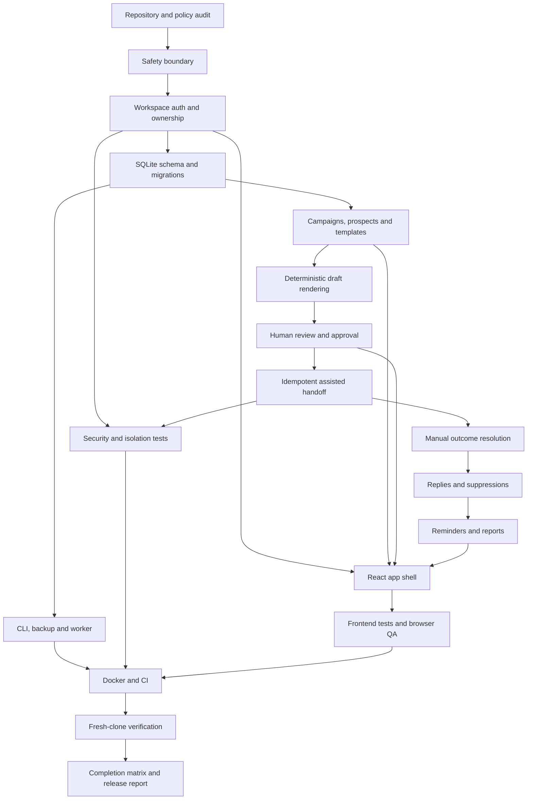

# Task graph

```mermaid
flowchart TD
  A[Repository and policy audit] --> B[Safety boundary]
  B --> C[Workspace auth and ownership]
  C --> D[SQLite schema and migrations]
  D --> E[Campaigns, prospects and templates]
  E --> F[Deterministic draft rendering]
  F --> G[Human review and approval]
  G --> H[Idempotent assisted handoff]
  H --> I[Manual outcome resolution]
  I --> J[Replies and suppressions]
  J --> K[Reminders and reports]
  C --> L[React app shell]
  E --> L
  G --> L
  K --> L
  D --> M[CLI, backup and worker]
  C --> N[Security and isolation tests]
  H --> N
  L --> O[Frontend tests and browser QA]
  M --> P[Docker and CI]
  N --> P
  O --> P
  P --> Q[Fresh-clone verification]
  Q --> R[Completion matrix and release report]
```

The provider account is deliberately outside the execution graph. The only edge to it is a user-initiated browser link after approval.
